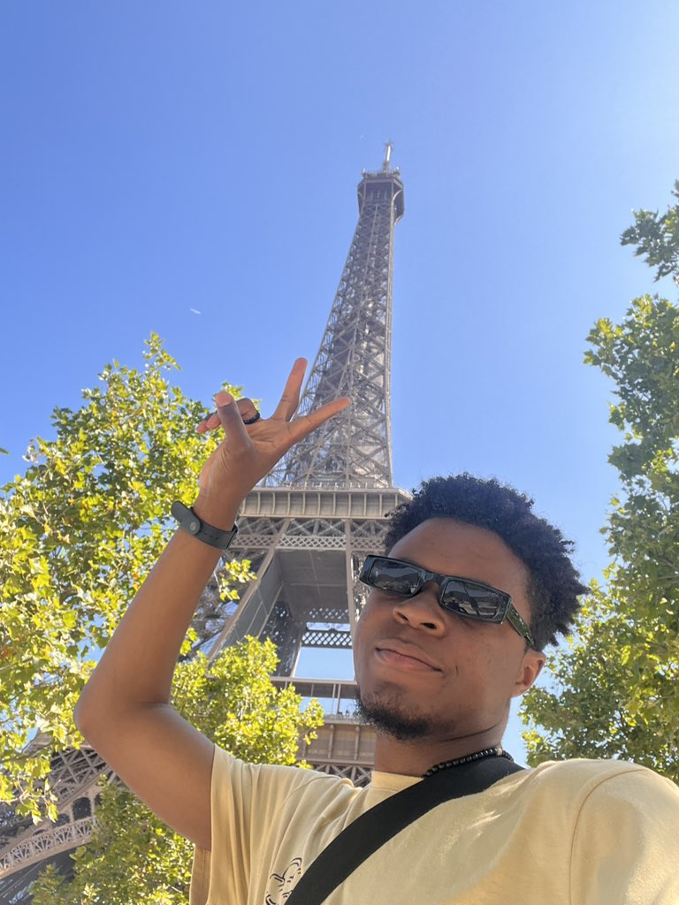

I first read my [2021 in review](/p/2021-in-review/) before starting this article. This is why I love documenting my experiences. Seeing where I was at the end of 2021, and where I currently am, makes me realize I'm learning, improving, and growing in my life. Makes me the more proud of my journey.

---

2022! A bit of a long read, but I hope it's worth it for you 🙂

I don't think one word can do justice to describe this year. But two phrases I can use to describe the year are **a new life** and **an overwhelming year**.

There were highs, and of course to complement them, lows.

## Starting the year after quarantine

I relocated to the Netherlands from Nigeria and went for covid check a few days later. My results came in positive on December 25th 🙃. So I was in isolation until the 1st of this year. It was like stepping out of my door on the new year and feeling like:

"well...what an interesting way to start the year"

I'll try to break down the year into different sections of my life.

I'm also currently working on a series on my YouTube channel: [1 YEAR IN THE NETHERLANDS](https://youtube.com/playlist?list=PLZbkW34mJmDTIFPQ3cxaU0umAHYsNKtkO). In this series, I go into detail in several videos explaining how I "survived" this journey so far.

## New Life, New Country

I only knew of 1-degree situations in movies and the fridge. Apparently, I came into the country in the winter season, and my first shock when people ask me is **IT IS SO COLD 😭**. I had the heating system in my house turned on almost all the time as that was the only way I could live.

My first task was having to figure out how to cope with the weather.

During the winter season, the sun rises very late and sets very early. 7am looks like a regular 5am and 5pm already looks like a regular 9pm. I got used to that to an extent until summer came.

Summer is the opposite; the sun rises very early and sets very late. 6am already looks like a regular 8am and 10pm looks like a regular 4pm. This messed up my sleeping cycle (combined with the fact that I had transparent curtains) as I'd be up as early as 6am, 1 hour before my alarms because it was already bright in my room.

The summer was also so hot that I felt like "this is giving Deja Vu...this is literally Nigeria 😭". Yeah, it was so hot that I'd usually sleep without shirts, and even had to get two standing fans.

It's winter season again and -2 degrees is looking like a regular situation:

Me:

Asides from getting used to the weather, also getting used to the culture and environment was another task. The transportation, the people, and so much more were a lot.

And learning a new language 🥲 I'm glad the language barrier in Amsterdam is not so bad. In my experience, most people know English and are willing to communicate with it if you are non-dutch. But still, I'm [learning dutch using Duolingo](https://youtu.be/0zSjfy4BDVI) to also help my communication in other areas.

## Career

I was excited to finally go to my company's office and meet my colleagues after [processing relocation](https://youtube.com/playlist?list=PLZbkW34mJmDRsuAAOaXRije_Dw-LYJFU1) for up to 3 months. Initially, I thought I would have to go to the office every day; I mean it only made sense to me that they brought me here for that. I was used to remote working so that felt like a challenge, only for me to realize that the culture was flexible and I could choose to work remotely.

"So you brought me here, and I can still work from home? Interesting"

Over time, I learned more about the working culture in Europe and began to find it less weird.

[I got laid off in June](https://twitter.com/iamdillion/status/1542565569278402560?s=20&t=bUO6ShoDO2DGyyK_EIAVIQ) from my company, and had four months to look for a new job else I'd have to return to Nigeria. It was the most shocking part of this year. Distabilized me on some days but I'm glad I scaled through. 4 months first looked like a long time and I felt "I should be able to get something within this duration", but I was left with just one month when I still hadn't gotten anything and 2 out of 3 companies I was interviewing with also dropped me 😂

Well, glad I secured the third opportunity. I'm currently an [Internal Developer Advocate at Adyen](https://youtu.be/IMbBvcNMWdw). It's a beautiful role, and also the company has amazing people and culture.

## Family and Friends from Nigeria

Moving to a new country, one of my concerns was "how do I sustain communication with my family and friends from Nigeria?". I used to be someone who did a lot of my communication with people on phone (Whatsapp chat, Twitter chat, and sometimes Instagram chat), but "chatting" became an issue as time went on. Is Adulting catching up with me?

Distant communication became harder with time. At first, communication was easy because I was mostly at home (working from home, hardly going out asides from Church on Sundays) and I also didn't have many commitments.

My commitments began to grow with time; I was creating content regularly as you can see in the [Content Creation section](#content-creation). And gradually, I started going out a bit more...hanging out after church with friends and also hanging with friends on some days of the week.

I also had [Calendly meetings](https://calendly.com/dillionmegida) with people during the week and had external writing tasks I was doing on the side.

All of these began to catch up with me at some point when I noticed I had become so busy that I started missing messages from family and friends.

Added to these, I also have a very complicated relationship with my phone which makes me want to use it less (turning off notifications, keeping it far away from me), and get offended when I find myself using it more. By keeping my phone away, distant communication worsened.

I've explained this to my family and some of my friends, and also trying to be more intentional 🙂

## Church and New Friends

When I came here, another concern I had was "how do I make friends here?". I'm not very used to approaching strangers to start a conversation and my idea of starting a friendship is that it flows organically instead of starting with "can we be friends?". I love when friendships just flow naturally. Could start with you answering their question, them checking up on you randomly, you replying to their tweet, and slowly, it moves from "I know this person" to "this is my friend".

I only knew two people when I came here: Musa and Gift. I've known Musa from a programming WhatsApp group so when I came here, it was nice to see him. He showed me around--where I can barb, buy Nigerian foodstuff, and a few other things.

Also seeing Gift again, [after 3 years when I first met her at a conference in Nigeria](https://twitter.com/iamdillion/status/1505281886708510725?s=20&t=bUO6ShoDO2DGyyK_EIAVIQ) was nice.

### Looking for a church

I started [following CCI online](https://twitter.com/iamdillion/status/1452269822549581831?s=20&t=jwbJOS2kWd0p3I_t6s0SRQ) a few months before moving. But one thing I missed about CCI was that I couldn't easily access their physical community. In Ilorin, Kwara State where I lived, they didn't have a branch. In my spiritual life in 2021, I noticed the [absence of community] and knew that was the next thing I wanted...a church with a physical community I can associate with.

When I came here, I continued with CCI for a few weeks, but I had to look for something physical. I searched online, and a few options came out; the one that stood out to me was [C3 Imagine](https://c3imagine.church/en/) for two reasons:

* it's 25 mins away from my house (other churches I found, with more ratings, in fact, were like an hour or more away...no way I'm waking up 2 hours earlier than I should on a Sunday 🫣)
* their website had a nice theme and was filled with lowercase letters

I personally believe uppercase is stress, and if I had my way, I would stop worrying about holding the shift button on my keyboard. But that's just me.

It's a beautiful atmosphere in the church, and I've made amazing friends there.

<!-- I have an article on [Finding a church in Amsterdam]() which you could check out. -->

### Making friends outside my new church

I've also made a few interesting friendships outside the church. Some who reached out to me on twitter after [announcing my relocation](https://twitter.com/iamdillion/status/1472566702164656130?s=20&t=bUO6ShoDO2DGyyK_EIAVIQ) to meet, some who I met after going to a friend's hangout and seeing other Nigerians and exchanging Instagrams. I used to be the person who would go to a hangout, have a nice chat with everyone and go my way home. Didn't exchange contacts as the others did. But I've now become the person who goes to a hangout, and at the end, I'm like "let's exchange instagrams" 😂. My [personal Instagram](http://instagram.com/dillionmegida) had been idle for a while. But I use it often now.

## Spiritual Life

One thing I lacked in 2021, living alone, in my spiritual journey with Christ was **community**. I used to go to church every Sunday and some Wednesdays, but that was it--just church and I go back home. I thought I could do my spiritual walk alone but with time I began to realize it wasn't scalable for me.

Following CCI online was a big step I took which I was proud of last year. It gave my spiritual walk a better direction, but I still missed having a physical community (as they didn't have a branch in Ilorin, Kwara State where I lived).

Coming to the Netherlands, one of my goals was to find a church, and I would be part of a physical community. C3 Imagine, as I tell people, feels more like a community than an official church to me. And I so much love it. It's not the 500 or 1000 people attendance I was used to in Nigeria and not like I do not want the church to grow 😂 but being in a small attendance church made me feel a lot at home and in a community. The community here includes the teams I belong to (Production and Worship), and the young adult group from which I made amazing friends.

Finding a community this year helped a lot spiritually. It helped me stay accountable and helped me realize I wasn't alone and we're all going through one struggle or the other spiritually, each of us also in need of direction. A community also helped me learn that I had to take steps to grow in my walk with God and people can only pray and advice. Regularly seeing how others took their Spiritual journeys seriously inspired me to also want the same and make some commitments.

Also, one mindset I had since last year was that I don't need to compare my spiritual journey with everyone. I do not need to feel less of a Christian because I do not pray for 5 hours or go out on outreaches every Saturday as others do. I learned to accept that my spiritual walk is mine to improve, and my relationship between me and God is between us.

This mindset helped a lot this year. I decided to gradually make prayers a habit, make devotionals a habit, and read the Bible more. Those "little" steps I took, helped me a lot and made me consistent. In the last few weeks, however, I've noticed some inconsistency and I haven't been able to trace it to where it started. But thankful for friends who are praying and have advised me on how to recover from this phase.

## Travelling Countries

My VISA in the Netherlands allows me to all [26 Schengen countries in Europe](https://home-affairs.ec.europa.eu/schengen-visa_en). In Nigeria, I wasn't used to traveling--as a matter of fact, I didn't like it because of all the mental planning and anxiety that comes with it. Seeing how accessible the transportation is here, plus free visits to other countries, I decided I would do some traveling.

Asides from traveling to other cities in the Netherlands, I visited three other countries.

### Trip to Belgium

I went to Belgium with two friends. It was my first time traveling with friends to a different location so it was really exciting. In Belgium, we visited Brussels and Antwerp.

You can find pictures [on this tweet I made](https://twitter.com/iamdillion/status/1544352621657456642). Or you can check out my IG [Brussels](https://www.instagram.com/stories/highlights/18142595425257823/) and [Antwerp](https://www.instagram.com/stories/highlights/17926358129302527/) story highlights.

Brussels had a lot of old and maintained structures. For me, it didn't give off "modern" in any way. Plus, the language barrier--most people only spoke Flammige and French, and English was hard as you could tell in their accents. And one more, the Airbnb we booked didn't turn out as nice as we thought it would be.

Antwerp on the other hand had a fine balance of modern and old structures. You could tell it was a modern city. The language barrier wasn't bad as people could speak Dutch and English. And our AirBnB was nicer than we expected. We even regretted not spending more days in Antwerp than we did in Brussels 😂

### Trip to France

Two weeks later, when I had not fully recovered from Belgium (still getting used to travels you know), I went to Paris with 5 friends. The experiences we had in Paris were not all amazing honestly, but what made it all fun was that we experienced them together.

You can find pictures [in this tweet I made](https://twitter.com/iamdillion/status/1548792996455399426). Or, my IG [Paris](https://www.instagram.com/stories/highlights/18201934102165039/) story highlight.

Highlight, as may be obvious, I visited the famous Eiffel Tower. We didn't climb it though. It's usually a long queue, and you have to book weeks before to get a good spot. We didn't plan for that, but it was nice being in front of the tower. I was more fascinated by the structure, elevators, and the work it must have taken to build something that tall and solid.

### Trip to Prague

I also went to Prague, but that was for a conference, not a vacation. I went with some colleagues and had great talks and presentations.

We didn't explore the country a lot but we did a few walks around our hotel and the conference center. We also climbed a tall hill, where we could view the whole of the city from. I have a vlog coming soon on this.

<!-- I documented the conference experience [in this article](/p/devrelcon-prague-2022) -->

## Content Creation

I made a lot of content this year. From [life and career videos on YouTube](https://youtube.com/c/dillionmegida), to [coding videos on YouTube](https://www.youtube.com/c/deeecode), to [coding posts on Instagram](https://www.instagram.com/deeecode/) to [life, career and coding videos on TikTok](https://www.tiktok.com/@iamdillion); you can find a list of them on [my contents page](/contents).

Before I lost my job in June, writing articles and making videos was tasking. I'd mostly use weekends and/or my evenings after work for those. When I lost my job and was searching for a job, I took advantage of that "unemployment period" to make a lot of content. Not being committed to a full-time opportunity made me go full-time into content creation.

At some point, I had to tell myself "you currently don't have a full-time job, but you still don't have time to rest 🤔"

I grew a lot on my different content platforms.

After getting my new job, it became hard to make daily videos on TikTok or daily posts on Instagram 🥲. The TikTok algorithm doesn't favor me as much anymore, and I'm losing followers also 😭. My Instagram is still growing gradually anyways.

A lot of people benefitted from [the Relocation playlist](https://youtube.com/playlist?list=PLZbkW34mJmDRsuAAOaXRije_Dw-LYJFU1) on my YouTube channel. It's one of my proudest sets of videos. I experienced scenarios where someone recognized me as I walked on the street:

"You're Dillion, right? Wow. I used your relocation videos when coming here. They were so helpful"

Also other scenarios in the cinema and at a store. In fact, a few Nigerians who work in my current company used my videos 🥹

Those were really fulfilling and proud moments for me.

You can learn more about my content creation journey in this article: [Content Creation Recap 2022](/p/content-creation-recap-2022)

## Wrap Up

Well, that's the wrap-up of my 2022. My church is having a Christmas event on the 24th, and I'd be dancing and singing 🙃. I'll share pictures or links here afterward.

2022 hasn't ended yet, so who knows, I might get a new highlight before 2023--perhaps a girlfriend? 🫣 Haha...if I need to add anything, I will.

If you read it this far, my hopes are that by sharing my experience, there's a part of my story that inspires you or pushes you to do and become more. Perhaps the part where [the Netherlands almost chased me out of their country job](https://twitter.com/iamdillion/status/1604868769423269889) since I didn't have a job but God came through 😂

Happy Christmas 🎄 and Merry New Year ✨
