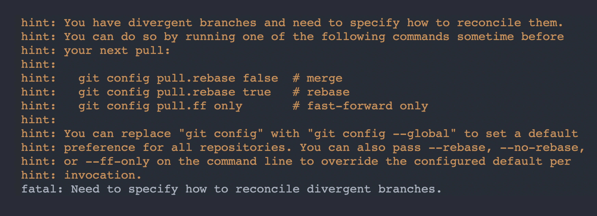

In git, you can display the list of all branches you have locally with the `git branch` command. This command also supports a list of options that determines how the result is displayed.

One of those options is `--merged`:

```bash
git branch --merged
```

By using this option with the branch command, you get a list of all branches that have been merged to `HEAD`, which is the active branch when the command is run. You can explicitly specify a target branch like this:

```bash
git branch --merged main
```

This will show a list of all branches that have been merged to `main`. The branches listed would also include `main` because the changes in `main` have been merged into `main` 😅

## Instances where you may not get merged branches

> TLDR: if **the state of the remote branch is different from the local branch**, and the remote branch is merged to a target branch, git would not be able to verify if the local branch has been merged to the target branch

Recently, I ran this merged command, but I didn't get the list of merged branches I expected.

My scenario was that I had some local branches which were synced with remote branches. Those remote branches were merged with main. So I pulled main:

```bash
git pull origin main
```

But when I ran `git branch --merged`, I didn't see the list of local branches which I expected. What I discovered (hours later) was that **the state of the local branches were not in sync with the state of the remote branches when the remote branches were merged**.

What makes the state of a local branch different from its remote counterpart?

### Remote branch history conflicts with local branch history

Something might have happened to the branch on remote which didn't happen locally, and that would put the branches out of sync. If this happened before the remote branch was merged, git would be unable to tell if the branch has been merged locally.

I experienced this while using a "rebase and fast-forward" merge approach.

My setup is like this: for merge requests, I don't do the regular merging which adds a new commit when a branch is merged with another branch. Instead, I use the fast-forward merge which adds only the commits made in the branch I want to merge, without including a "merge commit".

But fast-forwards are only possible if the branch I want to merge (let's call it `testing`) contains all changes in the target branch (let's call it `main`). So if I have already made new changes on `main` since the time `testing` was created, a fast-forward merge for `testing` to `main` won't work.

For a fast-forward merge to work, I'd have to rebase `testing` with `main`. And when that works successfully, `testing` would contain all the changes in `main` (with the new changes added on top), and a fast-forward merge would work. I can easily perform a rebase on [the GitLab UI](https://docs.gitlab.com/ee/topics/git/git_rebase.html#from-the-gitlab-ui) (without having to do that locally) so that my merge can be successful.

So here is where the git history of the new branch on remote becomes out of sync with the local branch.

By rebasing on the GitLab UI (which I had to do as there were new changes on `main`) before merging, the state of the remote `testing` branch changes. The remote branch now contains the new changes made on `main`. But that's not the case with the local `testing` branch right?

Because I didn't rebase locally, the local branch only contains changes from `main` which existed before the branch was created. It doesn't contain new changes on `main` that are made afterwards.

What do you notice here? The remote `testing` branch and local `testing` branch are now in different states.

So, the remote branch is merged, and then you sync the remote `main` branch with the local `main` branch (by `git pul`ling).

Now, even if the local `main` branch now contains the new changes you made in `testing`, running `git branch --merged` won't show you `testing`, because the state of the remote `testing` branch before it was merged was different from the local `testing` branch.

However, if you check "remote branches that are merged", you would see the remote testing branch:

```bash
git branch -r --merged
```

The `r` option shows only remote branches in the result.

So how do you fix this for the local branch?

## Fix git branch --merged not showing all merged branches

To solve this, you have to ensure that the local `testing` branch is synced with the remote `testing` branch. By doing that, the local branch would have the same state as the remote branch, and then, git can verify that the branch has indeed been merged.

Here are two ways you can ensure the branches are synced.

### git rebase locally

Remember that what changed the state of the remote branch was the fact that it was rebased with `main`. We can repeat that for the local branch. For example:

```bash
git checkout testing
git rebase main
```

This would put the local `testing` branch in the same state as the remote `testing` branch.

Now when you run `git branch --merged`, `testing` would be listed as a merged branch.

### git pull from remote

Instead of rebasing, you can also sync the remote branch with the local branch, by pulling:

```bash
git checkout testing
git pull origin testing
```

But this would throw an error. The reason for this is that your branches are out of sync--they have diverged. You may see a similar error from git like this:



The reason for this error, again, is that both branches are in different states. So you can't automatically do a push.

As you see in the hints, git recommends a rebase. So we can rebase the local branch with the remote by using this command:

```bash
git rebase origin/testing
```

The `testing` remote and local branches are now in the same state, so when you run `git branch --merged`, you'd see `testing`. 

## Squash and Merge approach also affects git branch --merged

This problem does not only occur in fast-forward merges. It can also occur if you're using the [squash and merge](https://docs.gitlab.com/ee/user/project/merge_requests/squash_and_merge.html) approach. If all commits in a branch (say, `testing`) are squashed into one commit during merge, git would not be able to tell if `testing` was merged with the target branch by executing `git branch --merged`.

That's because, even though all the content changes in `testing` exist in the target branch, the histories are different. The target branch has **only one commit with all the changes**, while `testing` has **multiple commits with the changes**. Hence, git would not be able to tell.

As for this, I don't know the solution, but when I discover it, I'll share :)

---

If you enjoyed or learn anything from this piece, please share with others 😇
