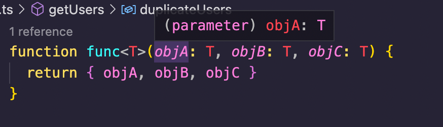
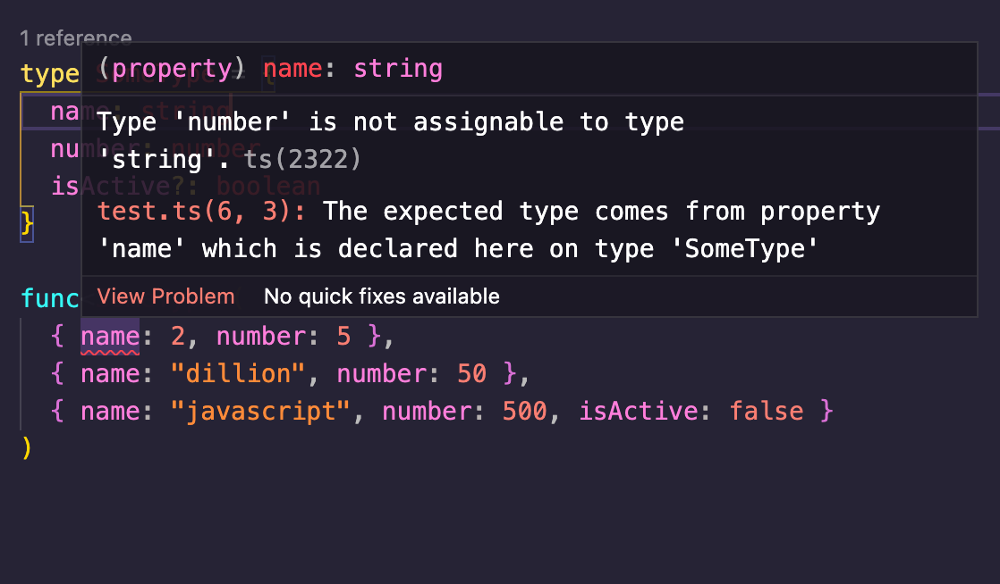

TypeScript is a superset of JavaScript, which I call "JavaScript with powers"—specifically typing powers.

With TypeScript, you can add types to your JavaScript codes. This system helps avoid compilation errors produced due to unexpected types and values at different parts of your application.

TypeScript has types, interfaces, enums, and so many other features. In this article, I'll simplify the **generics** feature of TypeScript for you. You'll understand what this feature is all about, why it's relevant, and a use case showing how to use it.

## What is a Generic Type?

A generic type in TypeScript allows you to write general types that support different types when used. Think of this as a placeholder type like you have functions in JavaScript:

```js
function add(a + b) {
    return a + b
}
```

The `add` function above has no idea what the arguments `a` and `b` are. But it has those placeholders for when the function is executed. All this function does is create a "blank cheque" and return the sum of the two values passed when called.

This is similar to generic types. They are used for writing placeholder types in functions, classes, types, and even interfaces. These placeholders can further be used to add custom types. If these words sound confusing, do not worry. They'll become clearer as we move forward.

## Syntax of a Generic Type

The syntax of a generic type is:

```ts
<X, Y, Z>
```

This syntax is a generic type that accepts three types: `X`, `Y` and `Z`. Just like placeholders, these can be any set of characters you want. Here's a simple example to explain this syntax:

```ts
function func<T>(objA: T, objB: T, objC: T) {
  return objA.number + objB.number + objC.number
}
```

`<T>` is the generic type, and I defined this type for parameters `objA`, `objB`, and `objC`. Highlighting on `ojbA`, I get this in my editor:



Note that, my editor, VSCode supports TypeScript; that's why I can see this popup. You may need to set up your editor for TypeScript if it doesn't show the same.

From the image, you can see that at the time of the function declaration, `objA` expects the `T` type, which is unknown . Now let's add a type.

```ts
type SomeType = {
  name: string
  number: number
  isActive?: boolean
}

add<SomeType>()
```

On typing the bracket, I get the function definition and the expected arguments in my editor like so:


From the popup, you can see that the arguments `objA`, `objB` and `objC` have the `SomeType` type as if it was specified during the function declaration.

I also get type errors when I provide an unexpected type like so:



## Why would you need Generic Types

As you may have already guessed, for code reusability. Just like you create reusable functions, generic types allow you to create general type declarations in functions, interfaces, and classes that allow for reusability with different types.

## Use case of Generic Types

There are many basic and advanced applications of generic types. This section will show you one good application of Generic Types.

### Generic Types for API requests and responses

Let's say you're creating a reusable API request function in TypeScript like so:

```ts
async function apiRequest(
  url: string,
  method: "get" | "post",
  data?: { [x: string]: string }
): Promise<any> {
  return fetch(url, { method, body: JSON.stringify(data) })
}
```

We have the `apiRequest` function, which takes in three arguments: `url` of type string, `method` of "get" and "post" string literal types, and an optional `data`, which can be an object of different properties. The part of this function to focus on is the return type: `Promise<any>`.

This function returns a promise with the `any` type. This means we won't get any type benefits on the returned data when this function is used.

The first thing to notice here is that the `Promise` constructor/type is a generic type. And so, we've passed the `any` type.

Now, let's improve this return type:

```ts
async function apiRequest<T>(
  url: string,
  method: "get" | "post",
  data?: { [x: string]: string }
): Promise<T> {
  return fetch(url, { method, body: JSON.stringify(data) }).then(
    res => res.json() as Promise<T>
  )
}
```

By updating the code to the above, the `apiRequest` can now accept type when this function is called. The type passed to it is also passed to the `Promise` return type, thereby giving the function a better return type. We also type the `json()` method to keep everything consistent.

Now, we can use this function like this:

```ts
type User = {
  id: number
  name: string
}

async function getUsers() {
  const users = await apiRequest<User[]>("https://users.com", "get")
}

const duplicateUsers = users.map(u => {
  const id = u.uid
})
```

From my editor, here are some helpful TypeScript popups I get:


## Conclusion

The example mentioned here is just a random example. It may not really be practical, or there may be better workarounds for such use cases. I used this example for demonstration purposes.

There are still many things you can do with Generic types. For example:

- you can specify a default type (just like default values for parameters in functions)
- add a bit of structure to your generic types to ensure that the types passed during usage have specific properties
- and so much more

The aim of this article was to briefly and simply explain what this tag is, how it works and why you need it.

The [TypeScript Generics Documentation](https://www.typescriptlang.org/docs/handbook/2/generics.html) goes into more detail, so definitely check that out for more information.
