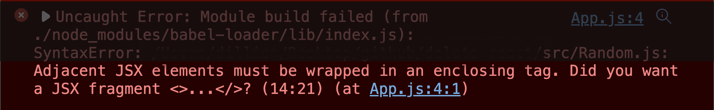

This error exists because JSX expressions must have only one parent element, and somewhere in this project, two parents have been used.

But why, though? Why isn't it possible to have two parents like this:

```jsx
function App() {
  return (
    <div>Why</div>
    <div>Can I not do this?</div>
  )
}
```

or this:

```jsx
function App() {
  return (
    <div>
      {isOpen && (
        <div>Why again</div>
        <div>Can I not do this</div>
      )}
    </div>
  )
}
```

In this article, I will explain why you cannot have two parents, as seen in the two code blocks above.

## A brief about JSX

JSX stands for JavaScript XML. It is an extension of JavaScript that allows developers to use HTML-like syntax in JavaScript code. This extension makes the composition of components easier to read as it looks like an HTML code made up of HTML elements and React elements. With JSX, you can build a component like this:

```jsx
function App() {
  return (
    <div>
      <h1>Hello</h1>
    </div>
  )
}
```

The code in the `return` statement is JSX.

What's the normal way to create components without JSX?

## React.createElement

JSX is syntactic sugar for `React.createElement` which is a normal JavaScript method. JSX is compiled back to normal JavaScript, which the browser understands.

To create a React element without JSX, you use the `createElement` method on the `React` object. The syntax for this method is:

```js
React.createElement(element, props, ...children)
```

For example, this JSX:

```jsx
function App() {
  return (
    <div>
      <h1>Hello</h1>
    </div>
  )
}
```

is syntactic sugar for:

```js
function App() {
  return React.createElement(
    "div",
    null,
    React.createElement("h1", null, "Hello")
  )
}
```

You can verify this on this [Babel Compiler](https://babeljs.io/repl/#?browsers=defaults%2C%20not%20ie%2011%2C%20not%20ie_mob%2011&build=&builtIns=false&corejs=3.21&spec=false&loose=false&code_lz=GYVwdgxgLglg9mABAQQA6oBQEpEG8BQiiATgKZQjFIaFGIA8AJjAG4B8tdDAFgIxsAJUgBthcegHo-HLpObtaWfAF8gA&debug=false&forceAllTransforms=false&shippedProposals=false&circleciRepo=&evaluate=false&fileSize=false&timeTravel=false&sourceType=module&lineWrap=true&presets=react&prettier=false&targets=&version=7.17.9&externalPlugins=&assumptions=%7B%7D)

Using this code, you notice that the component `App` starts with a parent `React.createElement` of element `div`. This parent has a child, which is also a parent `React.createElement` of element `div`. In turn, the second parent has a child, which is the "Hello" text.

## Returning two parents at once, example 1

What if we wanted two parents at the root? Like the first example earlier:

```js
function App() {
  return (
    <div>Why</div>
    <div>Can I not do this?</div>
  )
}
```

This JSX translates to:

```js
function App() {
  return React.createElement("div", null, "Why")
  React.createElement("div", null, "Can I not do this?")
}
```

We're trying to return two things at a time, but this is not valid JavaScript. We cannot return two items at a time.

So, we can only return one parent, and that parent can have as many children and grandchildren as it wants.

To return more than one child, you pass them as arguments to `createElement` like this:

```js
return React.createElement(
  "h1",
  null,
  "Hello",
  "Hi",
  React.createElement("span", null, "Hello")
  // more children
)
```

The JSX representation of this will be:

```js
return (
  <h1>
    Hello Hi
    <span>Hello</span>
  </h1>
)
```

## Returning two parents at once, example 2

Now, let's inspect this code block from earlier:

```js
function App() {
  return (
    <div>
      {isOpen && (
        <div>Why again</div>
        <div>Can I not do this</div>
      )}
    </div>
  )
}
```

This one has a root parent `div` but still complains about multiple parents in the `isOpen` expression. Why?

First, let's see the [Babel Compiler](https://babeljs.io/repl/#?browsers=defaults%2C%20not%20ie%2011%2C%20not%20ie_mob%2011&build=&builtIns=false&corejs=3.21&spec=false&loose=false&code_lz=GYVwdgxgLglg9mABAQQA6oBQEpEG8BQiiATgKZQjFIaFGIA8AJjAG4B8tdeMAzgPKpSSAGTDENLlyas2AdQAWAT0QBDAOYqYYegHpm7TnSwBfQ7v0ciWfMaA&debug=false&forceAllTransforms=false&shippedProposals=false&circleciRepo=&evaluate=false&fileSize=false&timeTravel=false&sourceType=module&lineWrap=true&presets=react&prettier=false&targets=&version=7.17.9&externalPlugins=&assumptions=%7B%7D) of just one `div` in the `isOpen` expression.

With one `div` tag, this code:

```jsx
function App() {
  return <div>{isOpen && <div>Why again</div>}</div>
}
```

compiles to:

```js
function App() {
  return React.createElement(
    "div",
    null,
    isOpen && React.createElement("div", null, "Why again")
  )
}
```

The `isOpen` expression is a child in the first `createElement`, and this expression uses the logical `&&` operator to add the second `createElement` parent as a child to the first.

This means that this code with two parents:

```jsx
function App() {
  return (
    <div>
      {isOpen && (
        <div>Why again</div>
        <div>Can I not do this</div>
      )}
    </div>
  )
}
```

is supposed to translate to:

```jsx
function App() {
  return React.createElement(
    "div",
    null,
    isOpen
    && React.createElement("div", null, "Why again")
    React.createElement("div", null, "Can I not do this")
  )
}
```

This code is a wrong syntax because, after the `&&` operator, we are attempting to return two things, and JavaScript only allows you to return one expression at a time. The returned expression should have one parent and as many children as possible.

This is why JSX expressions must have only one parent.

## Wrap up

JSX is syntactic sugar for `React.createElement`, which can only be returned once in a component (or in an expression) but can have as many children as possible.

I believe most of us, at one point in our React journey, may have come across the "JSX expressions must have one parent element" warning. And to fix this, we just add a parent element or use fragments. This article aims to give you a better understanding of why this warning exists.

This article may not change how you write your React, but I hope it makes you more knowledgeable about how React works.

Kindly share if you find this helpful.
