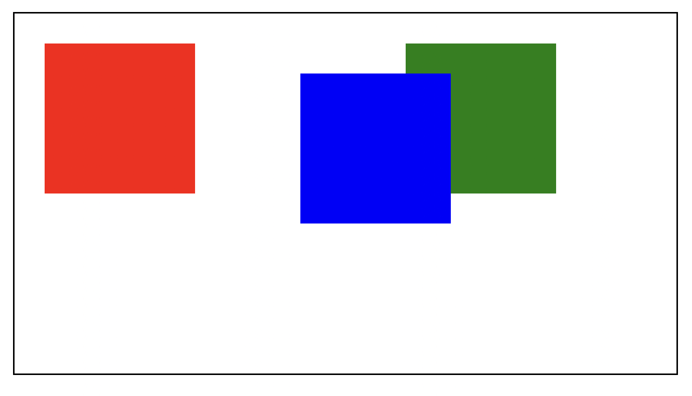
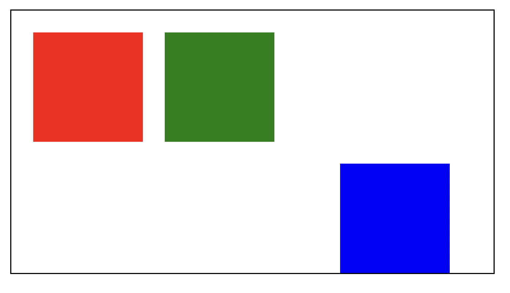
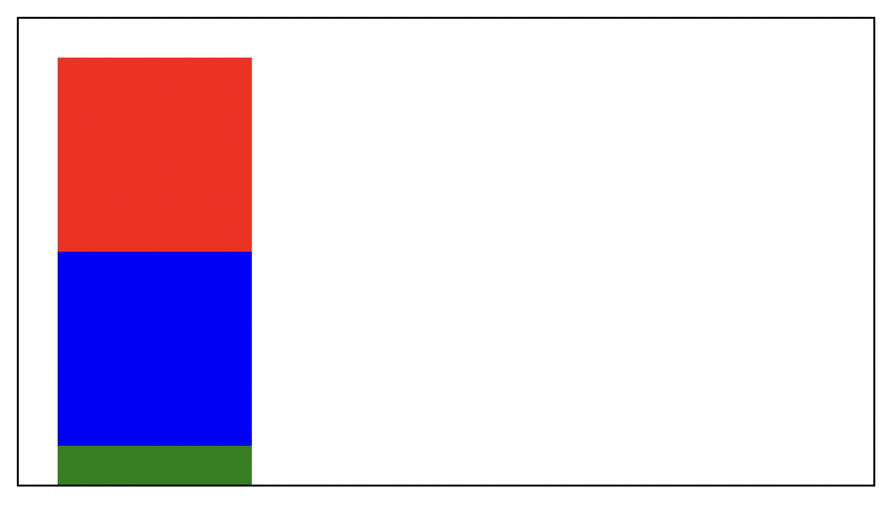
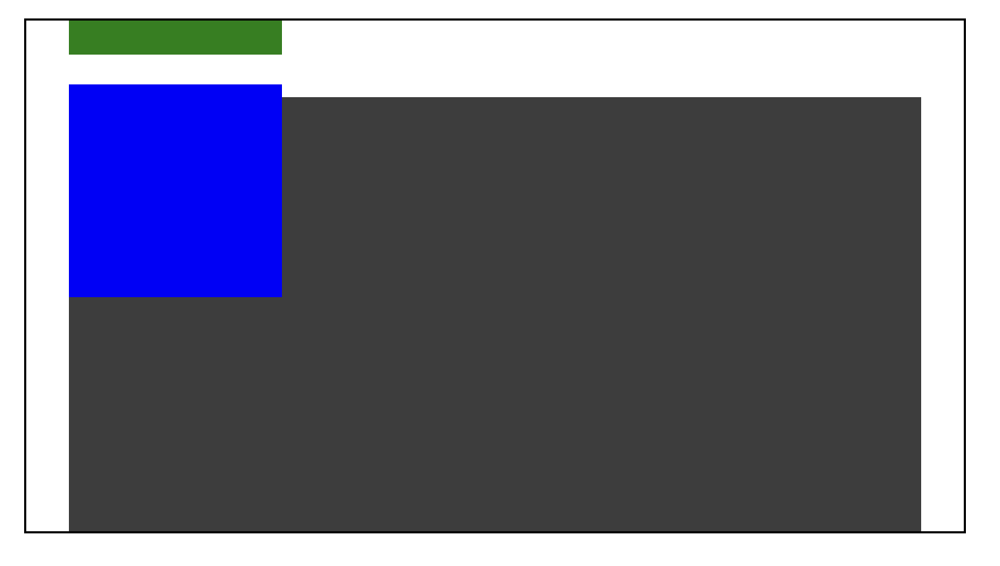

CSS has different positions that can be applied to elements. They include `static`, `relative`,`absolute`, `fixed`, and `sticky`. These positions specify how an element should be positioned in a document which causes the element to behave differently.

In this article, we will understand the difference between these positions.

## Positioned and Non-positioned elements

Before looking at these position styles, the first thing to understand is positioned and non-positioned elements.

Non-positioned elements appear on a page following the order they are declared in the DOM, and they occupy as much space as they need. Vertical and horizontal positioning (`top`, `left`, `right` `bottom`) cannot be applied to such elements because they are not positioned.

In contrast, vertical and horizontal positioning can be applied to positioned elements. Positioned elements, by default, appear on a page like they are static, but using vertical and horizontal positioning can affect them differently, depending on the type of position.

Now, let's look at these position styles.

## Static position

`static` position is the default position style for elements. With this style, elements are non-positioned--they appear as they are in the markup document. This style is also the only non-positioned style.

`top`, `left`, `right`, and `bottom` does not work with this style. You can visualize it with this code:

```html
<div class="container">
  <div class="red-block"></div>
  <div class="blue-block"></div>
  <div class="green-block"></div>
</div>
```

```css
.container {
  margin: 20px;
  height: 200px;
  display: flex;
  border: 1px solid black;
  padding: 20px;
  width: 400px;
}

.red-block,
.blue-block,
.green-block {
  width: 100px;
  height: 100px;
  margin-right: 20px;
}

.red-block {
  background-color: red;
}

.blue-block {
  background-color: blue;
  left: 20px;
  top: 20px;
}

.green-block {
  background-color: green;
}
```


The `left` and `bottom` style declarations on the blue block are ignored. Of course, you can apply margins, but that would affect the element after it:

```css
.blue-block {
  /* ... */
  margin-left: 20px;
  margin-top: 20px;
}
```


## Relative position

You can think of the `relative` position as a style that gives `static` elements more flexibility. But unlike `static`, elements with the `relative` position are considered positioned elements. This means that such elements can appear differently from the markup flow.

With `relative`, the element retains its flow in the document and occupies as much space as needed by default, but you can use positioning properties like `top`. The idea here is that the element is **relative** to its default position. Using these positioning elements moves the element around the default position without affecting others. Here is what I mean:

```css
.blue-block {
  position: relative;
  top: 20px;
  left: 50px;
}
```



The blue block is still assumed to be filling up its default space, but positioning styles can move it around without pushing the others.

## Absolute position

Elements with the `absolute` position are positioned elements that are removed from the flow of the document--like they are not there. Their space on the screen is taken away from them and assigned to other elements. Here's what I mean:

```css
.blue-block {
  /*  */
  position: absolute;
  top: 40px;
  left: 50px;
}
```


As you would notice, the blue block's space earlier is now occupied by the green block. Even if you use margins on the absolute block, it does not affect the others. You can see it as the absolute element in its own territory outside the container.

As it is currently, the absolute element has no relationship with the container. Absolute elements are positioned within the closest `relative` positioned parent, and if none, they are placed within the viewport (browser window). For example, with a positioning style of `left: 0`, the element moves to the left edge of the relative parent or the viewport.

To set a relationship between the blue block and the container, you need to apply a `relative` class to the container:

```css
.container {
  /*  */
  position: relative;
}
```

Now, you can push the blue block to the edges of the container:

```css
.blue-block {
  /*  */
  bottom: 0;
  right: 20px;
}
```



As you can see, the container serves as a boundary that the positioning properties can move the absolute element along. If there were no closest `relative` parents, the blue block would appear like this:


## Fixed position

The `fixed` position is similar to the `absolute` position. The difference is that the fixed position does not respect any relative parents (or ancestors). It only respects the viewport. So a style like this:

```css
.container {
  /*  */
  position: relative;
}

.blue-block {
  /*  */
  position: fixed;
  top: 0;
  left: 0;
}
```

will produce this:


The `fixed` element only respects the viewport regardless of the relative parent.

## Sticky position

As the name implies, this makes an element stick to a container. The `sticky` position toggles between the `relative` and `fixed` position in a scrolling container. An element of this position style starts with the `relative` position, retaining its flow in the document. Upon scrolling in the container, if the specified positioning distance (with `top`, for example) is met, the element becomes fixed until the scrolling container is out of view.

Here's an example to explain this:

```html
<div class="container">
  <div class="red-block"></div>
  <div class="blue-block"></div>
  <div class="green-block"></div>
  <div class="other-block"></div>
</div>
```

```css
.container {
  width: 400px;
  height: 200px;
  border: 1px solid black;
  overflow-y: auto;
  margin: 20px;
  padding: 20px;
}

.red-block,
.blue-block,
.green-block {
  width: 100px;
  height: 100px;
  margin-right: 20px;
}

.red-block {
  background-color: red;
}

.blue-block {
  background-color: blue;
  position: sticky;
  top: 10px;
}

.green-block {
  background-color: green;
}

.other-block {
  height: 500px;
  margin-top: 20px;
  width: 100%;
  background-color: rgb(61, 61, 61);
}
```

At the start, the blue block appears in the flow of the document like this:



When you scroll in the container, and the blue block meets the `top: 10px` condition, it becomes fixed as you scroll:



You can try it on this codepen. Try scrolling in the container and see the blue block fixed.



## Wrap up

In CSS, you have positioned and non-positioned elements. Non-positioned elements appear as the flow is declared in the markup. This applies to the `static` position style. Positioned elements may appear in the same flow in some cases (`sticky` and `relative`) and may not in some other cases (`absolute`, `fixed`), but they can be controlled with positioning styles (`top`, `left`, `right`, `bottom`).

In summary:

- `static`: default position style appears as the declared flow in the markup
- `relative`: appears as the declared flow but can be repositioned with respect to the default position
- `absolute`: leaves the flow, and another element occupies the default position. It can be repositioned with respect to the closest `relative` element if available; else, the viewport
- `fixed`: leaves the flow and can be repositioned with respect to the viewport
- `sticky`: behaves as `relative`, and when a specified positioning distance condition is met in a scrolling container, it becomes fixed.
