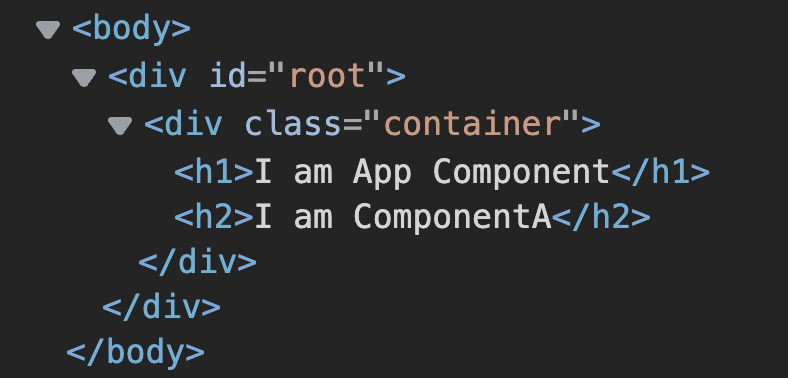
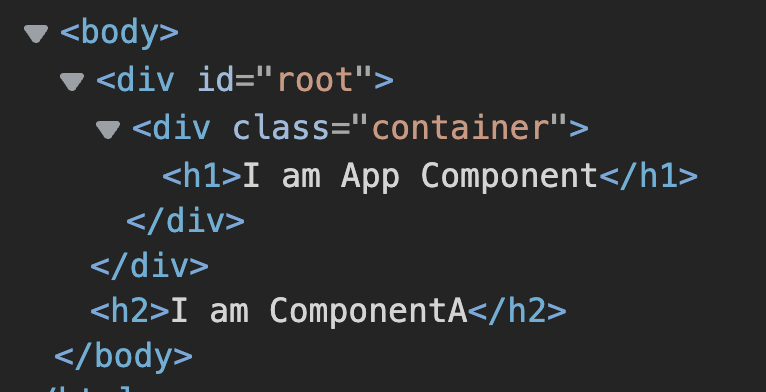
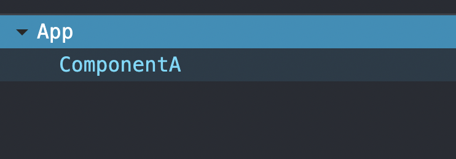

According to the dictionary, a portal is a **doorway to another place**. React has a feature, called **portals** which allows you to create a doorway for a component to be rendered in another place in the DOM.

Consider the following component composition:

```js
function ComponentA() {
  return <h2>I am ComponentA</h2>
}

function App() {
  return (
    <div className="container">
      <h1>I am App Component</h1>
      <ComponentA />
    </div>
  )
}
```

In the component composition above, `ComponentA` is used inside the `App` component. In the React tree and the DOM (on the browser), `App` is a parent of `ComponentA` as you will see in the screenshot below:



This result is normal, as you would expect. Here is where a potential problem comes in.

As `ComponentA` is a child of the `.container` div in the `App` component (in the DOM), `ComponentA` will have to depend on the styles applied to that div. If the `container` div, for example, has a `display` style of `none`, `ComponentA` will also be hidden.

Another example is if the div has a certain `z-index` style, `ComponentA` will have to depend on that index, and cannot appear above the div container.

One more example is that `ComponentA` will have to depend on the width and height of its parent. This means there's a possibility it may be cropped out.

The fact that `ComponentA` has to depend on `App` root element's styles makes it a problem for components like modals, popups, and dialog boxes in general. These are common use cases where you use React portals.

With React portals, you can make a component **visually break out from its parent**. Using React portals, you can declare `ComponentA` as a child of `App` but `ComponentA` will be appended to a different node in the DOM.

By visually breaking out from the parent the component is declared in the React hierarchy, that component will not have to depend on the parent's styles anymore. Applying this to modals makes it possible for such components to be visible while the parent in the React tree is invisible.

Here's how to create a portal in React:

```js
import ReactDOM from "react-dom"

function ComponentA() {
  return ReactDOM.createPortal(<h2>I am ComponentA</h2>, document.body)
}

function App() {
  return (
    <div className="container">
      <h1>I am App Component</h1>
      <ComponentA />
    </div>
  )
}
```

You create a portal using the `createPortal` method of the `ReactDOM` object. This method accepts three methods:

* `children`: which is the component you want to create a portal for
* `container`: which is the DOM node you want to append the component to (in the example above, we used `document.body`, but you can use any node with methods like `document.getElementById()`)
* `key`: optional, but a unique key to pass to the component

When you render this, in the DOM, you will find the following screenshot:



You notice that `ComponentA` (which contains the `h2` element) is nested directly under the `body` element and not in the `App` (with the div container) anymore. You have successfully created a doorway for that component to be nested somewhere else in the DOM, instead of where it was in the React tree. `ComponentA` has visually broken out of its parent.

By doing this, `ComponentA` will no longer be affected by the styles declared on `div.container`. Instead, it will depend on the styles declared on the `body` element.

Using portals for modals allows you to move modals to the root node (`body` in this case) so that it is not affected by the styles of the parent it was declared in the React tree.

There are a few things to note when you use React portals:

* in the case of modals, be sure to handle [accessibility](https://www.w3.org/WAI/ARIA/apg/example-index/dialog-modal/dialog)
* React portals only modify the DOM tree, but not the React tree. Here's the React tree after using the portals above:



This means that `ComponentA` can still have access to context data from the `App` component (if it uses React Context).

Also, event bubbling will work with the React tree and not the DOM tree. This means, an event triggered on `ComponentA` will also bubble to the `App` component.

## Wrap up

React portals are useful when you do not want a component to be affected by its parent's styles. Portals allow you to append a component to a different node of your choice in the DOM. A common use case of this feature is modals, dialog boxes, and popups which should always be completely visible when they should be.

Although it's worth noting that portals only modify the HTML structure and not the React components tree. To react, the component is still a child of its parent, but to the DOM, the component is a child of another parent.
