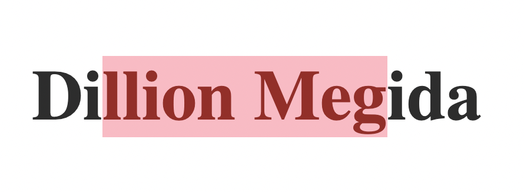

CSS has many pseudo elements which you can use to style different parts of an element. One of these pseudo elements is `::selection` which we will be looking at in this article.

This pseudo element is used to style the **highlighted part of an element** (most commonly a text element). Highlighting a text occurs when a user clicks and drags the cursor over characters of a text like this:


With this selector, you can apply styles on the selected characters "llion Megi". However, there are limited styles you can use with this selector such as `color`, `background-color`, `text-decoration`, `text-shadow`, `stroke-color`, `fill-color` and `stroke-width`.

Using this selector that help you to ensure theme consistency in your web applications. For example, if your app's theme is made up of red, purple and yellow, you can make text highlight also purple, instead of default light blue.

Here's how to use it:

```html
<h1>Dillion Megida</h1>
```

Let's see we have the html above: a `h1` tag which contains the "Dillion Megida" text. Let's move on to the CSS:

```css
h1 {
  color: #333;
  font-size: 20px;
}

h1::selection {
  background-color: pink;
  font-size: 200px;
  color: brown;
}
```

Here is the result with some characters highlighted:



As you can see, I highlighted "llion Meg" (in the "Dillion Megida" text) which is styled with a **pink** `background-color` and a **brown** `color`. You would also notice that the `font-size` of **200px** is ignored. This is due to the limited supported styles with this pseudo element.
