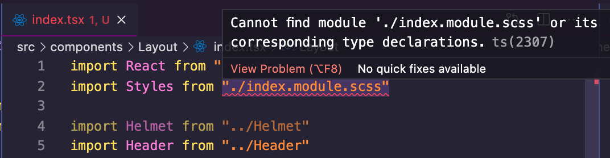

My early days with TypeScript were not so cool. I didn't understand its relevance, so I didn't use it so much in my applications. But as soon as I got the hang of its beauty, I've never liked vanilla JavaScript again 😶. TypeScript is awesome, trust me!

For every new JavaScript project, I make sure I start it with TypeScript. And for existing projects that I have to work on again, I try to convert them to TypeScript.

I've been wanting to convert my blog too for a while, but thinking of the stress that comes with converting (renaming files, adding types, resolving warnings like 'this variable implicitly has an `any` type') influenced my procrastination to do it. I finally did it on Thursday, spent ~3hrs (never expected this tbh), and here I am, writing this article to document the process so that someone else doesn't spend that much time.

## 1. Setting up TypeScript

Out of the box, Gatsby supports TypeScript. Hence, I didn't need to install anything before I could start using it.

I started with converting my `.js` files to `.ts` or `.tsx` (for React TypeScript).

I also had to create a `tsconfig.json` file at the root. This is a file that sets up the rules for how TypeScript should work with your application. Here's the [documentation for tsconfig](https://www.typescriptlang.org/tsconfig) where you can find the different options.

For my application, I used this:

```json
{
  "compilerOptions": {
    "target": "es5",
    "module": "commonjs",
    "jsx": "preserve",
    "strict": true,
    "esModuleInterop": true
  },
  "exclude": ["node_modules", "public", ".cache"]
}
```

## 2. Missing declaration file

Although Gatsby had declarations for React and some other libraries by default, I used some other plugins of which their type declarations were not present. One of them was `react-helmet`. So, I had to explicitly install the typings for that (`npm i --save-dev @types/react-helmet`) and every other similar plugin.

But not all open source libraries have types. And since TypeScript could find the type declarations for such libraries, my IDE kept yelling at me, like this:


As the error shows, TypeScript adds an implicit `any` type to the library as it could not find a declaration file.

There are two ways to stop this warning.

One way is to add the `noImplicitAny` option to `tsconfig.json` like this:

```json
{
  "compilerOptions": {
    "target": "es5",
    "module": "commonjs",
    "jsx": "preserve",
    "strict": true,
    "esModuleInterop": true,
    "noImplicitAny": false // highlight-line
  },
  "exclude": ["node_modules", "public", ".cache"]
}
```

This tells TypeScript to be quiet about `any` types.

The second way (which I did) is to add a `typings` directory at the root, and in it, a `declaration.d.ts` with the following code:

```ts
declare module question-form
```

The above creates a type declaration for `question-form`. Since I didn't add any typings for this declaration, everything imported from this module will be `any`.

## 3. `.scss` imports throws a warning



TypeScript by default supports `.ts` and `.tsx` imports and complains when a different file type is imported. To fix this, I added the following to the declaration file created above:

```ts
declare module "*.scss"
```

Just like in the previous section, this creates a type declaration for `.scss` files.

## 4. Importing from a `.js` file into a `.tsx` file

TypeScript and Gatsby will not complain if I use `.js` in some places and `.tsx` in some other places. The application would run just fine. But I experienced errors in places where I was importing from a `.js` file into a `.tsx` file. Here's one of them:


Here, the header component was created in `Header.js`, and I was trying to use it in a `Layout.tsx` file.

The solution to this was to change the Header file to `Header.tsx`.

This particular section took a whole lot of my time because of the shared components and functions. I ended up converting 95% (if not 100) of `.js` to `.tsx` and fixing the type warnings.

## 5. Implicit `any` throws warning in function arguments


Without explicitly adding types, TypeScript implicitly handles every function argument as `any`-typed. Also, it throws a warning. There are two solutions to this:

One way, just like we saw in the "Missing declaration file" section, is to add the `noImplicitAny` option with the value `false` to `tsconfig.json`.

The second way, which I did, was to explicitly add a type. It could be the `any` type (`(props: any)`) or something more specific to the argument. I did this because what's the beauty of TypeScript when you're just `any`-typing things? 🤪

## 6. Other `.js` references that weren't resolved

After fixing all warnings, I ran `gatsby develop` and it failed. The reason for this was, in `gatsby-node.js`, I used the `createPage` function to dynamically create the pages for all my articles in Markdown, and the template I was using was a `Blog/index.js` file.


Having changed all my `.js` to `.tsx`, `Blog/index.js` was not found. Therefore, creating pages with that template threw the error.

I changed the `Blog/index.js` to `Blog/index.tsx` and everything worked just fine.

## Conclusion

It was a fun ride. Through my research trying to fix some of these errors, I had a better understanding of TypeScript, declaration files, and the purpose of some of the `tsconfig` options.

I did more than I listed in this article. I made one big change when things weren't working during development, and in the process of writing this article, I tried the application without the change and realized that change was irrelevant 😅

Anyways, if you're also trying to convert your Gatsby blog/application to typeScript, I believe I've shown you things to watch out for as well as providing you solutions to some of the errors you might come across.
