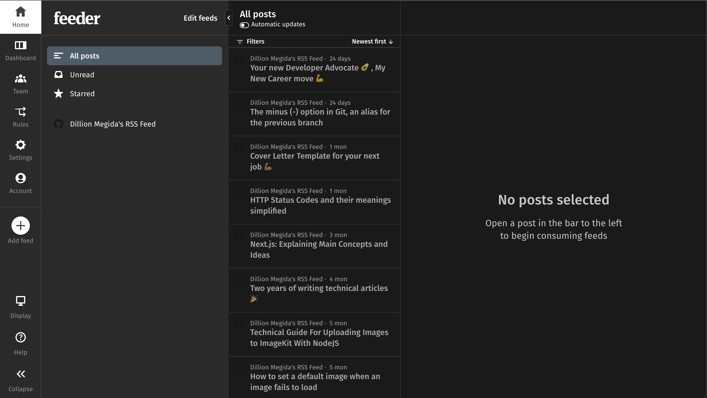
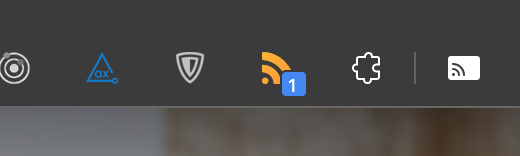
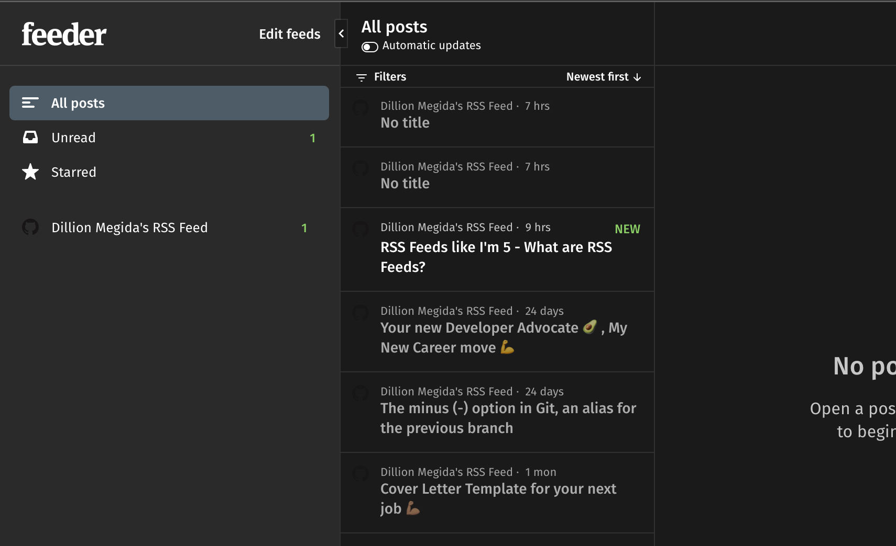

Heyyy...

You're probably thinking, "Who still uses RSS Feeds? Isn't that like a long time ago??". While I may not be sure if MANY people still use it, I know some do, and with its relevance that I realized recently, I'd be using it too.

If you're like me, the term "RSS Feed" has always been confusing. I know it's a file with a bunch of XML in it, but I've never really understood it. I finally did (thanks to a friend), and I want to share.

So RSS Feeds, like you've 5...

Do you have a blog that you follow consistently? Or maybe a newsletter? What I mean here is a blog where you constantly go to check for new content. Perhaps you don't do this, but some people do.

Think about blog pages for frameworks, web tools, or anything else that you use. You may go to check if there's a new post. If you're doing this for five blog platforms, you can imagine how tasking that can be, right? Either you have a checklist you use every day/week, or you may forget to check out a particular blog.

## Subscribing to blogs

A solution for this is that instead of continuously checking for new posts, you can subscribe to a blog (if that kind of subscribe form is provided). This way, when there's a new post, you'd get an email, and you can preview it.

But here are two cons of this method:

- "if that kind of subscribe form is provided"...It's common for newsletters to have a subscribe form, but for blog pages, you'd agree that they don't always have (well, at least in my experience).
- your email can be littered with many updates of new posts, and it can be challenging to follow or keep track

Now here comes RSS Feeds...

## RSS Feeds

RSS Feeds stand for Really Simple Syndication feeds.

They are like a raw version of a website (in XML format) that contains raw data of its content. They are also subscribe-able, which makes them very interesting.

RSS feeds make content follow-ups more effortless. Are you interested in following up on five newsletters, six blog pages, or ten content whatsoever? As long as the platforms on which these content exist are RSS-compatible, you can subscribe to them all. And when you do that, you can view all the content you've subscribed to in one place.

When you subscribe, you don't just get notified of new content. Depending on the platform you use to view the RSS Feeds, you can quickly identify blogs/newsletters with new content.

Here's what an RSS feed looks like:

The image above is the RSS Feed of my website (yes, I added them just while writing this article 😅). Check it out [https://dillionmegida.com/rss.xml](https://dillionmegida.com/rss.xml).

The image above is unreadable. What do you do with all these XMLs? And this is where RSS Feed Viewers come in. We'll see that in the next section.

It's worth noting that RSS Feeds are not just for blogs or newsletters. I used these examples because I believe you'll relate well to understand this article. RSS Feeds can be used for any kind of content. On a basic level, as an author of the feed, you're saving the title, date, URL, and maybe description of your content on the feed.

It's also important to know that you only have access to what the author made available to the feed when you view RSS Feeds.

## RSS Feed Viewer

Not everyone understands XML. And even for those that do, reading through XML may not be enjoyable. And that's why Feed viewers exist.

RSS Feed viewers parse different XMLs and display them in a more readable form. Some viewers have categories that easily let you know of new content that you haven't read yet. Some also send you push notifications or emails.

There are many of them, but here's one you can try out for free: [Feeder](https://feeder.co). You can also install the [Feeder Chrome Extension](https://chrome.google.com/webstore/detail/rss-feed-reader/pnjaodmkngahhkoihejjehlcdlnohgmp/related?hl=en)

Ensure to sign up on Feeder.

Install the extension on your browser, and you test along with me.

With the extension installed, when you open an RSS Feed of any platform ([my website's for example](/rss.xml)), you may get this modal:

Click Subscribe, and now you have one subscribed RSS Feed. When I go to my Feeder dashboard, here's how it looks:

You can see all the feeds you've subscribed to, starred content, and unread content in it. Different viewers offer you other options, but on the basic level, these are sufficient.

(I'm testing as I'm writing this article ...haha)

Now, I'm going to create a new article. I'll publish this current article (uncompleted yet) and see how the RSS Feed Viewer reacts.

On Feeder, your dashboard is updated every 2hrs for the FREE plan, so you'll have to wait for that time...

2+hrs later, and we have the following:

Chrome extension:

Dashboard:

## Conclusion

In this article, we've seen how RSS Feeds makes content follow-up and subscriptions easier and better.

One more beautiful thing about RSS Feeds is that you do not have to subscribe to newsletters using your email any longer. Your email stays clean of any Promotions, and you can subscribe to any RSS Feeds available.

If you use Gatsby for your blog, like myself, I recommend this article: [Adding an RSS Feed](https://www.gatsbyjs.com/docs/how-to/adding-common-features/adding-an-rss-feed/)

They could be many other alternative solutions to following up content-based platforms. I'm not saying RSS is the best. I want you to know how relevant they are. And now I hope you understand RSS Feeds better and want to give them a try.

If this was helpful to you, kindly share with your friends : )
