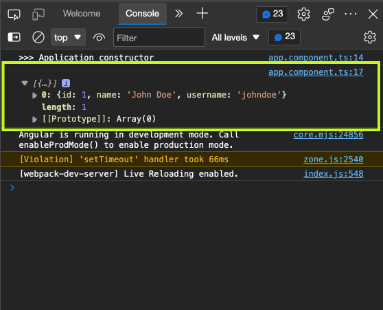
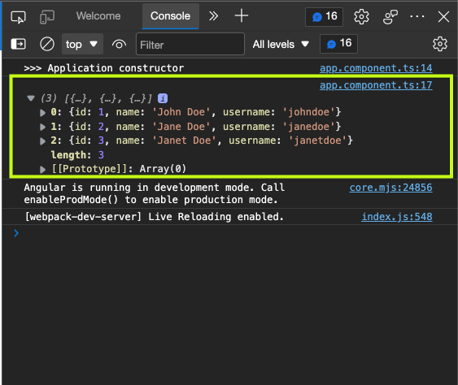

While working on an application yesterday, I struggled with observables and `Subject`s. After much research, it finally made sense.

In this article, I'll use a basic application to explain the difference between `Subject`s and `BehaviorSubject`s.

## TLDR:

With `Subject`s, you're saying, "Heyy producer... I'd love to subscribe for your future newsletters" but with `BehaviorSubject`s, you're saying, "Heyy producer... I'd love to subscribe to your future newsletters, but I'd still love to receive the last newsletter you sent"

With `Subject`s, you only receive the next values in the stream of values from the time of subscription. With `BehaviorSubject`s, you receive **the last value** as at the time of subscription as well as the next values in the stream.

If the TLDR is not enough, walk with me as I'll explain the difference in detail.

## Realizing that Subject was the solution to my problem

Early yesterday, I found myself repeating logic in an Angular application. It was a basic app, so I wasn't concerned until I wanted to "react to a change". At that point, I figured that since I'd like to react to it in a lot of places, I'd do so many more repetitions, and that would make the codebase unreadable. So I thought...Observables.

It was a hard search online learning how to create observables as I already knew how to subscribe to them. Until I found one way, and I implemented it. But I got stuck trying to add another data to the stream.

I did another search and discovered that subjects were what I needed. Long story short, I found myself debugging and debugging as I wasn't getting the data I subscribed to. Later on, I figured I was supposed to use `BehaviorSubject` and not `Subject` for my particular use case.

The TLDR section already concisely explains the difference, but I'll use an application to explain it more.

## Setting up the application

You can jump to the [using subjects section](#using-subjects) if you don't care about the application setup.

Ensure you have [Node.js](https://nodejs.org/en/) [Angular](https://angular.io/) installed globally on your system to follow along.

Set up a new project with the following command on your terminal:

"`bash
ng new subject-app

```

You can do without routing, and you can use any stylesheet of your choice. We won't be needing those.

Go into the project directory and start your application with the following command:

"`bash
cd subject-app
ng serve
```

## Creating a service for shared data

We'll use two files to understand the difference between `Subject`s and `BehaviorSubject`s--the `app.component.ts` (which already exists) and the `user.service.ts` (which we'll create).

To create that service file, go into your terminal and run the following command:

"`bash
ng g service user

````

`ng g service` is an angular command that generates a service file and a spec file for you. Using this, I have `/app/user.service.ts` to be:

```ts
import { Injectable } from "@angular/core"

@Injectable({
  providedIn: "root",
})
export class UserService {
  constructor() {}
}
````

So let's jump to the subjects now.

## Using subjects

This `user` service will have a `users$` observable, which the `app.component.ts` can be subscribed to. So let's update the users service to the following:

```ts
import { Injectable } from "@angular/core"
import { Subject } from "rxjs" // hightlight-line

// hightlight-start
const users = [
  {
    id: 1,
    name: "John Doe",
    username: "johndoe",
  },
  {
    id: 2,
    name: "Jane Doe",
    username: "janedoe",
  },
  {
    id: 3,
    name: "Janet Doe",
    username: "janetdoe",
  },
]
// hightlight-end

@Injectable({
  providedIn: "root",
})
export class UserService {
  users$ = new Subject<any>() // hightlight-line

  constructor() {
    this.users$.next(users) // hightlight-line
  }
}
```

From the above, we have the `users$` subject. And in the constructor, we add the users data to the observable stream.

Let's update `app.component.ts` to the following:

```ts
import { Component } from "@angular/core"
import { UserService } from "./user.service"

@Component({
  selector: "app-root",
  templateUrl: "./app.component.html",
  styleUrls: ["./app.component.scss"],
})
export class AppComponent {
  title = "subject-tutorial"
  users: any[] = [] // highlight-line

  // highlight-start
  constructor(private user: UserService) {
    console.log("Application constructor")
    this.user.users$.subscribe(users => {
      this.users = users
      console.log(users)
    })
  }
  // highlight-end
}
```

We access the `users$` observable from the constructor and subscribe to it. But let's see what happens in our console when we run the application:


From the image above, you'd notice that "Application constructor" is logged, but the callback function argument for the subscribe function is not evoked. That's because with `Subject`s, we're only subscribing to the next value in the stream. Not the last value. The previous value is the `users` array which was added to the stream after declaring the service (`private user: UserService`).

To get the next data in the stream, let's update our service with the following:

```ts
@Injectable({
  providedIn: "root",
})
export class UserService {
  users$ = new Subject<any>()

  constructor() {
    this.users$.next(users)
  }

  // hightlight-start
  updateUsers() {
    this.users$.next([users[0]])
  }
  // hightlight-end
}
```

We've added a method that allows us to manually add data to the stream (an array of the first object in the user's array). Let's call this method on `app.component.ts` using the following:

```ts
export class AppComponent {
  title = "subject-tutorial"
  users: any[] = []

  constructor(private user: UserService) {
    console.log(">>> Application constructor")
    this.user.users$.subscribe(users => {
      this.users = users
      console.log(users)
    })

    this.user.updateUsers() // hightlight-line
  }
}
```

From the above, after subscribing to the observable, we manually add the `next` data to the stream, and we can confirm from the image below that the subscription now gets new "newsletters":



Now, how does `BehaviorSubject`s come in? We don't have to "wait" for the next value with this type of subject. We can subscribe and also have access to the last value. Let's update the service to the following:

```ts
// previous imports
import { BehaviorSubject } from "rxjs" // hightlight-line

@Injectable({
  providedIn: "root",
})
export class UserService {
  users$ = new BehaviorSubject<any>(undefined) // hightlight-line

  constructor() {
    this.users$.next(users)
  }

  // updateUsers() {
  // this.users$.next([users[0]])
  // }
}
```

We've replaced `Subject` with `BehaviorSubject,` and we also passed a default value of `undefined` to the subject (because subscriptions would also have access to the "last" value).

And we update the `app.component.ts` to the following:

```ts
export class AppComponent {
  title = "subject-tutorial"
  users: any[] = []

  constructor(private user: UserService) {
    console.log(">>> Application constructor")
    this.user.users$.subscribe(users => {
      this.users = users
      console.log(users)
    })

    // don't need this anymore
    // this.user.updateUsers()
  }
}
```

And we'd have this in the console:



## Wrap up

I believe this clearly explains how these two types of Subjects work. There's also [`ReplaySubject`s](https://rxjs.dev/api/index/class/ReplaySubject), which are like `BehaviorSubject`s, but the key difference is, they have access to previous values. The keyword here is plural **values**. Behavior has access to the last value on subscription, while Replays has access to all previous values. Which means they could take two, three, or even more of the earlier values.

It just depends on what you're trying to subscribe to. If it's something where you need the last value in your subscription, then use `BehaviorSubject`. But if you're only concerned about future values, use `Subject`. I'm not sure about the disadvantages of using one over the other.

This is not a complete guide on the differences between these subjects. There's probably more to it, but this was what helped me yesterday, and I hope it clarifies things for you too.
