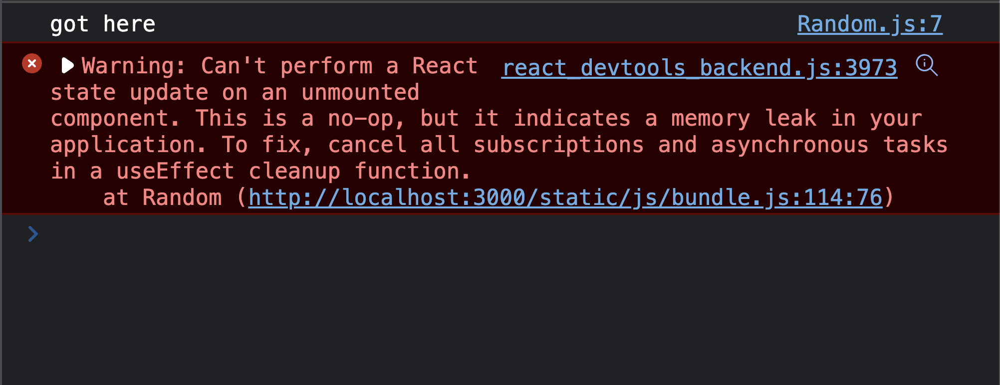

Well, because cleaning up is generally a good thing :)

Side effects happen a lot in React applications (in web applications generally. These effects include making asynchronous API calls, updating the DOM, creating sockets, etc. These side effects can happen when a button is clicked, when a form is submitted, or when a component mounts.

The `useEffect` hook in React gave functional components the power to do stuff when a component mounts or when some props or state changes. This hook also allows you to cleanup when the component unmounts.

What are side effects cleanups? Why should you cleanup them? How do you cleanup them?

In this article, I'll answer these questions, and hopefully, you will get a better hang of the `useEffect` hook at the end of it.

## What are side effects cleanups in React components

Cleaning up side effects in React is a way of stopping side effects that do not need to be executed anymore. A common reason why side effects can be irrelevant is when they are unmounted.

I order food at work, I get home, and the food arrives at work. What do I need the food for anymore? Feels like a waste of money. As a cleanup, I would want to cancel the order before going home if I do not get it.

For example, `ComponentA` makes an API request to get a list of products, but while making that asynchronous request, `ComponentA` is removed from the DOM (is umounted). There is no need to complete that asynchronous request. So as a cleanup method to improve your application, you can cleanup (cancel) the asynchronous request from completing.

Another example, `ComponentB` creates a WebSocket connection to a backend server which sends data that we need to add the UI data. When `ComponentB` unmounts, there is no need to have that socket connection on. You'll only be wasting network resources on the browser. `ComponentB` is mounted again, and another socket connection is created, making two connections. As a cleanup method, you can close the WebSocket connection when it unmounts.

## Why should you cleanup when a Component unmounts?

1. To avoid memory leaks
2. To optimize our applications for a good user experience
3. To prevent unexpected errors in our applications

### 1. To avoid memory leaks

Memory leaks in JavaScript occur when a piece of memory is occupied unnecessarily. This means that a portion of memory that should be available for use (should be accessible by a part of the application) is not available. Instead of being unavailable for a good cause (such as being used by another part of the application), it isn't.

When a component performs some side effects, the component indeed needs the side effects, so memory isn't wasted. It's a good cause. But if the component "forgets" the side effect and unmounts, it causes a leak. The side effect occupies some memory, but there's no component using it.

In some cases, [Garbage Collection](https://dev.to/dillionmegida/garbage-collection-in-javascript-3659) manages memory and clears up such memory usage. But if the side effects "keep working", it will keep using that memory. A good example is a WebSocket connection created by a component that unmounts later on. Since the connection keeps working, it will be a memory leak (it is constantly connected and waiting for events).

### 2. To optimize our applications for a good user experience

With many needless things happening in the background, there is more memory usage. This is still linked to the memory leaks situation. The more the memory usage, the lesser the available memory to do other things, thereby affecting the user experience on your application. Responses may be delayed, interactions may be delayed, and things like that.

### 3. To prevent unexpected errors in our applications

Sometimes, these are also necessary to avoid bugs in our applications. A great example of such bugs is when you are trying to "do something afterward" when a side effect completes, such as updating the state from a component that has unmounted.

Let's see a quick code example. Say we have two components, `App.js` and `Random.js` like this:

```js
// Random.js

import { useEffect, useState } from "react"

export default function Random() {
  const [state, setState] = useState(0)

  useEffect(() => {
    console.log("got here")

    setTimeout(() => {
      setState(1)
    }, 3000)
  }, [])

  return <>Random</>
}
```

```js
// App.js

import { useState, useEffect } from "react"
import Random from "./Random"

export default function App() {
  const [show, setShow] = useState(true)

  useEffect(() => {
    setTimeout(() => {
      setShow(false)
    }, 1000)
  }, [])

  return <div>{show && <Random />}</div>
}
```

The `App` component has a `show` state such that when true, the `Random` component shows on the screen. On mount, the `App` component sets a timeout if one second, which updates the `show` state to false afterwards, thereby unmounting the `Random` component.

The `Random` component, on the other hand, has a `state` state, and on mounting, with a timeout of three seconds, updates the `state` state.

But after one second, this `Random` component unmounts, which means on the third second where the component oughts to update the `state` component, it won't exist. Running this gives this error:



To avoid such errors, you have to clean up the side effect that does this update.

## How to Cleanup side effects in React

The syntax of `useEffect` is:

```js
useEffect(callbackFunction, dependencies)
```

Any returned function in `callbackFunction` serves as a cleanup function like this:

```js
useEffect(() => {
  return () => {
    // some cleanup stuff
  }
}, dependencies)
```

React executes this function:

- when the component unmounts ([`componentWillUnmount`](https://reactjs.org/docs/react-component.html#componentwillunmount) in class components)
- when the component updates ([`componentDidUpdate`](https://reactjs.org/docs/react-component.html#componentdidupdate) in class components)

The cleanup function is a way of "cleaning up stuff" before the next thing happens. The next thing can be the component unmounting, or it could be the next rerender (after state changes, for example).

### Use cases for cleaning up side effects in React

There are many forms of side effects, but we'll look at three use cases.

#### 1. Cleaning up API requests on unmount

In the cleanup function, you can abort requests using `AbortController` in [fetch](https://developer.mozilla.org/en-US/docs/Web/API/AbortController/abort) or [axios](https://github.com/axios/axios#cancellation). I believe they will also provide some abort methods for other request libraries.

Here's how it looks in code:

```js
useEffect(() => {
  const controller = new AbortController()
  const { signal } = controller

  const fetchData = async () => {
    const response = await fetch("some api here", { signal })
    // do something with response (update state or dom or whatever)
  }

  fetchData()

  return () => controller.abort()
}, [])
```

If the component unmounts and the fetch request has not been completed, the request is canceled.

#### 2. Cleaning up WebSocket connections

When you create a WebSocket connection, you can close it in the cleanup function. Here's how:

```js
useEffect(() => {
  const socket = new WebSocket("url", protocols)
  // do what you want with the socket

  return () => socket.close()
}, [])
```

With this, you won't leave socket connections on (and potentially create unlimited connections) when a component unmounts.

#### 3. Cleaning up timeouts

When you declare a `setTimeout`, you [can cancel it](https://dev.to/dillionmegida/how-to-cancel-a-settimeout-in-javascript-l2p) when the component unmounts. Here's how:

```js
useEffect(() => {
  const timeoutId = setTimeout(() => {
    // do something in the timeout
  }, 3000)

  return () => clearTimeout(timeoutId)
}, [])
```

With this, you don't have to worry about uncompleted timeouts when the component unmounts because they will be canceled.

## Conclusion

The cleanup function in `useEffect` is a handy function that gives us as much power as class components. There's the `componentWillUnmount` lifecycle method in class components, triggered when a component is about to unmount.

This cleanup function helps us clean up side effects that are no longer needed when a component unmounts. Such things include API requests, timeouts, socket connections, etc.

I've also shown you examples and use cases where cleanups can be effective.

If you learned from this article, kindly share :)
