Trailer/Demo:

<iframe width="100%" height="315" src="https://www.youtube.com/embed/0HikfLro_UM" title="YouTube video player" frameborder="0" allow="accelerometer; autoplay; clipboard-write; encrypted-media; gyroscope; picture-in-picture" allowfullscreen></iframe>

This is going to be quite a long tutorial post but trust me, you would love the end result of what you build. Grab your bottles of water and read/code along.

---

This post was originally posted on [Stream's blog](https://getstream.io/blog/gmail-spaces-clone-react/)

The Gmail Spaces in-app messaging feature allows Gmail account users to create spaces for long-term conversations between other users.

Using Stream Chat and the [React SDK](https://getstream.io/chat/docs/react/?language=javascript) from Stream, you will create a clone of this Gmail feature. We will call this **stream-spaces** 🚀

## Application Features

There are many complex and straightforward features in Gmail spaces, some of which integrate with other Gmail services, but we cannot do that all in this clone.

The scope of this clone includes:

- Sign in using different user accounts
- Creating new spaces with add members functionality
- Navigating chat spaces with the URL
- Browsing spaces
- Pinning spaces
- Joining/Leaving spaces

## Prerequisites and What You Will Learn

As a prerequisite to understanding and following this tutorial, you should have basic knowledge of React.

In this article, you will learn how to build this clone using the following concepts:

- Creating a new Stream Application
- Connecting your client React app to Stream and authenticating users
- Creating React Context for global state management
- Customizing the SDK’s components by overwriting CSS classes and using Context from the SDK
- Creating custom hooks and using built-in React hooks

## Let’s Build Our Gmail Spaces Clone


### Developer Setup

For this tutorial, you will install packages with NPM, so you need to have [Node installed](https://nodejs.org/en/) on your system. Alternatively, you can use yarn if you prefer that.

For this tutorial, I used [Node v16.13.1](https://nodejs.org/ru/blog/release/v16.13.1/). I encourage you to use the same version if you are coding along.

### Setting Up Stream

A Stream Chat App handles all the backend messaging services (events, channels, and so on) that your client chat app needs to provide an effective messaging experience.

To create a chat app on Stream, you need a Stream account. If you do not have one, head over to the [register page](https://getstream.io/try-for-free/) for a free trial account or register for a [Maker Account](https://getstream.io/blog/maker-account/) for free indefinite access to Stream.

To create a chat app:

1. Go to your [Stream dashboard](https://dashboard.getstream.io/)
2. Select **Create App**

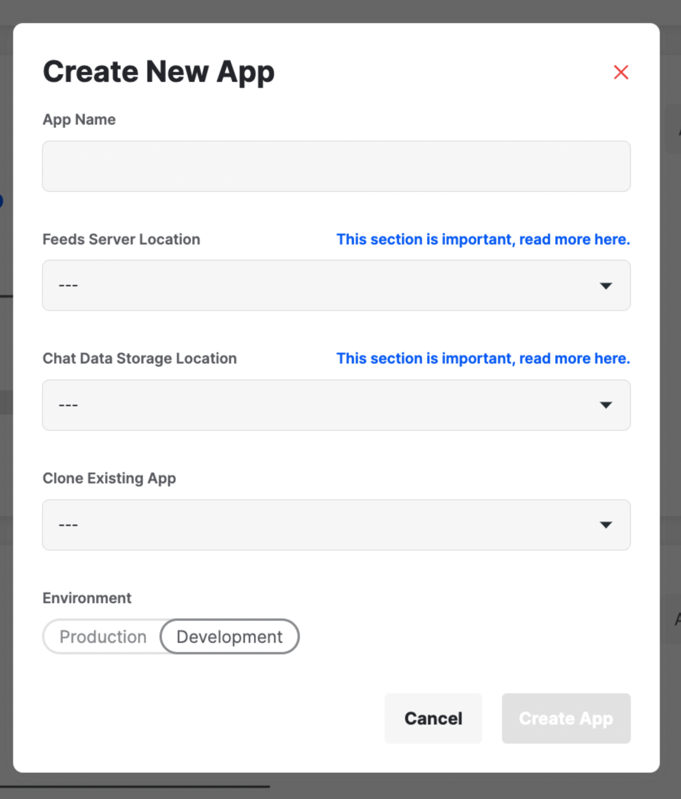

3. Enter an App Name (stream-spaces, for this tutorial)
4. Set your Server Location
5. Set the Environment to Development
6. Click on the Create App button

After creating your app, you will see it on your dashboard:


On your dashboard, you can manage the different channel types in your app, manage your API keys, add and remove users, add permissions, and many other admin-related operations.

You won’t be doing so much on this dashboard in this tutorial. You will instead create channels and users from the [React SDK](https://getstream.io/chat/sdk/react/).

Your **API Key** is unique to your application and is required to create a chat instance on your client app. This key can be safely shared publicly.

Your application also has the **Secret Key**, which is also unique but required to perform admin-related API operations on your app, such as authenticating users and changing permissions, to name a few. This key should always be private, most preferably on a backend server.

For development purposes in this tutorial, we do not have a backend server, so we will primarily be using the **API Key**. Please take note of it as you will need it later.

### Create Your Gmail Spaces Clone Application

For creating the React application for this clone, we will use [create-react-app (CRA)](https://create-react-app.dev/). On your terminal, run:

```bash
npx create-react-app stream-spaces
cd stream-spaces
```

This will create a React starter project. Next, install the dependencies we need for the project. There are two categories of dependencies.

**Stream’s dependencies**:

- [stream-chat](https://www.npmjs.com/package/stream-chat): the core stream chat JavaScript client library for creating a chat instance with several methods
- [stream-chat-react](https://www.npmjs.com/package/stream-chat-react): stream’s React SDK, built based on **stream-chat**, which provides UI components and context for building chat applications

**Other dependencies**:

- [react-router-dom](https://www.npmjs.com/package/react-router-dom): for adding routes to the application. In our case, we need the start page for selecting a user, and another page for the spaces
- [classnames](https://www.npmjs.com/package/classnames): utility library for dynamically joining classes together
- [date-fns](https://www.npmjs.com/package/date-fns): for interpreting dates in a readable manner
- [query-string](https://www.npmjs.com/package/query-string): for parsing query parameters in the URL. You will use this to set an active space based on the URL.
- [styled-components](https://www.npmjs.com/package/styled-components): for style declarations
- react@17 and react-dom@17: CRA installs the latest versions of **react** and **react-dom** (which is version 18, released recently), but Stream’s dependencies haven’t been updated to support React v18 yet.

Install dependencies by running:

```bash
npm install stream-chat stream-chat-react react-router-dom classnames date-fns query-string styled-components react@17 react-dom@17
```

### Application Folder Structure

Before jumping to the coding part, let us look at the folder structure of this application. First, this is what comes from CRA:

```txt
├── README.md
├── package-lock.json
├── package.json
├── node_modules
├── public
| ├── favicon.ico
| ├── index.html
| ├── logo192.png
| ├── logo512.png
| ├── manifest.json
| └── robots.txt
├── src
| ├── App.css
| ├── App.js
| ├── App.test.js
| ├── index.css
| ├── index.js
| ├── logo.svg
| ├── reportWebVitals.js
| └── setupTests.js
```

You need to update this following this structure:

- The components will be created in **src/components**, so create a components directory in the **src** folder
- The pages (starter and spaces pages) will be created in **src/views**, so create a **views** directory in the **src** folder
- Assets (icons and images) will be saved in **public/assets**, so create an **assets** directory in the **public** folder
- Custom hooks will be created in **src/hooks**, so create a **hooks** directory
- Utilities will be created in **src/utils** so create a **utils** directory

Now, you should have the following structure:

```txt
├── README.md
├── package-lock.json
├── package.json
├── public
| ├── assets/ // highlight-line
| ├── favicon.ico
| ├── index.html
| ├── logo192.png
| ├── logo512.png
| ├── manifest.json
| └── robots.txt
├── src
| ├── App.css
| ├── App.js
| ├── App.test.js
| ├── components/ // highlight-line
| ├── hooks/ // highlight-line
| ├── index.css
| ├── index.js
| ├── logo.svg
| ├── reportWebVitals.js
| ├── setupTests.js
| ├── utils/ // highlight-line
| └── views/ // highlight-line
```

### Add Assets

You need two categories of assets for this tutorial–icons and images. You only need one image, which will serve as the background in the spaces page.

And you need some icons for the UI. I got these icons from the [Remix Icon Library](http://remixicon.com/). Check out [this gist](https://gist.github.com/dillionmegida/19e0dd4b8031f07143d33326190f28e4) for the icons. Save these svg files in **public/assets/icons/**.

You also need an image for the background of the spaces page. Download it [from Unsplash](https://unsplash.com/photos/kgqu_qs3B78) and save it as **colored-background.jpg** in **public/assets/images/**.

### Create a Starter Page for Selecting Users

The starter page shows different demo users that a user can select from to use the spaces application. In an ideal application, the user will need to authenticate with a back-end server and a database with their credentials, but we will stick with demo users for demonstration purposes.

Here is what you will build in this section:


#### Add Demo Users

Create a new file called **src/users.js** and paste the following code:

```js
const users = [
  {
    id: "mike",
    name: "Mike",
    image:
      "https://i.picsum.photos/id/92/200/200.jpg?hmac=2cxZLFe94hVFQL5AERTDzRKET_GDG-2qpFi5-ctPekg",
  },
  {
    id: "mary1",
    name: "Mary",
    image:
      "https://i.picsum.photos/id/646/200/200.jpg?hmac=3jbia15y-hA5gmqVJjmk6BPJiisi4j-fNKPi3iXRiRo",
  },
  {
    id: "jake",
    name: "Jake",
    image:
      "https://i.picsum.photos/id/124/200/200.jpg?hmac=FuA4HgovVpaMlT_5gnjY_28jYCrrA2xrYXy3mJ9XDEw",
  },
  {
    id: "joe",
    name: "Joe",
    image:
      "https://i.picsum.photos/id/703/200/200.jpg?hmac=6zWxIBRmIf2e0jZTqvKBIwrc7wm-dPkvGky4go6Yyvg",
  },
]

export default users
```

This snippet above displays an array of users, each with an `id`, a required property for users to connect to the Stream app. `name` and `image` are optional properties, and you can add more data to the user object.

#### Create a Storage Utility

Next, create a storage utility in **src/utils/storage.js** with this code block:

```js
export const saveToStorage = (key, value) =>
  window.localStorage.setItem(key, value)

export const getFromStorage = key => window.localStorage.getItem(key)
```

This will handle saving and getting data from local storage. We need this utility to save the selected user **id** from the start page to the storage. This way, the user will not have to select a user on every refresh.

#### Add Global Default Styles

We need default styles for buttons, lists, and some other elements. Replace **src/index.css** with the following styles:

```css
@import url("https://fonts.googleapis.com/css2?family=Open+Sans:wght@400;500;600&family=Roboto:wght@500;700&display=swap");

body {
  margin: 0;
  font-family: "Roboto", -apple-system, BlinkMacSystemFont, "Segoe UI", "Roboto",
    "Oxygen", "Ubuntu", "Cantarell", "Fira Sans", "Droid Sans", "Helvetica Neue",
    sans-serif;
  -webkit-font-smoothing: antialiased;
  -moz-osx-font-smoothing: grayscale;
}

code {
  font-family: source-code-pro, Menlo, Monaco, Consolas, "Courier New",
    monospace;
}

* {
  box-sizing: border-box;
}

button {
  border: none;
  background: none;
  cursor: pointer;
}

button:disabled {
  cursor: not-allowed;
}

a {
  text-decoration: none;
}

ul {
  margin: 0;
  padding: 0;
  list-style: none;
}

li {
  padding: 0;
  margin: 0;
}

input {
  border: none;
}

h1,
h2,
h3,
h4,
h5,
h6,
p {
  margin: 0;
}
```

Using the [WhatFont](https://chrome.google.com/webstore/detail/whatfont/jabopobgcpjmedljpbcaablpmlmfcogm?hl=en) Chrome extension, you can identify the font used on a website. Gmail spaces uses **Google Sans** and **Roboto. Open Sans** (slightly similar to Google Sans) is public, and that’s what you have imported, together with **Roboto**, into the stylesheet.

#### Create the StartPage Component

For the starter page, create a new file **src/views/StartPage.js** with the following code:

```js
import { useNavigate } from "react-router-dom"
import styled from "styled-components"

import users from "../users"
import { saveToStorage } from "../utils/storage"

const Main = styled.main`
  display: flex;
  align-items: center;
  justify-content: center;
  width: 100%;
  height: 100vh;
  flex-direction: column;
  background-color: #eee;

  h1 {
    text-align: center;
    font-size: 20px;
    margin-bottom: 20px;
  }

  .users {
    display: flex;
    align-items: center;
    justify-content: space-between;
    width: 300px;
    margin: 0 auto;

    &__user {
      display: flex;
      flex-direction: column;
      img {
        width: 50px;
        height: 50px;
        border-radius: 50%;
        margin-bottom: 5px;
      }
      .name {
        margin: 0 auto;
        text-align: center;
      }
    }
  }
`

export default function Startpage() {
  const navigate = useNavigate()

  const onClickUser = id => {
    saveToStorage("user", id)
    navigate("/spaces")
  }

  return (
    <Main>
      <h1>Select a user</h1>
      <div className="users">
        {users.map(u => (
          <button
            onClick={() => onClickUser(u.id)}
            className="users__user"
            key={u.id}
          >
            
            <span className="name">{u.name}</span>
          </button>
        ))}
      </div>
    </Main>
  )
}
```

For some of the colors, I randomly selected a close color code, but for some notable colors, I used the [Eye Dropper](https://chrome.google.com/webstore/detail/eye-dropper/hmdcmlfkchdmnmnmheododdhjedfccka?hl=en) Chrome extension to pick the color from the Gmail spaces page.

In this page, you loop through the `users` array and display each one on the page.

When a user clicks on a user on the screen, the user’s id is saved to storage, and the browser navigates to **/spaces** where you will have the spaces page.

Now, you need to inform React to show this component on the index path.

#### Add a Route for the Start Page

Go to **src/App.js** and replace the content of the file to:

```js
import { BrowserRouter as Router, Routes, Route } from "react-router-dom"
import StartPage from "./views/StartPage"

export default function App() {
  return (
    <Router>
      <Routes>
        <Route path="/" element={<StartPage />} />
      </Routes>
    </Router>
  )
}
```

CRA created the **src/index.js** file with react and react-dom v18 syntax. Because you reverted to v17, update **src/index.js** to:

```js
import React from "react"
import ReactDOM from "react-dom"
import "./index.css"
import App from "./App"

ReactDOM.render(
  <React.StrictMode>
    <App />
  </React.StrictMode>,
  document.getElementById("root")
)
```

You can also delete the **src/App.css** file as you do not need it any more.

Start the development server by running `npm run start` on your terminal. On `http://localhost:3000`, you will get this page:

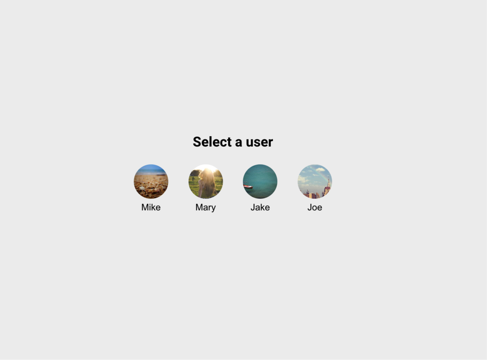

After selecting a user from the **StartPage**, the browser navigates to **/spaces**. This will display the **SpacesPage**, connect the user to Stream, and display the spaces the user belongs to.

Creating this page was easy.


### Connect a User to Stream in the SpacesPage Component

To create the **SpacesPage**, you first need a **Layout**. For the Layout, you also need a **Sidebar** component, which holds the “Mail”, “Chat” and “Spaces” buttons and toggles the spaces list visibility.

Here’s what you will build in this section:

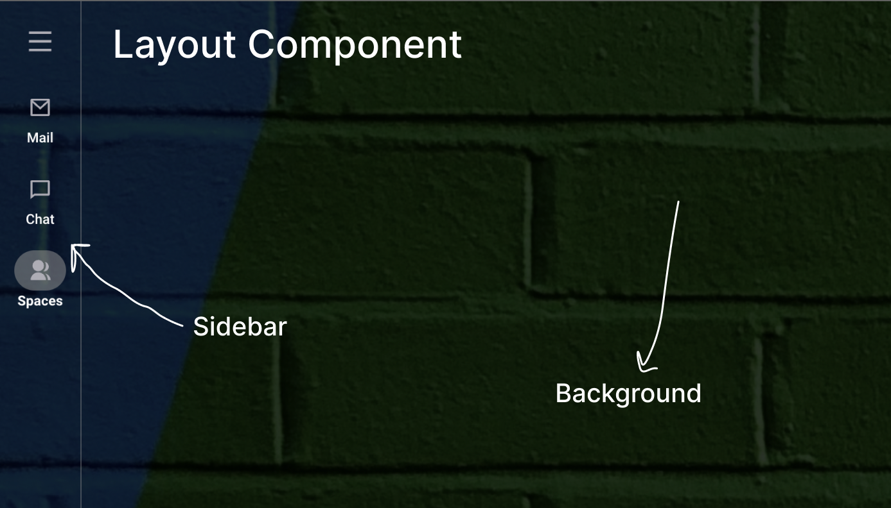

#### Create a Sidebar Component

Let us start from the **Sidebar**. Create a new file, **src/components/Sidebar.js** with this code:

```js
import { useContext } from "react"
import { Link } from "react-router-dom"
import styled from "styled-components"

import { LayoutContext } from "./Layout"

const links = [
  { icon: "/assets/icons/mail.svg", label: "Mail", href: "#" },
  { icon: "/assets/icons/chat.svg", label: "Chat", href: "#" },
  { icon: "/assets/icons/people.svg", label: "Spaces", href: "/spaces" },
]

const Container = styled.div`
  padding: 5px;
  --borderRightColor: ${({ rightBorderVisible }) =>
    rightBorderVisible ? "rgba(146, 146, 146, 0.433)" : "transparent"};
  border-right: 1px solid var(--borderRightColor);
  height: 100%;

  .toggle-container {
    display: flex;
    justify-content: center;
    width: 100%;
    margin-bottom: 10px;

    .toggle-btn {
      width: 60px;
      height: 60px;
      border-radius: 50%;
      display: flex;
      justify-content: center;
      align-items: center;
      img {
        width: 26px;
        height: 26px;
      }

      &:hover {
        background-color: rgba(146, 146, 146, 0.233);
      }
    }
  }
  .nav-links {
    display: flex;
    flex-direction: column;

    .link {
      display: flex;
      flex-direction: column;
      align-items: center;
      color: white;
      margin-bottom: 20px;
      text-align: center;
      font-size: 12px;

      &:nth-child(3) {
        font-weight: bold;
        .img-block {
          background-color: rgba(146, 146, 146, 0.533);
        }
      }

      .img-block {
        width: 45px;
        height: 35px;
        margin-bottom: 2px;
        display: flex;
        align-items: center;
        justify-content: center;
        border-radius: 20px;

        img {
          width: 20px;
          height: 20px;
        }

        &:hover {
          background-color: rgba(146, 146, 146, 0.533);
        }
      }
    }
  }
`

export default function Sidebar() {
  const { isSpacesListOpen, setIsSpacesListOpen } = useContext(LayoutContext)

  return (
    <Container rightBorderVisible={isSpacesListOpen}>
      <div className="toggle-container">
        <button
          onClick={() => setIsSpacesListOpen(!isSpacesListOpen)}
          className="toggle-btn"
        >
          
        </button>
      </div>
      <div className="nav-links">
        {links.map(link => (
          <Link key={link.label} className="link" to={link.href}>
            <div className="img-block">
              
            </div>
            <span>{link.label}</span>
          </Link>
        ))}
      </div>
    </Container>
  )
}
```

In this component, you loop through the links array and display each link with their icons with the toggle side spaces button. On clicking the toggle button, the `setIsSpacesListOpen` function from the `LayoutContext` is called. This context isn’t created yet. You will create that in the **Layout** component.

#### Create a Layout Component

Create a new file **src/components/Layout.js** with:

```js
import React, { createContext, useState } from "react"
import styled from "styled-components"

import Sidebar from "./Sidebar"
import { getFromStorage, saveToStorage } from "../utils/storage"

const Container = styled.div`
  display: flex;
  background-color: #333;
  height: 100vh;
  width: 100%;
  position: relative;
  background: url(/assets/images/colored-background.jpg) center no-repeat;
  &::after {
    position: absolute;
    content: "";
    left: 0;
    top: 0;
    width: 100%;
    height: 100%;
    background-color: rgba(0, 0, 0, 0.8);
    z-index: 0;
  }

  .sidebar,
  .content {
    position: relative;
    z-index: 1;
    height: 100vh;
  }

  .content {
    width: 100%;
    flex: 1;
  }
`

const spacesListStatusFromStorage = getFromStorage("is_spaces_list_open")

export const LayoutContext = createContext()

export default function Layout({ children }) {
  const [isSpacesListOpen, setIsSpacesListOpen] = useState(
    spacesListStatusFromStorage === "true" ? true : false
  )

  const setSpacesStatus = status => {
    const statusToBoolean = status || status === "true" ? true : false
    saveToStorage("is_spaces_list_open", statusToBoolean)
    setIsSpacesListOpen(statusToBoolean)
  }

  return (
    <LayoutContext.Provider
      value={{
        isSpacesListOpen,
        setIsSpacesListOpen: setSpacesStatus,
      }}
    >
      <Container>
        <div className="sidebar">
          <Sidebar />
        </div>
        <div className="content">{children}</div>
      </Container>
    </LayoutContext.Provider>
  )
}
```

In this code, you set the background of the `Layout` to be an image from the asset folder. Also, the local storage keeps track of the spaces list status, be it open or not.

Also, you create a `LayoutContext` and pass the `isSpacesListOpen` state and `setIsSpacesListOpen` method to the children components. The `Sidebar`, a child of this component, uses these context data to update the spaces list status accordingly with the toggle button.

#### Create a SpacesPage Component

For the spaces page, create a new file **src/views/SpacesPage.js** with the following code:

```js
import React, { useEffect, useState } from "react"
import { StreamChat } from "stream-chat"
import { useNavigate } from "react-router-dom"
import { Chat, LoadingIndicator } from "stream-chat-react"

import Layout from "../components/Layout"
import { getFromStorage } from "../utils/storage"
import users from "../users"

import "stream-chat-react/dist/css/index.css"

const API_KEY = "f5wu7bvh4xg5"

export default function SpacesPage() {
  const [chatClient, setChatClient] = useState(null)
  const navigate = useNavigate()

  const userId = getFromStorage("user")

  const user = users.find(({ id }) => id === userId)

  useEffect(() => {
    if (!user) return navigate("/")

    const client = StreamChat.getInstance(API_KEY)

    client.connectUser(user, client.devToken(user.id))

    setChatClient(client)

    return () => {
      client?.disconnectUser()
    } // cleanup user connection on unmount
  }, [])

  return (
    <Layout>
      {!chatClient ? <LoadingIndicator /> : <Chat client={chatClient}></Chat>}
    </Layout>
  )
}
```

The notable parts of this code are:

- `import '.../index.css'` to import Stream’s classes for the UI components
- You get the saved `userId` from the local storage and find the user from the users array
- On mount, using **[useEffect](https://reactjs.org/docs/hooks-effect.html)**, you:

  - Navigate to the homepage if the **userId** is not found in the users array
  - Create a chat instance, using the **API Key** of your app on your dashboard
  - **Connect the user** to the Stream app by passing the **user** object and a **token**
  - Return a cleanup function, which disconnects the user from the Stream app when the component unmounts
  - If the `chatClient` is null, you return a `LoadingIndicator` from the React SDK, else, you return the **[Chat](https://getstream.io/chat/docs/sdk/react/core-components/chat/)** component and pass the `chatClient` to the `client` prop

  **Note:** the connectUser method creates a WebSocket connection which connects a user to a Stream application. This connection aids emitting and reponding to different events that occur in the application. Learn more in the [Initialization and Users documentation](https://getstream.io/chat/docs/react/init_and_users/?language=javascript&q=connectUser). Also, here is a [best practicie for connecting and disconnecting a user](https://getstream.io/chat/docs/react/instantiating_the_client/?language=javascript&q=disconnectUser#examples).

Stream uses **tokens** for [user authentication](https://getstream.io/chat/docs/react/tokens_and_authentication/) to verify that a user has authorized access to your Stream app. Ideally, this token should be [generated using your secret key](https://getstream.io/chat/docs/react/tokens_and_authentication/#generating-tokens), and this should happen on your backend server as you wouldn’t want to expose the secret key. For development purposes, we will use **development tokens** generated with the **devToken** method which takes a user id argument as seen in the code:

```js
 ...client.devToken(user.id)
```

For development tokens to work, your app must be in development mode and you must disable authentications on your Stream dashboard.

Head over to [your dashboard](http://dashboard.getstream.io/), select the **stream-spaces** app and scroll down to the **Authentication Section**:

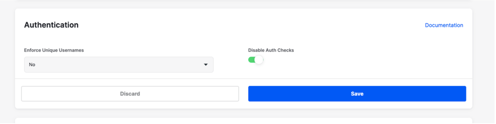

Select **Disable Auth Checks** and click on Save. With this, you can now use development tokens.

#### Add a Route for the Spaces Page

Back to **src/App.js**, you need to add a route for the spaces page. First, import the **SpacesPage** component:

```js
import SpacesPage from "./views/SpacesPage"
```

Below the first route for the start page, add:

```js
<Route path="/spaces" element={<SpacesPage />} />
```

Back on your browser on **http://localhost:3000**, select a user, and you will be navigated to the spaces page, showing this:

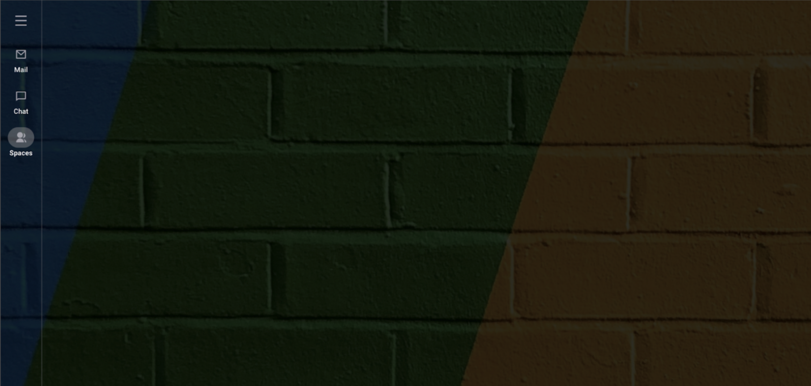

In your dashboard, select **Explorer** and **users** to see the users in your app:


Currently, there are two users: **mike** and **dillion-megida-stream**. The former is the user I clicked on in the Start page, and the latter is the admin user that is created for my app when I created an account on Stream. In your case, you will find your organization name.

To add more users, go to the Start page and click every demo user.

Now, your users dashboard should have all users added:

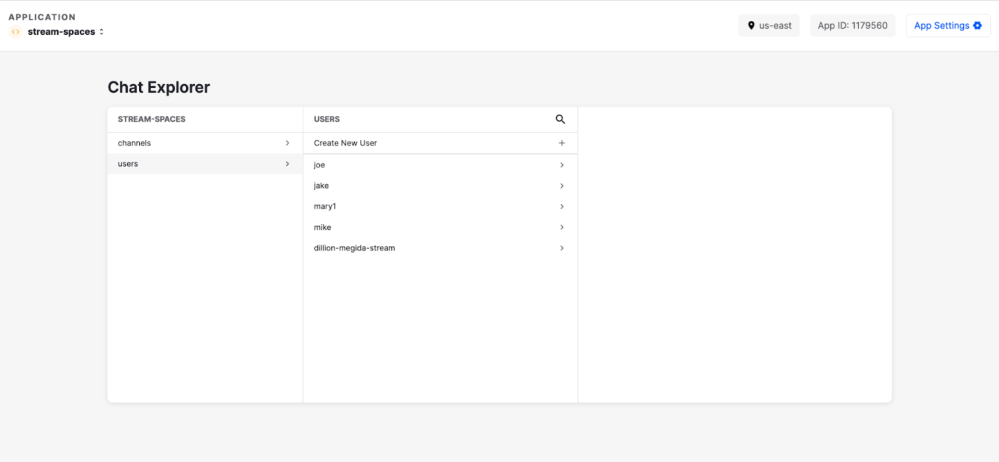

### Create the Spaces Layout Component

The Layout component you created in the previous component serves as the main layout for the app. Now, you need to create a spaces layout which will show the **header** (showing the search input and user icon), the **spaces list** and the **conversations** in a space.

Here’s what you will build in this section:

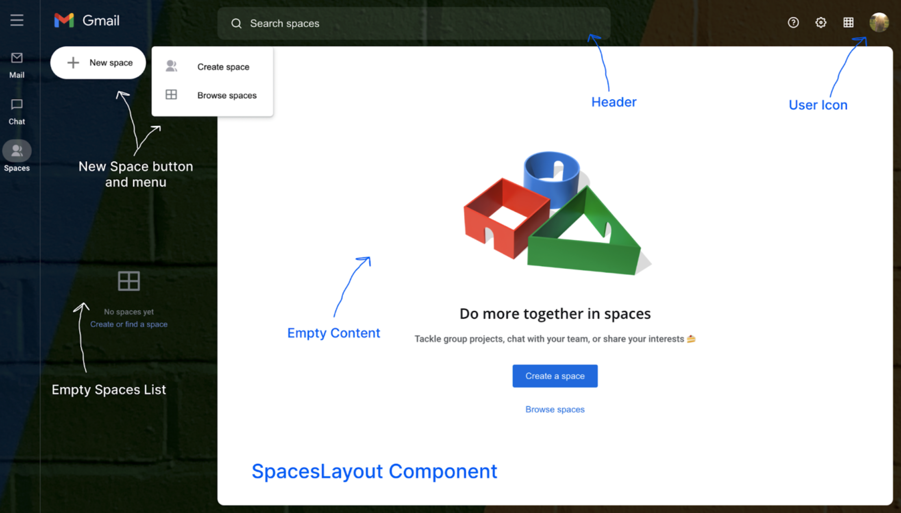

Let us start with the header.

#### Creating a Header Component

Create a new file **src/components/spaces/Header.js** with the following:

```js
import { useChatContext } from "stream-chat-react"
import styled from "styled-components"

const StyledHeader = styled.header`
  padding: 15px 0 10px;
  display: flex;

  .left-column {
    width: var(--leftColumnWidth);

    .gmail-logo {
      margin-left: 20px;
      img {
        height: 40px;
      }
    }
  }

  .right-column {
    flex: 1;
    display: flex;
    align-items: center;

    .search-input {
      position: relative;
      height: 50px;
      width: 600px;
      color: blue;

      img {
        position: absolute;
        left: 20px;
        bottom: 0;
        top: 0;
        margin: auto 0;
      }

      input {
        background-color: rgba(255, 255, 255, 0.1);
        height: 100%;
        width: 100%;
        border-radius: 10px;
        padding-left: 50px;
        outline: none;
        font-size: 16px;

        &::placeholder {
          color: white;
        }
      }
    }

    .other-options {
      padding-right: 20px;
      margin-left: auto;
      display: flex;
      align-items: center;
      .option-btn {
        margin-right: 10px;
        img {
          width: 20px;
          height: 20px;
        }
      }

      .user-icon {
        img {
          object-fit: cover;
          border-radius: 50%;
          width: 30px;
          height: 30px;
        }
      }
    }
  }
`

export default function Header() {
  const { client } = useChatContext()

  return (
    <StyledHeader>
      <div className="left-column">
        <div className="gmail-logo">
          
        </div>
      </div>

      <div className="right-column">
        <div className="search-input">
          
          <input placeholder="Search spaces" />
        </div>

        <div className="other-options">
          {[
            { img: "/assets/icons/question.svg", alt: "Help icon" },
            { img: "/assets/icons/settings.svg", alt: "Settings icon" },
            { img: "/assets/icons/tiny-grid.svg", alt: "Google apps icon" },
          ].map(option => (
            <button className="option-btn" key={option.alt}>
              
            </button>
          ))}
          <button className="user-icon">
            
          </button>
        </div>
      </div>
    </StyledHeader>
  )
}
```

Using **[useChatContext](https://getstream.io/chat/docs/sdk/react/contexts/chat_context/)**, exposed by the React SDK, you get the `client` object, which has a `user` object that contains information about the user. With this, you can display the user’s image on the profile icon.

Next, you will create the **SpacesList** component. This component contains a list of spaces, each with a context menu (with the pin and leave actions). Let us start by creating the context menu component.

The context menu and modals (which you will create later) look like a **Dialog** element. So, you will create a reusable Dialog component that can be shared between these components.

#### Create a Dialog Component

Create a new file **src/components/Dialog.js** with the following:

```js
import styled from "styled-components"

const Container = styled.div`
  background-color: white;
  box-shadow: 0 1px 2px 0 rgba(60, 64, 67, 0.3), 0 2px 6px 2px rgba(60, 64, 67, 0.15);
  border-radius: 5px;
`

export default function Dialog({ className, children }) {
  return <Container className={className}>{children}</Container>
}
```

#### Create a SpaceContextMenu Component

Create a new file **src/components/spaces/SpaceContextMenu.js** with the following:

```js
import styled from "styled-components"

import Dialog from "../Dialog"

const Container = styled(Dialog)`
  width: 100%;
  padding: 10px;
  background-color: white;
  border-radius: 5px;
  padding: 10px 0;

  .menu-btn {
    display: flex;
    align-items: center;
    width: 100%;
    text-align: left;
    padding: 7px 10px;

    &:hover {
      background-color: #ccc;
    }

    &__icon {
      width: 20px;
      margin-right: 20px;

      &--pin--unpin {
        position: relative;
        &::after {
          content: "";
          width: 2px;
          height: 20px;
          background-color: #5f6367;
          transform: rotate(45deg);
          position: absolute;
          right: 0;
          left: 0;
          margin: auto;
          bottom: 0;
          top: 0;
        }
      }

      img {
        width: 20px;
        height: 20px;
      }
    }

    &__details {
      .main-text {
        display: block;
        margin-bottom: 2px;
      }

      .sub-text {
        color: #666;
        font-size: 13px;
      }
    }
  }
`

export default function SpaceContextMenu({ space, onClickOption }) {
  const onLeave = async () => {}

  const onPin = async () => {
    onClickOption()
  }

  const onUnpin = async () => {
    onClickOption()
  }

  const menu = [
    {
      label: "Pin",
      icon: "/assets/icons/pin.svg",
      id: "pin",
    },
    {
      label: "Leave",
      icon: "/assets/icons/arrow-down.svg",
      subLabel: "You can always return",
      id: "leave",
    },
  ]

  const menuClicks = {
    leave: onLeave,
    pin: onPin,
  }

  return (
    <Container>
      {menu.map(m => (
        <button
          onClick={() => menuClicks[m.id]()}
          className="menu-btn"
          key={m.id}
        >
          <div className="menu-btn__icon">
            
          </div>
          <div className="menu-btn__details">
            <span className="main-text">{m.label}</span>
            {m.subLabel && <span className="sub-text">{m.subLabel}</span>}
          </div>
        </button>
      ))}
    </Container>
  )
}
```

In this component, you loop through the menu items (“Pin” and “Leave”), and you create handlers for these functions when clicked. For now, these functions do not do anything, but you will update them later.

For the UI of each of these items in the space list, you will create a **SpaceItem** component. But before that, we will create a custom hook–**useClickOutside**. The purpose of this hook is to handle click events outside dialogs. For example, when a click-outside happens on the context menu, we want them off the screen.

#### Create a useClickOutside Custom Hook

Create a new file **src/hooks/useClickOutside.js** with the following:

```js
import { useEffect } from "react"

export default function useClickOutside({ ref, cb }, dependencies) {
  useEffect(() => {
    const onClickOutside = e => {
      if (!ref || !ref.current) return

      if (!ref.current.contains(e.target)) cb()
    }

    window.addEventListener("click", onClickOutside)

    return () => window.removeEventListener("click", onClickOutside)
  }, [...dependencies])
}
```

This hook receives an object argument and a dependencies argument. The object has two properties:

- The **element reference**
- A **callback function**, which is called when a click-outside event occurs

#### Creating a SpaceItem Component

Create a new file **src/components/spaces/SpaceItem.js** with the following:

```js
import { useRef, useState } from "react"
import { useNavigate } from "react-router-dom"
import styled from "styled-components"

import useClickOutside from "../../hooks/useClickOutside"
import SpaceContextMenu from "./SpaceContextMenu"

const Container = styled.div`
  width: 100%;
  position: relative;
  border-radius: 30px;

  &.active {
    background-color: rgba(255, 255, 255, 0.3);
  }

  &:not(&.active):hover {
    background-color: rgba(255, 255, 255, 0.1);
  }

  .popup {
    position: absolute;
    max-width: 200px;
    width: 100%;
    left: calc(var(--leftColumnWidth) - 28px);
    top: 4px;
  }

  .preview-btn {
    width: 100%;
    display: flex;
    align-items: center;
    cursor: pointer;
    padding-right: 40px;

    .emoji {
      padding: 12px;
      width: 20px;
      height: 20px;
      border-radius: 50%;
      background-color: #ccc;
      display: flex;
      align-items: center;
      justify-content: center;
      margin-right: 8px;
    }

    .name {
      padding: 10px;
      font-size: 15px;
      color: white;
      flex: 1;
      text-align: left;
    }
  }

  &:hover {
    .more-btn {
      .more-icon {
        display: block;
      }
      .pin-icon {
        display: none;
      }
    }
  }

  .more-btn {
    position: absolute;
    right: 0;
    top: 2px;
    border-radius: 50%;
    align-items: center;
    justify-content: center;
    padding: 10px;
    display: flex;

    .more-icon {
      display: none;
    }

    .pin-icon {
      display: none;
      &--show {
        display: block;
      }
    }

    &:hover {
      background-color: rgba(255, 255, 255, 0.35);
    }

    img {
      width: 16px;
      height: 16px;
    }
  }
`

export default function SpaceItem({
  channel,
  displayTitle,
  active,
  setActiveChannel,
  watchers,
}) {
  const navigate = useNavigate()
  const menuRef = useRef(null)

  const [isMenuOpen, setIsMenuOpen] = useState(false)

  const onClickSpace = () => {
    navigate("?space_id=" + channel.id)
    setActiveChannel(channel, watchers)
  }

  const onClickSpaceMenu = () => {
    setIsMenuOpen(isMenuOpen => !isMenuOpen)
  }

  useClickOutside(
    { ref: menuRef, cb: () => isMenuOpen && setIsMenuOpen(false) },
    [isMenuOpen]
  )

  return (
    <Container className={active ? "active" : ""}>
      {isMenuOpen && (
        <div ref={menuRef} className="popup">
          <SpaceContextMenu
            onClickOption={() => setIsMenuOpen(false)}
            space={channel}
          />
        </div>
      )}
      <button onClick={onClickSpace} className="preview-btn">
        <div className="emoji">
          {channel.data.emoji || channel.data.name.charAt(0)}
        </div>
        <span className="name">{displayTitle}</span>
      </button>
      <button onClick={onClickSpaceMenu} className="more-btn">
        
        
      </button>
    </Container>
  )
}
```

This component receives five props:

- `channel`
- `displayTitle` (could be the `name` or `id` of the channel if `name` doesn’t exist)
- `active` (boolean, which indicates whether this channel is currently active or not)
- `setActiveChannel` (function for setting the active channel by clicking on the channel)
- [watchers](https://getstream.io/chat/docs/node/watch_channel/) (for querying watchers of a channel)

Conversations in Stream are stored in **channels**. Also, there are different [channel types](https://getstream.io/chat/docs/react/channel_features/).

In this space item component, the `useClickOutside` hook is used for hiding the context menu on a click-outside event.

When a space is clicked, the URL is updated with the spaces id, and the **setActiveChannel** function is used to set the active channel (that is, the active space).

Now, to the SpacesListcomponent.

#### Create a SpacesList Component

Create a new file **src/components/spaces/SpacesList.js** with the following:

```js
import { useContext, useEffect, useRef, useState } from "react"
import { useLocation } from "react-router-dom"
import { ChannelList, useChatContext } from "stream-chat-react"
import styled from "styled-components"
import queryString from "query-string"

import SpaceItem from "../spaces/SpaceItem"
import Dialog from "../Dialog"
import useClickOutside from "../../hooks/useClickOutside"
import { SpacesContext } from "./SpacesLayout"

const Container = styled.div`
  width: var(--leftColumnWidth);
  padding: 0 15px;
  height: 100%;
  display: flex;
  flex-direction: column;
  position: relative;

  .new-space-container {
    position: relative;

    .new-btn {
      max-width: 200px;
      border-radius: 30px;
      background-color: white;
      display: flex;
      align-items: center;
      padding: 10px 20px;
      margin: 0 0 20px;

      img {
        width: 30px;
        height: 30px;
        margin-right: 10px;
      }
    }

    .new-space-dialog {
      padding: 10px 0;
      padding-right: 5px;
      position: absolute;
      right: -100px;
      top: 0;
      z-index: 5;

      .menu-btn {
        padding: 10px 20px;
        width: 100%;
        display: flex;
        align-items: center;
        border-top-right-radius: 30px;
        border-bottom-right-radius: 30px;

        &:hover {
          background-color: #eee;
        }

        .icon {
          margin-right: 30px;

          img {
            width: 20px;
            height: 20px;
          }
        }
      }
    }
  }

  .spaces-empty {
    display: flex;
    justify-content: center;
    align-items: center;
    flex-direction: column;
    height: 100%;

    img {
      width: 40px;
      height: 40px;
      margin-bottom: 20px;
    }

    .no-spaces-text {
      color: #80868a;
      text-align: center;
      display: block;
      margin-bottom: 4px;
      font-size: 12px;
    }

    .create-space-btn {
      color: #7895dd;
      text-align: center;
      font-size: 12px;
    }
  }

  .spaces-list {
    .str-chat {
      width: 100%;
      height: 100%;

      &.messaging {
        background-color: transparent;
      }
    }

    .str-chat__channel-list-messenger {
      background: transparent;
      width: 100%;
      min-width: 100%;
    }

    .str-chat-channel-list .str-chat__channel-list-messenger__main {
      padding: 0;
      overflow: visible;
    }

    .str-chat__loading-channels {
      width: var(--leftColumnWidth);
      height: 100%;
      background: transparent;
    }
  }
`

export default function SpacesList() {
  const { channelListKey, spaces, setActiveSpace } = useContext(SpacesContext)
  const { client } = useChatContext()

  const location = useLocation()

  const newSpaceDialogRef = useRef(null)
  const [showNewSpaceDialog, setShowNewSpaceDialog] = useState(false)

  useClickOutside(
    {
      ref: newSpaceDialogRef,
      cb: () => showNewSpaceDialog && setShowNewSpaceDialog(false),
    },
    [showNewSpaceDialog]
  )

  const { space_id } = queryString.parse(location.search)

  useEffect(() => {
    if (!spaces) return

    async function init() {
      if (space_id) {
        const spaceById = spaces.find(s => s.id === space_id)
        if (spaceById) return setActiveSpace(spaceById)
      }

      setActiveSpace(spaces[0], false)
    }

    init()
  }, [space_id, spaces])

  const noSpaces = spaces?.length < 1

  return (
    <Container>
      <div className="new-space-container">
        <button onClick={() => setShowNewSpaceDialog(true)} className="new-btn">
          
          New space
        </button>
        {showNewSpaceDialog && (
          <div ref={newSpaceDialogRef}>
            <Dialog className="new-space-dialog">
              {[
                {
                  icon: "/assets/icons/people.svg",
                  label: "Create space",
                  id: "create",
                },
                {
                  icon: "/assets/icons/grid.svg",
                  label: "Browse spaces",
                  id: "browse",
                },
              ].map(menu => {
                const actions = {
                  create: () => null,
                  browse: () => null,
                }

                return (
                  <button
                    onClick={() => {
                      setShowNewSpaceDialog(false)
                      actions[menu.id]()
                    }}
                    className="menu-btn"
                    key={menu.id}
                  >
                    <div className="icon">
                      
                    </div>
                    <span className="label">{menu.label}</span>
                  </button>
                )
              })}
            </Dialog>
          </div>
        )}
      </div>

      {noSpaces ? (
        <div className="spaces-empty">
          
          <span className="no-spaces-text">No spaces yet</span>
          <button className="create-space-btn">Create or find a space</button>
        </div>
      ) : (
        <div className="spaces-list">
          <ChannelList
            key={channelListKey}
            Preview={SpaceItem}
            filters={{
              customType: "space",
              members: { $in: [client.user.id] },
            }}
          />
        </div>
      )}
    </Container>
  )
}
```

Notable things from this component:

- It also uses the Dialog component to display the two options for creating a space (Browsing spaces and Creating spaces)
- It uses the **[ChannelList](https://getstream.io/chat/docs/sdk/react/core-components/channel_list/)** component from the React SDK, applies a filter for the spaces that the currently logged-in user is a member of, and also uses a custom component, **SpaceItem**, as the **Preview** of each item in the list
- If there’s a `space_id` query from the URL, it gets the first space from the list of spaces and sets it as the active space. If there is no `space_id`, it sets the first space in the list as the active one.
- The channel list component also uses the `channelListKey` from the `SpacesContext`, which you will create shortly.

When the channel list key changes, the channel list rerenders. We need this functionality for cases where users join a new channel, or a channel is pinned.

#### Create a SpacesEmpty Component

When there are no spaces in the app, we want to show a Spaces Empty component. This will be the content of **SpaceContent** which you will create shortly.

Create a new file **src/components/spaces/SpacesEmpty.js** with:

```js
import styled from "styled-components"

const Container = styled.div`
  display: flex;
  justify-content: center;
  flex-direction: column;
  align-items: center;
  height: 100%;

  .img-block {
    width: 300px;
    height: 250px;

    img {
      object-fit: cover;
      width: 100%;
      height: 100%;
    }
  }

  h3 {
    font-family: "Open Sans";
    font-size: 22px;
    font-weight: 600;
    line-height: 40px;
    color: #202124;
    margin: 0 0 10px;
  }

  p {
    margin: 0;
    font-size: 14px;
    color: #5f6368;
  }

  .create-space-btn {
    background-color: #1b72e8;
    color: white;
    margin-top: 30px;
    width: 130px;
    height: 35px;
    border-radius: 3px;
  }

  .browse-spaces-btn {
    margin-top: 25px;
    color: #1b72e8;
  }
`

export default function SpacesEmpty() {
  return (
    <Container>
      <div className="img-block">
        
      </div>
      <h3>Do more together in spaces</h3>
      <p>
        Tackle group projects, chat with your team, or share your interests 🍰
      </p>
      <button className="create-space-btn">Create a space</button>
      <button className="browse-spaces-btn">Browse spaces</button>
    </Container>
  )
}
```

#### Create the SpaceContent Component

The function of this component is to show the header, message list, message input and reactions in a selected space (active channel according to Stream). For now, we will not add all the elements for this component.

Create a new file **src/components/spaces/SpaceContent.js** with:

```js
import { useContext } from "react"
import { Channel } from "stream-chat-react"
import styled from "styled-components"

import SpacesEmpty from "./SpacesEmpty"
import { SpacesContext } from "./SpacesLayout"

const Container = styled.div`
  background-color: white;
  width: 100%;
  height: 100%;
  position: relative;
  border-radius: 10px;
  overflow: hidden;
`

export default function SpaceContent() {
  const { spaces } = useContext(SpacesContext)

  if (!spaces) return <></>

  if (spaces.length < 1)
    return (
      <Container>
        <SpacesEmpty />
      </Container>
    )

  return (
    <Channel>
      <Container></Container>
    </Channel>
  )
}
```

Since there are no spaces yet in the app, the `SpacesEmpty` component will be visible in the container.

#### Create a SpacesLayout Component

With the different spaces section created, you can create a spaces layout component. Create a new file **src/components/spaces/SpacesLayout.js** with:

```js
import { createContext, useContext, useEffect, useState } from "react"
import { useChatContext } from "stream-chat-react"
import styled from "styled-components"
import { useNavigate } from "react-router-dom"
import classNames from "classnames"

import Header from "./Header"
import SpaceContent from "./SpaceContent"
import SpacesList from "./SpacesList"
import { LayoutContext } from "../Layout"

const Container = styled.div`
  height: 100vh;
  display: flex;
  flex-direction: column;
  padding-bottom: 20px;
  --leftColumnWidth: 270px;

  .body {
    flex: 1;
    display: flex;
    width: 100%;

    .left-column {
      position: relative;
      z-index: 1;
      transition: visibility 300ms, opacity 300ms, transform 300ms, width 300ms;

      &--hidden {
        opacity: 0;
        transform: translateX(-301px);
        width: 0;
        visibility: hidden;
      }

      &--show {
        opacity: 1;
        visibility: visible;
        transform: translateX(0);
        width: var(--leftColumnWidth);
        transition: transform 300ms, width 300ms;
      }
    }

    .right-column {
      flex: 1;
      width: 100%;
      padding-right: 20px;

      .str-chat,
      .str-chat__container {
        border-radius: 10px;
        height: 100%;
      }

      .str-chat-channel {
        height: 100%;
      }

      .str-chat.messaging {
        background-color: white;
      }

      .str-chat__date-separator {
        display: none;
      }
    }
  }
`

export const SpacesContext = createContext()

export default function SpacesLayout() {
  const navigate = useNavigate()
  const { client, setActiveChannel, channel } = useChatContext()
  const [spaces, setSpaces] = useState(null)
  const [users, setUsers] = useState(null)

  const setActiveSpace = (space, shouldNavigate = true) => {
    setActiveChannel(space)
    shouldNavigate && navigate("?space_id=" + space.id)
  }

  const { isSpacesListOpen } = useContext(LayoutContext)

  const [channelListKey, setChannelListKey] = useState(Math.random())

  const updateChannelListKey = () => setChannelListKey(Math.random())

  useEffect(() => {
    if (!client) return

    const initChannels = async () => {
      const spaces = await client.queryChannels({
        customType: "space",
        members: { $in: [client.user.id] },
      })
      setSpaces(spaces)
    }

    const initUsers = async () => {
      const response = await client.queryUsers({})
      setUsers(
        response.users.filter(({ id }) => id !== "dillion-megida-stream")
      )
    }

    initChannels()
    initUsers()
  }, [client])

  return (
    <SpacesContext.Provider
      value={{
        updateChannelListKey,
        channelListKey,
        spaces,
        activeSpace: channel,
        setActiveSpace,
        users,
      }}
    >
      <Container>
        <div>
          <Header />
        </div>
        <div className="body">
          <div
            className={classNames(
              "left-column",
              isSpacesListOpen ? "left-column--show" : "left-column--hidden"
            )}
          >
            <SpacesList />
          </div>

          <div className="right-column">
            <SpaceContent></SpaceContent>
          </div>
        </div>
      </Container>
    </SpacesContext.Provider>
  )
}
```

In this component, you create the `SpacesContext`. This context provides:

- The `channelListKey` which the **ChannelList** in the spaces list component uses
- The `updateChanelListKey` which you will use in other parts of the application to rerender the channel list to show the updated values
- The `spaces` that the user is a member of
- The `users` in the app, but without the admin **dillion-megida-stream**
- The `activeSpace` (selected space)
- The `setActiveSpace` to select a space at a time and also update the URL query

With the spaces layout created, you can add it to **src/views/SpacesPage.js** as a child of the **Chat** component like this:

```js
import SpacesLayout from "../components/spaces/SpacesLayout"

// ...
return (
  <Layout>
    {!chatClient ? (
      <LoadingIndicator />
    ) : (
      <Chat client={chatClient}>
        <SpacesLayout /> // highlight-line
      </Chat>
    )}
  </Layout>
)
```

On your browser, you should have this:

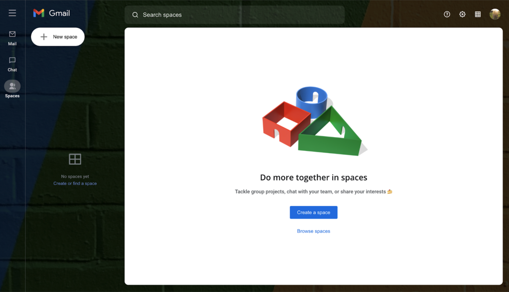

Currently, there are no spaces, so you cannot see the **SpaceItem** and **SpaceContextMenu** yet.

On clicking the toggle in the sidebar, you should have:

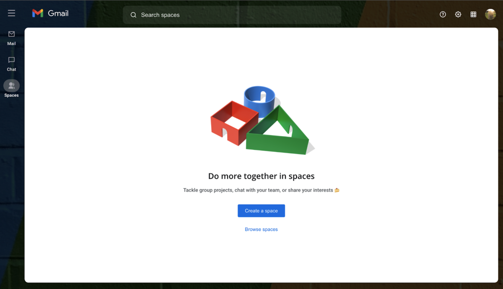

On clicking **New space**, you should have this:

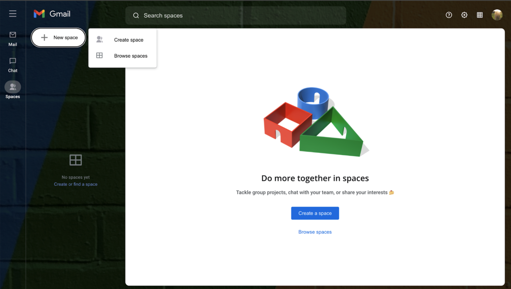

On clicking **Create space** or **Browse spaces**, nothing happens. Let us start by adding the functionality to create spaces.

### Building the CreateSpaceModal Component

This is what you will build in this section:


The first thing you need to do is keep track of a “creating space” state to show (active state) and hide (inactive state) the AddSpace modal accordingly.

#### Keeping Track of the CreatingSpace Global State

The reason why you want to keep track of global state for creating spaces is because different parts of the application can trigger a “create space” event and you want to avoid prop drilling.

Going back to the **SpacesContext**, you will add more data. Go to **src/components/SpacesLayout.js** and add the following state:

```js
// ...
const [isCreatingSpace, setIsCreatingSpace] = useState(false)
// ...
```

Then add these to the SpacesContext provider:

```js
return (
  <SpacesContext.Provider
    value={{
      updateChannelListKey,
      channelListKey,
      spaces,
      activeSpace: channel,
      setActiveSpace,
      users,
      // highlight-start
      isCreatingSpace,
      setIsCreatingSpace,
      // highlight-end
    }}
  >
    // ...
  </SpacesContext.Provider>
)
```

#### Create a String Utility

You need a string utility that replaces the spaces in a string with hyphens and also converts the whole string to lowercase. You need this to create **ids** from a space name.

Create a new file **src/utils/string.js** with:

```js
export const removeSpaces = str =>
  str
    .replace(/\s+/g, "-")
    .trim()
    .toLowerCase()
```

#### Create CreateSpaceModal Component

This component is a modal, with all the functionality you need to create a new space. We will go through the code for this component section by section.

Create a new file **src/components/spaces/CreateSpaceModal.js**.

First, add the imports:

```js
import classNames from "classnames"
import { Picker } from "emoji-mart"
import { useContext, useRef, useState } from "react"
import { useChatContext } from "stream-chat-react"
import styled from "styled-components"

import useClickOutside from "../../hooks/useClickOutside"
import { removeSpaces } from "../../utils/string"
import Dialog from "../Dialog"
import { LayoutContext } from "../Layout"
import { SpacesContext } from "./SpacesLayout"
```

You will use `Picker` for creating an emoji selector for the new space. Also, you will use `useClickOutside` to handle clicking outside the modal. You will also use the `setCreatingSpace` method from the `SpacesContext`.

Next, the styles using `styled-components`:

```js
const Container = styled.div`
  position: absolute;
  width: 100%;
  height: 100vh;
  background-color: rgba(0, 0, 0, 0.4);
  display: flex;
  justify-content: center;
  align-items: center;

  .modal-container {
    width: 100%;
    max-width: 600px;
  }
`

const Modal = styled.div`
  background-color: white;
  padding: 30px 0;

  form {
    padding: 0 20px;

    h2 {
      font-weight: 400;
      font-size: 20px;
      margin-bottom: 20px;
    }

    .space-name {
      display: flex;
      align-items: center;
      margin-bottom: 25px;

      &__input-group {
        flex: 1;

        input {
          background-color: #f8f9fa;
          height: 40px;
          width: 100%;
          padding: 8px 8px;
          border-bottom: 1px solid #e5e5e6;
          &::placeholder {
            color: #8e9295;
          }
        }
      }

      .emoji-container {
        width: 40px;
        height: 40px;
        margin-right: 15px;
        position: relative;
      }

      .emoji-btn {
        width: 40px;
        height: 40px;
        font-size: 25px;
        display: flex;
        justify-content: center;
        align-items: center;
        background-color: #f8f9fa;
        border-radius: 3px;
        position: relative;

        img {
          width: 25px;
          height: 25px;
        }

        &::after {
          content: "+";
          position: absolute;
          color: #1b72e8;
          bottom: 0;
          right: 0;
          width: 18px;
          height: 18px;
          font-size: 18px;
          border-radius: 3px;
          background-color: white;
        }
      }
    }

    .add-users-container {
      position: relative;
      .input-group {
        background-color: #f8f9fa;
        width: 100%;
        border-bottom: 1px solid #e5e5e6;
        display: flex;
        align-items: center;
        padding: 0 10px;

        .added-user {
          border: 1px solid #ccc;
          border-radius: 30px;
          display: flex;
          align-items: center;
          height: 30px;
          margin-right: 10px;

          &__img {
            height: 25px;
            width: 25px;
            margin-left: 2px;
            border-radius: 50%;
            margin-right: 7px;
          }

          &__name {
            color: #333;
            margin-right: 10px;
          }

          &__remove-btn {
            color: #333;
            font-size: 15px;
            margin-right: 5px;
          }
        }

        input {
          height: 40px;
          padding: 8px 8px;
          background: none;
          width: 100%;
          outline: none;
          &::placeholder {
            color: #8e9295;
          }
        }
      }

      .users-popup {
        position: absolute;
        z-index: 6;
        padding: 15px 20px 10px 0;
        left: 0;
        width: 100%;
        border-top: 1px solid #1b72e8;
        border-top-left-radius: 0px;
        border-top-right-radius: 0px;

        &__user {
          display: flex;
          align-items: center;
          padding: 10px 0 10px 30px;
          border-top-right-radius: 30px;
          border-bottom-right-radius: 30px;
          width: 100%;

          &:hover {
            background-color: #eee;
          }

          &__image {
            width: 40px;
            height: 40px;
            border-radius: 50%;
            overflow: hidden;
            margin-right: 10px;

            img {
              width: 100%;
              height: 100%;
            }
          }

          &__details {
            display: flex;
            .online-indicator {
              margin-right: 5px;
              width: 8px;
              height: 8px;
              border: 1px solid #333;
              border-radius: 50%;

              &--online {
                background-color: green;
              }
            }
          }

          &__name {
            font-weight: bold;
            position: relative;
            top: -3px;
          }
        }
      }
    }

    .emoji-picker {
      position: absolute;
      right: 0;
      top: 50px;
      z-index: 2;
    }

    .actions {
      margin-top: 30px;
      border-top: 1px solid #e5e5e6;
      padding: 30px 20px 0;
      width: calc(100% + 40px);
      position: relative;
      left: -20px;
      display: flex;
      justify-content: flex-end;

      button {
        width: 80px;
        height: 30px;
        border-radius: 3px;
      }

      &__cancel {
        color: #1b72e8;
      }

      &__submit {
        background-color: #1b72e8;
        color: white;

        &:disabled {
          background-color: #f0f3f4;
          color: #c4c8cb;
          cursor: not-allowed;
        }
      }
    }
  }
`
```

Now, to the component itself:

```js
export default function CreateSpaceModal() {
  const modalRef = useRef(null)
  const emojiPickerRef = useRef(null)
  const addUserInputRef = useRef(null)
  const peoplePopupRef = useRef(null)

  const [emojiPickerOpened, setEmojiPickerOpened] = useState(false)
  const [peoplePopupOpened, setPeoplePopupOpened] = useState(false)

  const [selectedEmoji, setSelectedEmoji] = useState(null)
  const [name, setName] = useState("")
  const [usersSearch, setUsersSearch] = useState("")
  const [addedUsers, setAddedUsers] = useState([])

  const { isSpacesListOpen, setIsSpacesListOpen } = useContext(LayoutContext)

  const { users, setActiveSpace, setIsCreatingSpace } = useContext(
    SpacesContext
  )

  const { client } = useChatContext()
}
```

You need refs for the **modal** (for outside-click events), the **emoji picker** (for click-outside events), the **add user input** (to control focus for the people popup), and for the **people popup** (click-outside events).

Also, you created default states for some components.

From the `SpacesContext`, you extracted `setIsCreatingSpace` and from `LayoutContext`, you extracted `isSpacesListOpen` and `setIsSpacesListOpen`. You specifically need the `setIsSpacesListOpen` such that on creating a new space, if the spaces list is closed, it will open.

Let us continue. Add:

```js
const onSelectEmoji = emojiObject => {
  setSelectedEmoji(emojiObject)
  setEmojiPickerOpened(false)
}

useClickOutside(
  {
    ref: modalRef,
    cb: () => !emojiPickerOpened && setIsCreatingSpace(false),
  },
  [emojiPickerOpened]
)

useClickOutside(
  {
    ref: emojiPickerRef,
    cb: () => emojiPickerOpened && setEmojiPickerOpened(false),
  },
  [emojiPickerOpened]
)

useClickOutside(
  {
    ref: peoplePopupRef,
    cb: () => {
      if (
        !peoplePopupOpened ||
        addUserInputRef.current === document.activeElement
      ) {
        return
      }

      addUserInputRef.current.blur()
      setPeoplePopupOpened(false)
    },
  },
  [peoplePopupOpened]
)
```

For this code:

- the `onSelectEmoji` updates the emoji state and also closes the emoji popup
- **click outsides** for the emoji picker, modal, and for the people popup

```js
const otherUsers = users?.filter(({ id }) => id !== client.user.id)

const filteredUsers = otherUsers?.filter(({ name, id }) => {
  const doesSearchMatch = name
    .toLowerCase()
    .startsWith(usersSearch.toLowerCase())

  if (!doesSearchMatch) return false

  const isUserAdded = addedUsers.find(user => id === user.id)

  if (isUserAdded) return false

  return true
})

const addUser = (e, u) => {
  e.stopPropagation()
  setAddedUsers(addedUsers => [...addedUsers, u])
  addUserInputRef.current.focus()
  setUsersSearch("")
}

const removeAddedUser = (e, user) => {
  e.stopPropagation()
  const newUsersState = addedUsers.filter(({ id }) => id !== user.id)
  setAddedUsers(newUsersState)
  addUserInputRef.current.focus()
}
```

For this code:

- `otherUsers` are the users in the app, but with the currently logged-in user filtered out
- `filteredUsers` are the users that match the search criteria and are not already added in the `addedUsers` array
- The `addUser` method adds a user to the `addedUsers` array
- The `removeAddedUser` removes a user from the `addedUsers` array

```js
const onSubmit = async e => {
  e.preventDefault()

  const data = {
    emoji: selectedEmoji?.native || null,
    name,
  }

  const channel = client.channel(
    "messaging",
    "space-" + removeSpaces(data.name),
    {
      name: data.name,
      emoji: data.emoji,
      members: [client.user.id, ...addedUsers.map(({ id }) => id)],
      customType: "space",
    }
  )

  await channel.watch()

  setActiveSpace(channel)

  setIsCreatingSpace(false)

  if (!isSpacesListOpen) setIsSpacesListOpen(true)
}
```

This code snippet includes the submit handler for the form which creates a new space. The notable part of this code is creating a channel.

Using the `client` from the `useChatContext` exposed by the React SDK, you declare a channel. The `channel` method on the client accepts three arguments:

- the **channel type**, which in our case is “messaging”
- the **channel id** which is gotten from the name
- an object with information about the space such as:
  - the **space name**
  - the **space emoji**
  - the **members of the space**, which is the logged in user and the added users
  - a `customType` of space which you use to filter the channels in this app

After declaring the channel, you [watch the channel](https://getstream.io/chat/docs/react/watch_channel/). Watching the channel creates the channel if it does not exist already, and also watches the channel for events (such as new messages, new members, etc.)

After watching, you set the created channel to be `active`, set the creating space status to `false`, and also open the spaces list if it is closed.

And for the UI:

```js
return (
  <Container>
    <div className="modal-container" ref={modalRef}>
      <Modal>
        <form onSubmit={onSubmit}>
          <h2>Create a space</h2>
          <div className="space-name">
            <div className="emoji-container">
              <button
                onClick={() => !emojiPickerOpened && setEmojiPickerOpened(true)}
                className="emoji-btn"
                type="button"
              >
                {selectedEmoji ? (
                  selectedEmoji.native
                ) : (
                  
                )}
              </button>

              {emojiPickerOpened && (
                <div ref={emojiPickerRef} className="emoji-picker">
                  <Picker onSelect={onSelectEmoji} />
                </div>
              )}
            </div>

            <div className="space-name__input-group">
              <input
                name="name"
                onChange={e => setName(e.target.value)}
                placeholder="Space name"
              />
            </div>
          </div>

          <div className="add-users-container">
            <div className="input-group">
              {addedUsers.length > 0 &&
                addedUsers.map(u => (
                  <div className="added-user" key={u.id}>
                    
                    <span className="added-user__name">{u.name}</span>
                    <button
                      onClick={e => removeAddedUser(e, u)}
                      type="button"
                      className="added-user__remove-btn"
                    >
                      X
                    </button>
                  </div>
                ))}
              <input
                onFocus={() => setPeoplePopupOpened(true)}
                ref={addUserInputRef}
                onChange={({ target }) => setUsersSearch(target.value)}
                value={usersSearch}
                placeholder={
                  addedUsers.length < 1 ? "Enter name of person" : ""
                }
              />
            </div>
            {peoplePopupOpened && filteredUsers && filteredUsers.length > 0 && (
              <div ref={peoplePopupRef}>
                <Dialog className="users-popup">
                  <ul>
                    {filteredUsers.map(u => (
                      <li key={u.id}>
                        <button
                          onClick={e => addUser(e, u)}
                          className="users-popup__user"
                        >
                          <div className="users-popup__user__image">
                            
                          </div>
                          <div className="users-popup__user__details">
                            <div
                              className={classNames(
                                "online-indicator",
                                u.online && "online-indicator--online"
                              )}
                            ></div>
                            <span className="users-popup__user__name">
                              {u.name}
                            </span>
                          </div>
                        </button>
                      </li>
                    ))}
                  </ul>
                </Dialog>
              </div>
            )}
          </div>

          <div className="actions">
            <button
              onClick={() => setIsCreatingSpace(false)}
              className="actions__cancel"
              type="button"
            >
              Cancel
            </button>
            <button
              disabled={!name.length}
              className="actions__submit"
              type="submit"
            >
              Create
            </button>
          </div>
        </form>
      </Modal>
    </div>
  </Container>
)
```

In the UI, you add the refs to the correct elements and use the states to display the popups, emoji picker, or modal.

#### Display the CreateSpaceModal On the UI

To add this modal to the UI, go to the spaces layout component in **src/components/spaces/SpacesLayout.js** and add the modal towards the end of the **Container** component like this:

```js
import CreateSpaceModal from "./CreateSpaceModal"
//  ...
return (
  <Container>
    // ...
    {isCreatingSpace && <CreateSpaceModal />} // highlight-line
  </Container>
)
```

But the `isCreatingSpace` state is still `false`. There are currently two elements that can trigger a creating space scenario:

- The **Create space** menu in the **SpacesList** component:


- and the **Create a space** button in the **SpacesEmpty** component:

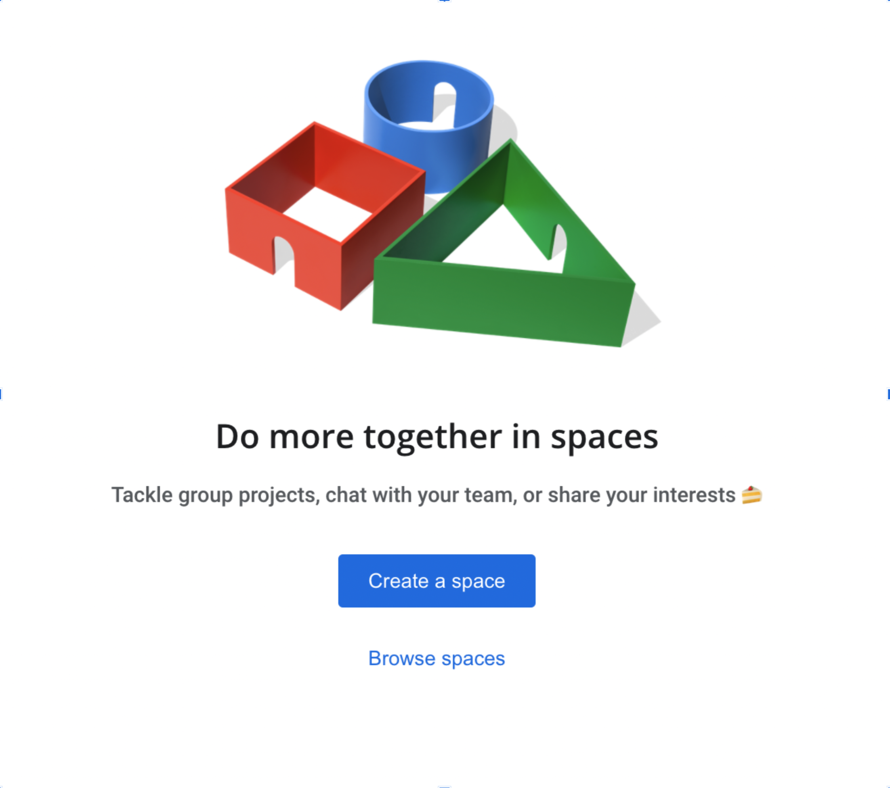

Let us start from the spaces list.

In **src/components/spaces/SpacesList.js**, get the **setIsCreatingSpace** method from the spaces context:

```js
//  ...
export default function SpacesList() {
  //  ...
  const {
    channelListKey,
    spaces,
    setActiveSpace,
    setIsCreatingSpace, // highlight-line
  } = useContext(SpacesContext)
  //  ...
}
```

And for the new space dialog, update the creating space status like this:

```js
//  ...
const actions = {
  create: () => setIsCreatingSpace(true), // highlight-line
  browse: () => null,
}
//  ...
```

When you click on **New Space**, the menu dialog appears with **Create space** and **Browse spaces**. When you click on **Create space**, the `isCreatingSpace` state becomes `true` and the **CreateSpaceModal** appears like this:

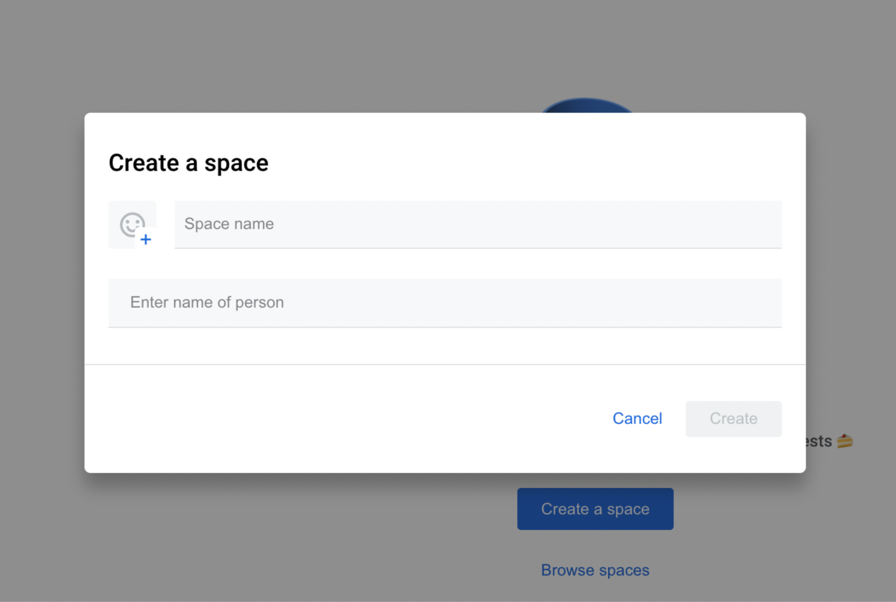

Also, go to **src/components/spaces/SpacesEmpty.js** and trigger the create space modal to open like this:

```js
import { useContext } from "react"
import { SpacesContext } from "./SpacesLayout"

export default function SpacesEmpty() {
  const { setIsCreatingSpace } = useContext(SpacesContext) // highlight-line
  //  ...
}
```

Then, call the method on the create button:

```js
//  ...
<button
  onClick={
    () => setIsCreatingSpace(true) // highlight-line
  }
  className="create-space-btn"
>
  Create a space
</button>
//  ...
```

Now, you can create your first space. Select an emoji, enter the name of the Space and add two members:

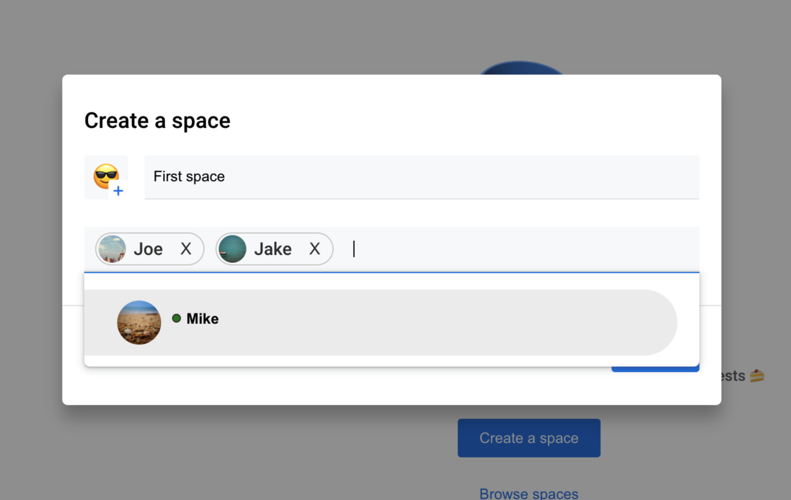

Congrats! Your very first space now shows in the in the **SpacesList** component:


And here is the context menu you created earlier:


Use this modal to create more spaces with names “Second space”, “Third space”, “Fourth space”, and “Fifth space” with any emojis of your choice and any members of your choice.


With the space creation feature added and spaces now showing in the list, we can add more actions.

### Leaving Spaces

When you create a new space, it creates a new channel in your Stream app. Now, you will add the leaving space functionality. Leaving a space does not delete the space from your Stream app. It only removes you as a member which you can rejoin later.

The leave button lives in the **SpaceContextMenu**, so head over to **src/components/spaces/SpaceContextMenu.js** to add that functionality.

First, start with the imports:

```js
import { useContext } from "react"
import { useNavigate } from "react-router-dom"
import { useChatContext } from "stream-chat-react"
import { SpacesContext } from "./SpacesLayout"
```

Then, update the **onLeave** function:

```js
export default function SpaceContextMenu({ space, onClickOption }) {
  const { client } = useChatContext()

  const { setActiveSpace, activeSpace, spaces } = useContext(SpacesContext)

  const navigate = useNavigate()

  // highlight-start
  const onLeave = async () => {
    space.removeMembers([client.user.id])

    if (activeSpace.cid === space.cid) {
      const spacesForThisUser = spaces.filter(s => s.cid !== space.cid)

      setActiveSpace(spacesForThisUser[0])
      navigate("?space_id=" + spacesForThisUser[0].id)
    }
  }
  // highlight-end
  //  ...
}
```

This function:

- Removes the currently logged-in user as a member of the space using the `removeMembers` method on the **space object**
- Sets the active space if the space left was active

With this, go back to the UI, open the context menu of any space and click on **Leave**. You should see the spaces list updated to the spaces the currently logged-in user belongs to.

What if a user wants to rejoin a space or basically join other spaces in the Stream app that they do not belong to? That’s where we add the **Browse Spaces** feature.

### Create the Browse Spaces Modal

This component will show the spaces that the currently logged-in user does not belong to and also provide the option for them to join the space.

This is what you will build in this section:


#### Add Permissions for Users to Browse Channels

Stream works with [permissions](https://getstream.io/chat/docs/react/permissions_reference/?language=js) for different types of users. Users can be **admins**, **channel owners**, **channel members**, or **ordinary users**.

By default, ordinary users cannot browse the channels in your Stream application. They can only see the channels that they belong to. To give these users permission to browse channels, you need to update the **Permissions settings** for your app.

To update your app’s permissions settings:

1. Go to the stream-spaces app on [your dashboard](http://dashboard.getstream.io/)
2. Select the **messaging** channel type (because your app is of this type)
3. Scroll down to the **Permissions** section and add **ReadChannel** and **ReadChannelMembers** permissions to the `Users can create channels` role:

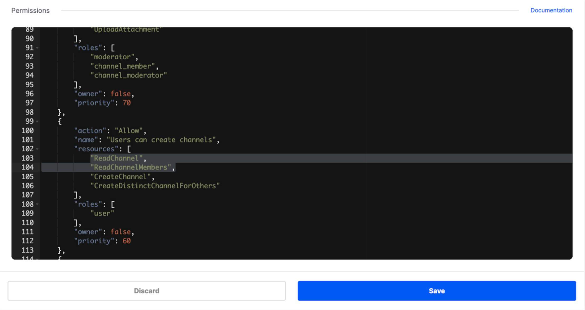

These permissions allow users to access the information of channels they do not belong to.

#### Keep Track of the Browsing Spaces Global State

For the same reason you created a space global state, you want to keep track of the browsing spaces state without prop drilling.

Go to **src/components/SpacesLayout.js** and add the following state:

```js
//  ...
const [isBrowsingSpaces, setIsBrowsingSpaces] = useState(false)
//  ...
```

Then add these to the **SpacesContext** provider:

```js
//  ...
return (
  <SpacesContext.Provider
    value={{
      updateChannelListKey,
      channelListKey,
      spaces,
      activeSpace: channel,
      setActiveSpace,
      users,
      isCreatingSpace,
      setIsCreatingSpace,
      // highlight-start
      isBrowsingSpaces,
      setIsBrowsingSpaces,
      // highlight-end
    }}
  >
    // ...
  </SpacesContext.Provider>
)
//  ...
```

#### Create the Browsing Spaces Modal

Create a new file **src/components/spaces/BrowseSpacesModal.js**.

Start with the imports:

```js
import classNames from "classnames"
import { useContext, useEffect, useRef, useState } from "react"
import { useChatContext } from "stream-chat-react"
import styled from "styled-components"

import useClickOutside from "../../hooks/useClickOutside"
import Dialog from "../Dialog"
import { SpacesContext } from "./SpacesLayout"

const Container = styled.div`
  position: absolute;
  width: 100%;
  height: 100vh;
  background-color: rgba(0, 0, 0, 0.4);
  display: flex;
  justify-content: center;
  align-items: center;
  z-index: 5;

  .modal-container {
    width: 100%;
    max-width: 500px;
  }
`

const Modal = styled(Dialog)`
  width: 100%;
  background-color: white;

  .header {
    display: flex;
    align-items: center;
    padding: 20px 20px;
    box-shadow: 0 2px 2px 0 rgb(0 0 0 / 14%), 0 1px 5px 0 rgb(0 0 0 / 12%),
      0 3px 1px -2px rgb(0 0 0 / 20%);

    h2 {
      font-weight: 400;
      flex: 1;
    }

    .nav {
      width: 80px;
      display: flex;
      justify-content: space-between;
    }
  }

  .body {
    padding: 40px 20px;

    &__content {
      width: 100%;
      min-height: 350px;
      input {
        background-color: #f8f9fa;
        height: 40px;
        width: 100%;
        padding: 10px 8px;
        border-bottom: 1px solid #e5e5e6;
        &::placeholder {
          color: #8e9295;
          width: 100%;
        }
      }

      &__space-list {
        border: 1px solid #eaeaea;
        border-radius: 5px;
        margin-top: 40px;

        &--empty {
          display: none;
        }

        &__item {
          position: relative;
          display: flex;
          padding: 15px 30px;
          justify-content: space-between;

          &:hover {
            background-color: #eee;
          }

          .details {
            text-align: left;
            flex: 1;
            .name {
              display: block;
              font-size: 15px;
              margin-bottom: 6px;
            }
            .members-count {
              font-size: 13px;
              color: #5f6367;
            }
          }

          &:not(:last-child) {
            border-bottom: 1px solid #e5e5e6;
          }

          .add-btn {
          }
        }
      }

      .empty-list {
        margin-top: 40px;
        border: 1px solid #eaeaea;
        height: 240px;
        width: 100%;
        display: flex;
        flex-direction: column;
        align-items: center;
        text-align: center;

        &--empty {
          display: none;
        }

        img {
          width: 100px;
        }

        p {
          margin: 15px 0 25px;
        }

        button {
          background-color: #1b72e8;
          color: white;
          border-radius: 3px;
          padding: 10px 20px;
        }
      }
    }
  }
`
```

Then:

```js
export default function BrowseSpacesModal() {
  const { client } = useChatContext()

  const {
    updateChannelListKey,
    setActiveSpace,
    isBrowsingSpaces,
    setIsBrowsingSpaces,
    setIsCreatingSpace,
  } = useContext(SpacesContext)

  const [spaces, setSpaces] = useState([])
  const [filteredSpaces, setFilteredSpaces] = useState([])

  const modalRef = useRef(null)

  const [inputValue, setInputValue] = useState("")

  useClickOutside(
    {
      ref: modalRef,
      cb: () => setIsBrowsingSpaces(false),
    },
    [isBrowsingSpaces]
  )

  useEffect(() => {
    const getSpaces = async () => {
      const spaces = await client.queryChannels({
        customType: "space",
        members: { $nin: [client.user.id] },
      })

      setSpaces(spaces)
      setFilteredSpaces(spaces)
    }

    getSpaces()
  }, [])

  useEffect(() => {
    const filteredSpaces = spaces.filter(s =>
      s.data.name.toLowerCase().startsWith(inputValue.toLowerCase())
    )

    setFilteredSpaces(filteredSpaces)
  }, [inputValue])
}
```

Here’s what’s happening in this code snippet:

- You keep track of the `filteredSpaces` state based on the input
- You use the `modalRef` and `useClickOutside` hook for click-outside events outside the modal
- You use the `useEffect` hook, which updates the `filteredSpaces` state when the input state changes

For the UI:

```js
//  ...
return (
  <Container>
    <div ref={modalRef} className="modal-container">
      <Modal>
        <div className="header">
          <h2>Browse Spaces</h2>
          <div className="nav">
            {[
              {
                icon: "/assets/icons/more-dark.svg",
                alt: "Menu",
                id: "menu",
              },
              { icon: "/assets/icons/close.svg", alt: "Close", id: "close" },
            ].map(m => {
              const actions = {
                close: () => setIsBrowsingSpaces(false),
              }

              return (
                <button onClick={() => actions[m.id]()} key={m.id}>
                  
                </button>
              )
            })}
          </div>
        </div>

        <div className="body">
          <div className="body__content">
            <input
              onChange={e => setInputValue(e.target.value)}
              placeholder="Space name"
            />

            <ul
              className={classNames(
                "body__content__space-list",
                filteredSpaces.length < 1 && "body__content__space-list--empty"
              )}
            >
              {filteredSpaces.map(s => {
                const membersCount = Object.keys(s.state.members).length

                const joinSpace = async () => {
                  await s.addMembers([client.user.id])
                  await s.watch()

                  setActiveSpace(s)

                  setIsBrowsingSpaces(false)
                  updateChannelListKey(true)
                }

                return (
                  <li className="body__content__space-list__item" key={s.id}>
                    <div className="details">
                      <span className="name">{s.data.name}</span>
                      <span className="members-count">
                        {membersCount} members
                      </span>
                    </div>
                    <button onClick={joinSpace} className="add-btn">
                      
                    </button>
                  </li>
                )
              })}
            </ul>

            <div
              className={classNames(
                "empty-list",
                filteredSpaces.length > 0 && "empty-list--empty"
              )}
            >
              
              <p>Can't find a matching space or you've already joined it</p>
              <button
                onClick={() => {
                  setIsBrowsingSpaces(false)
                  setIsCreatingSpace(true)
                }}
              >
                Create space
              </button>
            </div>
          </div>
        </div>
      </Modal>
    </div>
  </Container>
)
//  ...
```

For getting the members of a space, you use the `state` object on a channel (which in our case is **space**). The state object has a `members` object with many properties where the key of a property is the **user id** and the value is an object of the user’s information.

Using `Object.keys(s.state.members).length` gives us the number of object keys.

For joining a space, you have a `joinSpace` function. This function:

- Adds members to the space using the [addMembers](https://getstream.io/chat/docs/react/channel_members/#adding-removing-channel-members)** method of the space (which is **client.user.id\*\* which is the currently logged in user)
- [Watches](https://getstream.io/chat/docs/react/watch_channel/)\*\* a channel for events
- Sets the `isBrowsingSpaces` state to `false`
- Updates the **channel list key** so that the spaces list updates with the new channel

#### Display the BrowseSpaceModal on the UI

To add this modal to the UI, go to the spaces layout component in **src/components/spaces/SpacesLayout.js** and add the modal after the **CreateSpaceModal**:

```js
import BrowseSpacesModal from "./BrowseSpacesModal"

//  ...
return (
  <Container>
    // ...
    {isCreatingSpace && <CreateSpaceModal />}
    {isBrowsingSpaces && <BrowseSpacesModal />} // highlight-line
  </Container>
)
//  ...
```

But, the `isBrowsingSpaces` is `false`. Similar to the create space modal, there are two components that can update the browsing spaces state: the **SpacesList** and the **SpacesEmpty** component.

For the spaces list, go to **src/components/spaces/SpacesList.js**. Get the **setIsBrowsingSpaces** from the **SpacesContext** like:

```js
const {
  channelListKey,
  spaces,
  setActiveSpace,
  setIsCreatingSpace,
  setIsBrowsingSpaces, // highlight-line
} = useContext(SpacesContext)
//  ...
```

For the `actions` object, update the browsing spaces state:

```js
const actions = {
  create: () => setIsCreatingSpace(true),
  browse: () => setIsBrowsingSpaces(true), // highlight-line
}
```

In **SpacesEmpty**, also update the browsing spaces state:

```js
const { setIsCreatingSpace, setIsBrowsingSpaces } = useContext(SpacesContext)

return (
  //  ...
  <button
    onClick={() => setIsBrowsingSpaces(true)} // highlight-line
    className="browse-spaces-btn"
  >
    Browse spaces
  </button>
  //  ...
)
```

Now, when you click on **Browse spaces**, you get this:


On joining a channel with the **plus** button, you will get this:

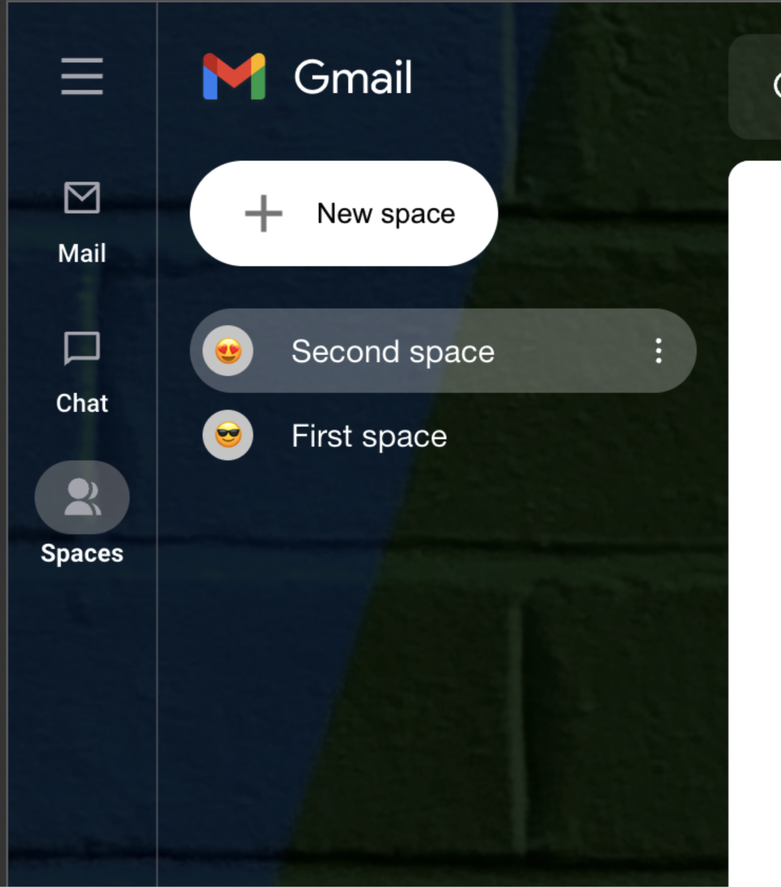

### Create a SpaceContent Component

This component will display the content of the active space which is the:

- header, with the name of the of the space and the number of members
- list of messages with their reactions
- message input for sending a new message (with a reaction selector)

Here is what you will build in this section:


Let us start from the header.

#### Create a SpaceHeader Component

Create a new file **src/components/spaces/SpaceHeader.js**. First, add the imports and styles.

```js
import { useContext } from "react"
import styled from "styled-components"
import { SpacesContext } from "./SpacesLayout"

const Container = styled.div`
  position: relative;

  .top,
  .bottom {
    padding-left: 40px;
  }

  .top {
    display: flex;
    align-items: center;

    .arrow-left {
      position: absolute;
      left: 10px;
      img {
        width: 16px;
        height: 16px;
      }
    }

    .details {
      color: #333;
      text-align: left;
      padding: 8px;

      &:hover {
        background-color: rgba(146, 146, 146, 0.233);
        border-radius: 5px;
      }

      &__name {
        display: flex;
        align-items: center;

        &-text {
          font-size: 16px;
        }

        .menu-btn {
          margin-left: 7px;
        }
      }

      &__members {
        display: block;
        margin-top: 3px;
        font-size: 12px;
        color: #818487;
      }
    }
  }

  .menu {
    margin-top: 3px;
    border-bottom: 1px solid rgba(146, 146, 146, 0.233);

    &__btn {
      font-size: 13px;
      color: #818487;

      &:not(:last-child) {
        margin-right: 30px;
      }

      &--active {
        color: #1b72e8;
        position: relative;
        padding-bottom: 8px;

        &::after {
          content: "";
          width: 25px;
          height: 3px;
          position: absolute;
          bottom: 0;
          left: 0;
          right: 0;
          margin: 0 auto;
          border-top-left-radius: 3px;
          border-top-right-radius: 3px;
          background-color: #1b72e8;
        }
      }
    }
  }
`
```

Next, the component:

```js
const menus = [
  {
    id: "chat",
    label: "Chat",
  },
  {
    id: "files",
    label: "Files",
  },
  {
    id: "tasks",
    label: "Tasks",
  },
]

export default function SpaceHeader() {
  const { activeSpace } = useContext(SpacesContext)

  return (
    <Container>
      <div className="top">
        <button className="arrow-left">
          
        </button>
        <button className="details">
          <div className="details__name">
            <span className="details__name-text">
              {activeSpace?.data?.name}
            </span>
            
          </div>
          <span className="details__members">
            {activeSpace?.data?.member_count} members
          </span>
        </button>
      </div>

      <div className="bottom menu">
        {menus.map(menu => (
          <button
            className={
              "menu__btn " + (menu.id === "chat" ? "menu__btn--active" : "")
            }
            key={menu.id}
          >
            {menu.label}
          </button>
        ))}
      </div>
    </Container>
  )
}
```

The `menus` array is used for showing the top bar menu options. For this app, you will only use the `chat` menu.

In the `SpaceHeader`, you use the `activeSpace`’s information for the header.

#### Create a SpaceMessageItem Component

Stream’s [MessageList component](https://getstream.io/chat/docs/sdk/react/core-components/message_list/) renders a scrollable list of messages with improved performance. You do not need to create a custom message list, but you can customize the UI of each message item in the list to look like Gmail’s.

Create a new file **src/components/spaces/SpaceMessageItem.js**. Start with the imports and styles:

```js
import classNames from "classnames"
import { format, isToday } from "date-fns"
import { useRef, useState } from "react"
import {
  Attachment,
  ReactionSelector,
  SimpleReactionsList,
  useMessageContext,
} from "stream-chat-react"
import styled from "styled-components"

import useClickOutside from "../../hooks/useClickOutside"

const MessageBlock = styled.div`
  display: flex;
  margin-bottom: 7px;

  .avatar {
    border-radius: 50%;
    overflow: hidden;
    margin-right: 20px;
    width: 30px;
    height: 0;

    img {
      display: none;
      object-fit: cover;
      width: 100%;
      height: 100%;
    }
  }

  .message {
    width: 100%;
    &__header {
      display: none;
      padding-left: 5px;
      margin-bottom: 5px;
      align-items: flex-end;
    }

    &__sender {
      font-weight: bold;
      margin-right: 10px;
    }

    &__date {
      color: #acafb1;
      font-size: 14px;
      line-height: 17px;
    }

    &__inner {
      position: relative;
      padding: 4px 6px;
    }

    &__text {
      font-size: 15px;

      &--link {
        color: #1c71e8;
      }
    }

    .str-chat__message-attachment--image {
      max-width: 300px;
    }

    &__options {
      position: absolute;
      display: none;
      background-color: white;
      border-radius: 20px;
      box-shadow: 1px 1px 3px #acafb1;
      right: 20px;
      top: -25px;
      align-items: center;

      &--open {
        display: flex;
      }

      &__btn {
        width: 30px;
        height: 30px;
        border-radius: 50%;
        display: flex;
        align-items: center;
        justify-content: center;

        &:not(:last-child) {
          margin-right: 5px;
        }

        img {
          width: 20px;
          height: 20px;
        }

        &--emoji--active {
          background-color: #e7eaed;
        }
      }
    }

    &__inner:hover {
      background-color: #f6f6f6;
      .message__options {
        display: flex;
      }
    }

    &__reaction-selector {
      position: absolute;
      right: 280px;
      top: -90px;
      z-index: 20;
    }
  }
`
```

You will use the:

- `useClickOutside` custom hook to handle clicking outside the reaction selector
- Stream’s **[ReactionSelector and SimpleReactionsList](https://getstream.io/chat/docs/sdk/react/custom-code-examples/reactions/)** for selecting and displaying reactions on each message
- Stream’s **[Attachment](https://getstream.io/chat/docs/sdk/react/message-components/attachment/)** for attachments in a message (for this tutorial, we will only use link attachments)
- Stream’s **[useMessageContext](https://getstream.io/chat/docs/sdk/react/contexts/message_context/)** to get the active message

And for the component:

```js
export default function CustomMessage() {
  const { message } = useMessageContext()

  const reactionSelectorRef = useRef(null)
  const [showReactionSelector, setShowReactionSelector] = useState(false)
  useClickOutside(
    {
      ref: reactionSelectorRef,
      cb: () => showReactionSelector && setShowReactionSelector(false),
    },
    [showReactionSelector]
  )

  let messageDateFormatted = ""

  const messageDate = new Date(message?.created_at)
  const isTodayMessage = isToday(messageDate)

  if (isTodayMessage) {
    messageDateFormatted = format(messageDate, "p")
  } else {
    messageDateFormatted = format(messageDate, "ccc p")
  }

  return (
    <MessageBlock>
      <div className="avatar">
        
      </div>

      <div className="message">
        <div className="message__header">
          <div className="message__sender">{message?.user?.name}</div>
          <div className="message__date">{messageDateFormatted}</div>
        </div>

        <div className="message__inner">
          <p
            className="message__text"
            dangerouslySetInnerHTML={{
              __html: message.text.replace(
                /https?:\/\/.*[^\s]/gi,
                url => `<a class='message__text--link' href=${url}>${url}</a>`
              ),
            }}
          />
          <Attachment attachments={message.attachments} />
          <SimpleReactionsList />

          {showReactionSelector && (
            <div
              ref={reactionSelectorRef}
              className="message__reaction-selector"
            >
              <ReactionSelector />
            </div>
          )}
          <div
            className={classNames("message__options", {
              "message__options--open": showReactionSelector,
            })}
          >
            {[
              {
                icon: "/assets/icons/smiling-emoji.svg",
                alt: "Choose emoji",
                id: "emoji",
                onClick: () => setShowReactionSelector(true),
              },
              {
                icon: "/assets/icons/pencil.svg",
                alt: "Edit message",
                id: "edit",
              },
              {
                icon: "/assets/icons/delete.svg",
                alt: "Delete message",
                id: "delete",
              },
            ].map(opt => (
              <button
                onClick={opt.onClick}
                className={classNames("message__options__btn", {
                  [`message__options__btn--${opt.id}--active`]: showReactionSelector,
                })}
                key={opt.id}
              >
                
              </button>
            ))}
          </div>
        </div>
      </div>
    </MessageBlock>
  )
}
```

Using the active message, you display the text, the attachments, a reaction selector and a reaction list. The emoji button on the message’s context menu is used to show the reaction selector.

#### Create a SpaceMessageInput Component

Create a new file **src/components/spaces/SpaceMessageInput.js** with the following imports and styles:

```js
import { Picker } from "emoji-mart"
import { useRef, useState } from "react"
import { useChannelActionContext } from "stream-chat-react"
import styled from "styled-components"

import useClickOutside from "../../hooks/useClickOutside"

const Container = styled.div`
  position: absolute;
  width: 100%;
  left: 0;
  bottom: 0;
  height: 100px;
  padding: 0 20px;
  background-color: white;
  display: flex;
  align-items: center;

  .input-block {
    display: flex;
    position: relative;
    bottom: 0;
    align-items: center;
    width: 100%;
  }

  .add-btn {
    width: 22px;
    height: 22px;
    display: flex;
    justify-content: center;
    align-items: center;
    color: #707377;
    border: 2px solid #707377;
    font-size: 13px;
    font-weight: bold;
    border-radius: 50%;
    padding-bottom: 2px;
  }

  form {
    display: flex;
    align-items: center;
    margin-left: 20px;
    flex: 1;
    width: 100%;

    .text-input-group {
      position: relative;
      height: 50px;
      width: 100%;

      .text-input {
        height: 100%;
        border: 1px solid #dbdde1;
        width: 100%;
        border-radius: 50px;
        padding: 0 20px;
      }

      .input-options {
        position: absolute;
        right: 0;
        top: 0;
        bottom: 0;
        margin: auto 0;
        padding: 0 10px;
        display: flex;
        align-items: center;

        .emoji-input {
          width: 34px;
          height: 34px;
          position: relative;

          &--open::before {
            content: "";
            width: 38px;
            height: 38px;
            background-color: #e5eefc;
            border-radius: 50%;
            position: absolute;
            left: -3px;
            top: -3px;
          }

          .default-emoji {
            width: 100%;
            height: 100%;
            position: relative;
            z-index: 1;
          }

          .emoji-picker {
            position: absolute;
            right: 0;
            bottom: 40px;
          }
        }
      }
    }

    .submit-btn {
      margin-left: 10px;
      &:disabled {
        opacity: 0.5;
      }
    }
  }
`
```

For the imports:

- The `Picker` component is used for selecting emojis
- The **[useChannelActionContext](https://getstream.io/chat/docs/sdk/react/contexts/channel_action_context/)** provides actions you can perform on a channel (specifically, you will use the `sendMessage` method)
- The `useClickOutside` will be used for handling click-outside events of the `Picker` component

Add the following to the file:

```js
export default function SpaceInput() {
  const emojiPickerRef = useRef(null)
  const { sendMessage } = useChannelActionContext()

  const [text, setText] = useState("")

  const [isEmojiOpen, setIsEmojiOpen] = useState(false)

  const onClickEmoji = emojiObj => {
    console.log({ emojiObj })
    setText(text + emojiObj.native)
  }

  useClickOutside(
    {
      ref: emojiPickerRef,
      cb: () => isEmojiOpen && setIsEmojiOpen(false),
    },
    [isEmojiOpen]
  )

  const onSubmit = async e => {
    e.preventDefault()

    await sendMessage({ text })
    setText("")
  }
}
```

You use the [sendMessage](https://getstream.io/chat/docs/sdk/react/contexts/channel_action_context/#sendmessage) method from the channel action context to send messages to the channel.

And the UI:

```js
//  ...
return (
  <Container>
    <div className="input-block">
      <button className="add-btn">+</button>
      <form onSubmit={onSubmit}>
        <div className="text-input-group">
          <input
            onChange={e => setText(e.target.value)}
            placeholder="History is on"
            className="text-input"
            value={text}
          />
          <div className="input-options">
            <button
              type="button"
              onClick={() => setIsEmojiOpen(true)}
              className={
                "emoji-input" + (isEmojiOpen ? " emoji-input--open" : "")
              }
            >
              
              {isEmojiOpen && (
                <div ref={emojiPickerRef} className="emoji-picker">
                  <Picker onSelect={onClickEmoji} />
                </div>
              )}
            </button>
          </div>
        </div>
        <button className="submit-btn" disabled={text.length < 1} type="submit">
          
        </button>
      </form>
    </div>
  </Container>
)
//  ...
```

#### Display the Content of a Space

With all the components for the active space added, you want to show them in the **SpaceContent** component.

Go to **src/components/spaces/SpaceContent.js**. First, add more imports:

```js
import { Channel, MessageList } from "stream-chat-react"
import { formatDistance } from "date-fns"

import SpaceHeader from "./SpaceHeader"
import SpaceMessageItem from "./SpaceMessageItem"
import SpaceMessageInput from "./SpaceMessageInput"
```

Next, update the container style with:

```js
const Container = styled.div`
  background-color: white;
  width: 100%;
  height: 100%;
  position: relative;
  border-radius: 10px;
  overflow: hidden;

  .chat-body {
    height: calc(100vh - 180px);
    background-color: white;
    overflow-y: auto;
    border-radius: 10px;
    &__details {
      height: 300px;
      display: flex;
      flex-direction: column;
      align-items: center;
      .chat-icon {
        width: 150px;
        margin-bottom: 10px;
      }

      .date {
        font-size: 12px;
        color: #b0b3b4;
        text-align: center;
      }

      .action-btns {
        margin-top: 20px;
        display: flex;
        justify-content: center;

        button {
          border: 1px solid #f4f5f6;
          border-radius: 3px;
          display: flex;
          align-items: center;
          color: #5494ee;
          padding: 10px 8px;

          &:not(:last-child) {
            margin-right: 10px;
          }

          img {
            margin-right: 7px;
          }
        }
      }

      .history-details {
        margin-top: 20px;

        &__heading {
          display: flex;
          justify-content: center;
          color: #7f8082;
          font-size: 12px;
          text-transform: uppercase;

          img {
            margin-right: 10px;
          }
        }

        p {
          text-align: center;
          font-size: 12px;
          color: #a6a8ab;
          margin-top: 3px;
        }
      }
    }

    .str-chat__list {
      padding-bottom: 100px;
      height: calc(100%);
    }

    .str-chat__li {
      &--top,
      &--single {
        .avatar {
          height: 30px;
        }
        img {
          display: block;
        }

        .message__header {
          display: flex;
        }
      }

      .str-chat__simple-reactions-list {
        border: 1px solid #d9dce0;
        border-radius: 20px;
        display: inline-flex;
        align-items: center;

        .emoji-mart-emoji span {
          width: 16px !important;
          height: 16px !important;
        }

        &-item--last-number {
          color: #1b72e8;
          font-weight: bold;
          font-size: 16px;
          margin-bottom: 2px;
        }
      }

      .str-chat__message-simple {
        &--me {
          justify-content: flex-start;
        }

        .str-chat__reaction-list--reverse {
          left: 15px;
          right: initial;
        }

        .str-chat__reaction-list--reverse::before {
          left: -26px;
          width: 26px;
          background-position: 0 0;
        }

        .str-chat__reaction-list--reverse::after {
          right: -13px;
          width: 13px;
          background-position: -46px 0;
        }

        .str-chat__reaction-list--reverse ul {
          margin: -1px -4px 0 -16px;
        }

        .str-chat__message-simple-status {
          display: none;
        }

        .str-chat__avatar {
          order: 1;
          margin-left: 0;
          margin-right: 15px;
          position: relative;
        }

        .str-chat__message-inner {
          order: 2;
          margin-left: 0;
        }

        .str-chat__message-text-inner {
          background: transparent;
          padding: 0;
          min-height: unset;
        }

        .str-chat__message-data {
          left: 0;
        }
      }

      &--bottom {
        margin-bottom: 30px;
      }
    }
  }
`
```

Get the **activeSpace** from the **SpacesContext**:

```js
//  ...
const { spaces, activeSpace } = useContext(SpacesContext)
//  ...
```

And for the UI when the length of the spaces is more than zero:

```js
// ...
​​return (
  <Channel>
    <Container>
        <SpaceHeader />
        <div className="chat-body">
            <div className="chat-body__details">
            
            <p className="date">
                You created this space{' '}
                {formatDistance(
                new Date(),
                new Date(activeSpace?.data?.created_at)
                )}{' '}
                ago
            </p>
            <div className="action-btns">
                {[
                {
                    icon: '/assets/icons/user-add.svg',
                    label: 'Add people & bots',
                },
                {
                    icon: '/assets/icons/google-drive.svg',
                    label: 'Share a file',
                },
                {
                    icon: '/assets/icons/checkbox-circle.svg',
                    label: 'Assign tasks',
                },
                ].map((action) => (
                <button key={action.label}>
                    
                    <span>{action.label}</span>
                </button>
                ))}
            </div>

            <div className="history-details">
                <div className="history-details__heading">
                
                History is on
                </div>
                <p>Messages sent with history on are saved</p>
            </div>
            </div>
            <MessageList Message={SpaceMessageItem} />
            <SpaceMessageInput />
        </div>
    </Container>
  </Channel>
)
// ...
```

In the `MessageList` component, the `Message` prop is used to specify a custom message component, and in the code, you specified the `SpaceMessageItem` component.

Back in the UI, you have this:


You can send a message, a link, and add reactions to messages:


### Pin/Unpin Spaces

For the pinning and unpinning functionality, this is what you will build in this section:


Pinning and unpinning spaces happens in the **SpaceContextMenu.js** file. But first, you will add the functionalities to the **SpacesLayout** and provide the methods via context.

#### Pin Space Function

Go to **src/components/spaces/SpacesLayout.js**. Add the **pinSpace** method:

```js
//  ...
const MAX_PINS = 3

const pinSpace = async cid => {
  const alreadyPinnedSpaces = client.user.pinned_spaces || []

  if (alreadyPinnedSpaces.length >= MAX_PINS) {
    return alert(`Cannot pin more than ${MAX_PINS} spaces`)
  }

  await client.upsertUser({
    id: client.user.id,
    image: client.user.image,
    name: client.user.name,
    pinned_spaces: [cid, ...alreadyPinnedSpaces],
  })

  updateChannelListKey()
}
//  ...
```

To keep track of the pinned spaces, you will add an extra property to the user object: `pinned_spaces`.

This property is an array that holds the `cid`s of the pinned spaces.

Also, you set a maximum number of pins.

To update a user, you use the `upsertUser` method. Ideally, this should be called on the server-side as it can be used for admin-related updates (for example, making a user an admin). You can use it for development as there is no backend server.

#### Unpin Space function

Add the **unpinSpace** method in the same file:

```js
//  ...
const unpinSpace = async (cid, updateList = true) => {
  const pinnedSpaces = [...client.user.pinned_spaces]

  const targetSpace = pinnedSpaces.findIndex(channelCid => {
    return channelCid === cid
  })

  if (targetSpace > -1) {
    pinnedSpaces.splice(targetSpace, 1)

    await client.upsertUser({
      id: client.user.id,
      image: client.user.image,
      name: client.user.name,
      pinned_spaces: [...pinnedSpaces],
    })

    if (updateList) updateChannelListKey()
  }
}
//  ...
```

The `unpinMethod` has an `updateList` argument which when true, calls the `updateChannelListKey` method. In some cases (like leaving a pinned channel), you may not want to update the channel list key.

This removes the space from the pinned spaces and updates the user object.

#### Provide New Methods in the SpacesContext

Now, add the two methods to the **SpacesContext** provider:

```js
//  ...
return (
  <SpacesContext.Provider
    value={{
      updateChannelListKey,
      channelListKey,
      spaces,
      activeSpace: channel,
      setActiveSpace,
      users,
      isCreatingSpace,
      setIsCreatingSpace,
      isBrowsingSpaces,
      setIsBrowsingSpaces,
      // highlight-start
      pinSpace,
      unpinSpace,
      // highlight-end
    }}
  >
    // ...
  </SpacesContextProvider>
)
```

#### Pin/Unpin Spaces from Context Menu

Go to **src/components/spaces/SpaceContextMenu.js** to execute these methods.

Import **classNames** for some classes you will use in the UI:

```js
import classNames from "classnames"
```

Get the methods from the spaces context:

```js
//  ...
const {
  setActiveSpace,
  spaces,
  activeSpace,
  // highlight-start
  pinSpace,
  unpinSpace,
  // highlight-end
} = useContext(SpacesContext)
//  ...
```

Update the **onPin** and **onUnpin** method to the following:

```js
//  ...
const onPin = async () => {
  pinSpace(space.cid) // highlight-line
  onClickOption()
}

const onUnpin = async () => {
  unpinSpace(space.cid) // highlight-line
  onClickOption()
}
//  ...
```

Next, update the **menu** variable:

```js
//  ...
const spaceIsPinned = client.user.pinned_spaces?.includes(space.cid) // highlight-line

const menu = [
  {
    label: spaceIsPinned ? "Unpin" : "Pin", // highline-line
    icon: "/assets/icons/pin.svg",
    id: "pin",
  },
  {
    label: "Leave",
    icon: "/assets/icons/arrow-down.svg",
    subLabel: "You can always return",
    id: "leave",
  },
]

const menuClicks = {
  leave: onLeave,
  pin: spaceIsPinned ? onUnpin : onPin, // highlight-line
}
//  ...
```

You use the `client` object to check if a space is pinned.

Also, update the icon UI with some classes:

```js
//  ...
return (
  // ...
  <div
    // highlight-start
    className={classNames("menu-btn__icon", `menu-btn__icon--${m.id}`, {
      [`menu-btn__icon--${m.id}--unpin`]: spaceIsPinned,
    })}
    // highlight-end
  >
    
  </div>
)
//  ...
```

#### Change the Render Method for Pinned Spaces in SpacesList

By default, the **ChannelList** component does not do anything for pinned spaces. This is a custom functionality you added. But this component provides a [channelRenderFilterFn](https://getstream.io/chat/docs/sdk/react/core-components/channel_list/#channelrenderfilterfn) prop which you can use change how the items in the list are rendered.

Go to **src/components/spaces/SpacesList.js** and add a render filter function before the **return** keyword:

```js
//  ...
const spaceRenderFilterFn = spaces => {
  if (!client.user.pinned_spaces || !client.user.pinned_spaces.length)
    return spaces

  let spacesCopy = [...spaces]

  const filteredSpaces = []

  client.user.pinned_spaces.forEach(cid => {
    const channelId = spacesCopy.findIndex(c => c.cid === cid)
    if (channelId > -1) {
      filteredSpaces.push(spacesCopy[channelId])
      spacesCopy.splice(channelId, 1)
    }
  })

  filteredSpaces.push(...spacesCopy)

  return filteredSpaces
}
//  ...
```

This function modifies the list by putting the pinned spaces at the top. Next, pass this function to the filter prop:

```js
<ChannelList
  key={channelListKey}
  Preview={SpaceItem}
  filters={{
    customType: "space",
    members: { $in: [client.user.id] },
  }}
  channelRenderFilterFn={spaceRenderFilterFn} // highlight-line
/>
```

#### Show the Pin Icon for Spaces

In the **SpaceItem** component, you will display the pin icon when a space is pinned. Go to **src/components/spaces/SpaceItem.js**. Add some imports:

```js
import classNames from "classnames"
import { useChatContext } from "stream-chat-react"
```

Get the **client** from the **useChatContext**:

```js
//  ...
const { client } = useChatContext()
//  ...
```

For the image icon in the “more-btn” button, update the img element to:

```js

```

Now, you can pin and unpin spaces:

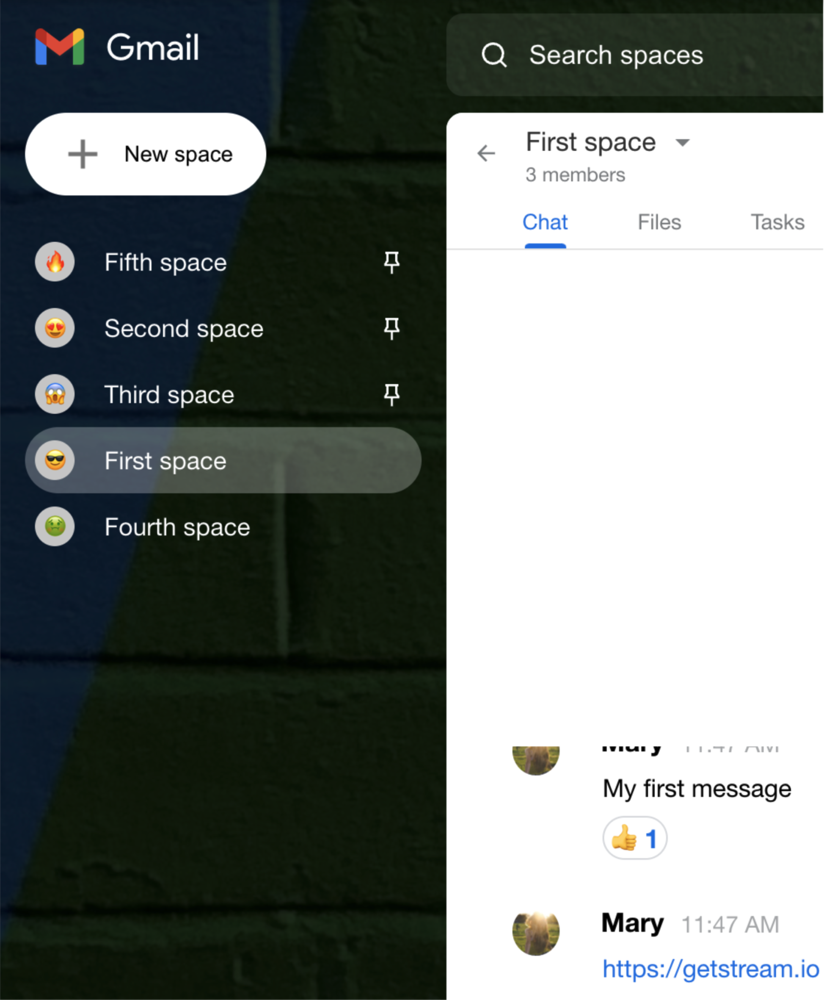

And there you have Stream Spaces 🚀


You can find the source code for everything we have built in the [stream-spaces GitHub repository](https://github.com/dillionmegida/stream-spaces).

## Conclusion

We have finally come to the end of this tutorial. You have built your own Gmail Spaces Clone. There are many features in Gmail spaces, but we have replicated:

- creating spaces
- leaving spaces
- browsing and joining spaces
- having conversations with reactions in a space
- pinning and unpinning spaces

In the React Stream application, you have also learned how to:

- customize the React SDK components using data from context
- create a custom hook for handling click-outside events
- create context for serving different parts of the application data
- update permissions for your Stream applications.
- and so much more.

By understanding the concept of channels, permissions and connecting users to Stream, you can build any in-app chat feature of your choice.

Check out the [React SDK Documentation](https://getstream.io/chat/docs/react/) to learn more about the SDK. Also, kindly leave a star on the [SDK repository](https://github.com/GetStream/stream-chat-react) if you enjoyed using it.
