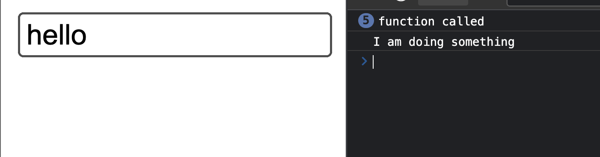

Debouncing is a technique used to optimize application performance by reducing the rate at which functions are called. Some functions are expensive (could be using more memory, or could be using a lot of CPU time, or causing many database transactions), and we don’t want to call them too often. Debouncing solves this.

In this article, I'll share use cases for debouncing and then explain how to achieve it with JavaScript.

## Use cases for debouncing

For example, a search input field where a function is called every time the user types a character. This function makes an API request to the server to get the search results. Calling this function every time the user types a character can affect performance and result in wasted resources.

This example is a good use case where debouncing can be helpful. Another example is when you want to trigger a file auto-save feature as you have on web platforms. You may not want to trigger this function on every action in the file, as it can affect performance also. It can also help to use the debouncing feature here.

For the rest of this article, I'll focus on the search input field example.

So how do you debounce a function in JavaScript?

## How to debounce a function in JavaScript

Before writing the code, let's first understand the idea. Note that there are many ways to debounce a function in JavaScript. But here is my approach.

We define a function that we want to debounce. We set the function to be executed after a certain time. This specific time is an estimated time that the user "relaxes" his fingers from clicking a button or typing in a text field. If the user still does something within that time, then postpone the execution of the function to another particular time. Continue in that manner until it is right to execute the function.

Here's an illustration to explain the approach to debouncing a function:


This approach reduces how many times the function is called within intervals of typing in an input.

Now, let's see this in code.

```javascript
function debounce(func, delay = 1000) {
  let timeoutId

  return function(...arguments) {
    console.log("function called")
    clearTimeout(timeoutId)

    timeoutId = setTimeout(() => {
      func(...arguments)
    }, delay)
  }
}

function doSomething() {
  console.log("I am doing something")
}

const debounced = debounce(doSomething)
```

Here's what this function does:

- the debounce function is defined with two arguments: the `function` to be debounced and the `delay` in milliseconds (with a default value of **1000**)
- the debounce function returns a function. The relevance of this function is:
  - it is called with the arguments that will be passed to the function to be debounced
  - it is used to preserve the scope (the `timeoutId` variable) of the function to be debounced
- in the returned function, the previous timeout (if it exists) is cleared, and a new timeout is set to execute the function after some time. Read on [How to cancel a setTimeout in JavaScript](https://dev.to/dillionmegida/how-to-cancel-a-settimeout-in-javascript-l2p) for more information.

Referring to the illustration I shared earlier, the `clearTimeout` and `setTimeout` expressions imitate the "postpone" function in the debounce function. When the `debounced` variable is called, it clears the previous timeout and sets another one (postpones it) with a different `timeoutId`

You can play with the result of this code in this codepen (modified to print the text on the screen):



Here's a screenshot to show the result of this code:



You will notice that on typing "h", "e", "l", "l", "o", the setTimeout function keeps postponing (despite "function called" being printed). But when I pause typing for 1 second, the main function is printed: "I am doing something".

## Wrap up

Debouncing helps to improve application performance by calling functions only after a certain amount of pause-time has passed and not on every action.

However, you do not have to implement this by yourself. Lodash, for example, has a [debounce function](https://lodash.com/docs/4.17.15#debounce). The contributors have optimized Libraries like Lodash to make the debounce function more effective.

In this article, I've explained what debouncing is, why it is valid and how to implement it in JavaScript.
