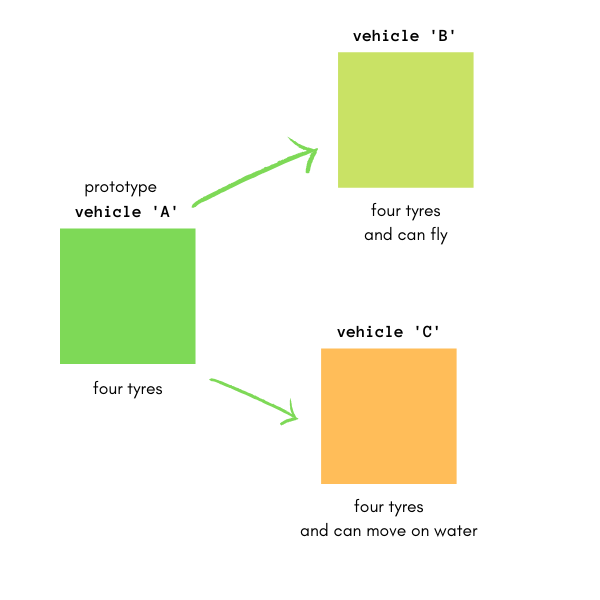
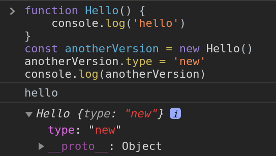

JavaScript is a prototype-based object-oriented language. Although, you'd see the `class` keyword (in modern Javascript) but it works as prototypes at the background. I explained how the `class` keyword works [in this article on `this`](../this-demystified).

In this article, we'll look at the prototype nature of JavaScript, as well as the Prototype chain in objects.

-----

Examine the following code:

```js
const animals = {
    name: "animal",
    type: "object"
}
animals.hasOwnProperty('name');
// true
```

But `animals` does not have a method called `hasOwnProperty` so why aren't we having undefined? By the end of this article, we'll understand how this works and more.

## The concept of prototypes

A prototype according to the dictionary is:

> a first or preliminary version of a device or vehicle from which other forms are developed.

A graphical example to best explain this, is this vehicle example in the diagram below:



The prototype 'A' is the first version from which other versions like 'B' and 'C' are created. In most cases, 'A' would contain the most essential features that a vehicle should have while 'B' and 'C' would contain more features for other use cases.

What this means is that, 'B' and 'C' are improved versions of 'A' but still contain features of 'A'. 'A' has four tyres, 'B' has four tyres and can fly, and 'C' has four tyres, cannot fly but can move in water.

JavaScript works on the basis of prototypes. At the declaration of every function, the JavaScript engine adds the `prototype` object property to that function which makes the function a prototype that other versions can be created from. You can confirm that with this example:

```js
function hello() {
    console.log("hello")
}
console.dir(hello)
```

Result:


The result (as seen in the image above) shows the properties of the function `hello` which includes `prototype`. Another property called `__proto__` can be seen. More on it later in this article.

The `prototype` object has two properties: the first being `constructor` and the other being `__proto__` (again). The former points to the `hello` function while the latter points to `Object`.

### The benefit of Prototypes

Prototypes makes it easy for functions to keep only one copy of features of which newer versions would have access to. This means that newer versions would not need to have their own copy, they could just focus on having more features which they'd need for their use case.

To explain this further, let's look at `constructor functions`, which is one way of creating objects.

```js
function Hello() {
    console.log("hello")
}
const anotherVersion = new Hello()
anotherVersion.type = "new"
console.log(anotherVersion)
```

_`Hello` with a capitalized first letter is a convention to show that a function would be used as a `constructor function` (that is, used to construct an object)._

Result:

;

The result shows us now that `anotherVersion` is a new object built from `Hello`. This can be a great way of creating objects with an existing skeleton (how the object should look), but problems set in when you want similar objects to have the same features (do the same things) using the constructor function alone. For example:

```js
function Obj(name) {
    this.name = name
    this.printName = function() {
        console.log(this.name)
    }
}
const javascript = new Obj("javascript")
const php = new Obj("php")
console.log(javascript)
// Obj {name: 'javascript', printName: f}
console.log(php)
// Obj {name: 'php', printName: f}
```

_The `this` variable used in `Obj` points to the object calling the function `Obj` (which in the above code is `javascript` and `php`). Learn more about `this` [in this article](../this-demystified)_

We can see that while `php` and `javascript` have different name values, they have the same function code. What if `php` never uses its `printName` function, that would result in memory wastage especially when many other objects are created from this constructor function.

With prototypes, you can create just one copy of `printName` and every object created from that prototype can have a different `name` value.

Remember above that `hello` had two properties: `prototype` and `__proto__`. `prototype` also had two properties: `constructor` (which pointed back to the function) and `__proto__`. When creating objects using the constructor function of `Obj`, the `constructor` property of the `prototype` property was used. This is the default function used when creating other objects. Let's check that with the following code:

```js
function Obj(name) {
    this.name = name
    this.printName = function() {
        console.log(this.name)
    }
}
const javascript = new Obj("javascript")
console.log(javascript);
```

Result:


From the image above, you'd see that the `__proto__` (called **dunder proto**) property which connects to our prototype `Obj` (more on `__proto__` later in this article) has a constructor which points to `Obj(name)` - our function. Confirmed!

### Sharing features with prototypes

Now we know that the `prototype` property of a function makes that function a prototype that can be used for creating other objects.

What if the `prototype` property had other properties asides `constructor` and `__proto__` since as we know, JavaScript properties can have new properties attached at any point in time? Let's see:

```js
function Obj(name) {
    this.name = name
    this.printName = function() {
        console.log(this.name)
    }
}
const javascript = new Obj("javascript")
Obj.prototype.printType = function() {
    console.log(this.type)
}
console.log(javascript);
```

Result:


As seen in the image above, the `__proto__` property now has a `printType` method but the object `javascript` itself does not have a `printType` method. Since `javascript` had access to the constructor function in the `__proto__` property by default, then it would also have access to `printType`. Hence, the following would work correctly:

```js
javascript.printType()
// undefined, because type does not exist
javascript.type = 'language'
javascript.printType()
// language
```

How does JavaScript do this? First it checks if the method exists on `javascript` and if it doesn't, it checks the `__proto__` property.

### Prototype Inheritance

This is the concept whereby an object inherits features from another object (which is the prototype). This relationship is shown on the `__proto__` property.

The inheritance is not so literal as assumed, because the new object would not have that feature directly. Prototype inheritance actually means that the new object has **access** to the `prototype`'s properties.

### Prototype chain

Backtrack to the last image, you'd notice that `__proto__` of `javascript` also has its own `__proto__`. As you may guess, this means that the object `Obj` which is used as a prototype, also inherits some features from another prototype. This is called the **prototype chain**.


This means that an object can be a new version of a prototype and at the same time be a prototype for another object. So, when you try to access a property on an object, JavaScript starts checking from the object to find the property, and if it doesn't, it continues checking the `__proto__`s all the way up until there is no `__proto__` or the property is found.

`undefined` is returned when such property does not exist.

## Wrap Up

Back to the first code block:

```js
const animals = {
    name: "animal",
    type: "object"
}
animals.hasOwnProperty('name');
// true
```

Things should be clearer by now, right?

When you check the properties of `animals` in the console, you'll notice that it has a `__proto__` pointing to the `Object`'s prototype. And, the `Object`'s prototype has `hasOwnProperty` property. `animals` inherited (has access to) that property and this makes it possible.

`Object` in JavaScript has a prototype which all objects inherit from. Constructors like `Function`, `String` and so on also inherit from `Object`. When a function is created (using the constructor or the literal method), it automatically has access to the `Function`'s prototype properties (which also has access to `Object` - prototype chain).

This is what makes things like `'string'.toLowerCase()` possible. The prototype object of `String` constructor has all of those properties, hence, string values can use them.

Thanks for reading : )
