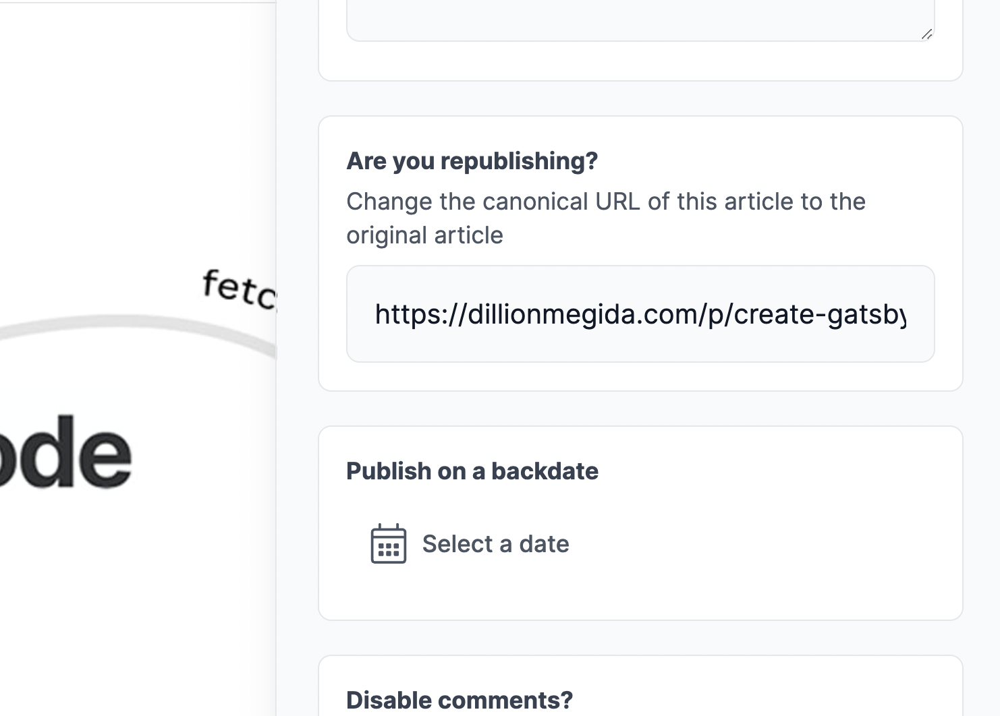
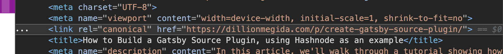

Do you have duplicate content on different websites and want a way to tell search engines the original and the duplicated version? This is where the canonical link comes on stage.

I'll explain what canonical links are and why they are relevant in this piece.

## What is the canonical link?

The canonical link is an HTML element found in the `head` tag. This element is used to inform search engines of a preferred page for similar content. It helps to protect the ranking of your web pages and prevent duplicate content problems.

When you have very similar content on different pages, it can affect these pages' SEO (Search Engine Optimization). It can be confusing for search engines to understand which should have a higher ranking over the other. In some cases, the page which ends up getting a better ranking may not be the one you want.

Canonical link solves this. The idea is that you have similar content on different pages or different websites, but you tell search engines, "**this is the preferred page I want you to rank for this content**". With this information, search engines will rank the specified page when the other pages get views, referrals, and other factors that improve SEO.

Next, I'll show you an example where I used a canonical link, and afterward, I'll show you how to specify a canonical link for your pages.

## Example of a canonical link

Over a year ago, I published [How to Build a Gatsby Source Plugin, using Hashnode as an example](https://dillionmegida.com/p/create-gatsby-source-plugin/) on my website. Some days later, I republished the [same article on Hashnode](https://dillion.hashnode.dev/how-to-build-a-gatsby-source-plugin-using-hashnode-as-an-example) to get more visibility for it.

Now, there are two similar articles on different websites. How do I tell search engines that I prefer the one on my website to be ranked? With a canonical link.

Using Hashnode's dashboard for my article, I added a canonical link:



With this, search engines would rank the article on my website. In fact, when you search "*dillion gatsby source plugin hashnode*", you will not see the article on Hashnode's website on the results page:

.

My article is first on the search result page, and the duplicated on Hashnode isn't.

So how do you add a canonical link?

## How to add a canonical link to a page

So far, I've taken you through a story of why the canonical link is relevant, but how do you add it?

The `link` tag is an HTML element mainly found in the head tag, and it is used to add a canonical link to a webpage like this:

```html
<link rel="canonical" href="preferred link" />
```

On your website, where you have access to the source code, you can add the canonical link this way. But other platforms may not give you access to their source code. However, they may provide you an input to add such links, just like I showed you on Hashnode.

On the page source for the [article I wrote on Hashnode](https://dillion.hashnode.dev/how-to-build-a-gatsby-source-plugin-using-hashnode-as-an-example), you can see the canonical link in the head tag:



Other platforms may provide the canonical link input differently, but the end goal is to have the canonical link in the head tag like the image above.

## Conclusion

When you republish content on different websites, always be aware of the canonical link. Some platforms do not provide this, which will affect the original content's ranking. So maybe check if a platform provides this before republishing unless you're not concerned about rankings on the original page.

In this piece, I've shared what canonical links are and why they are relevant. If you found it helpful, kindly share : )
